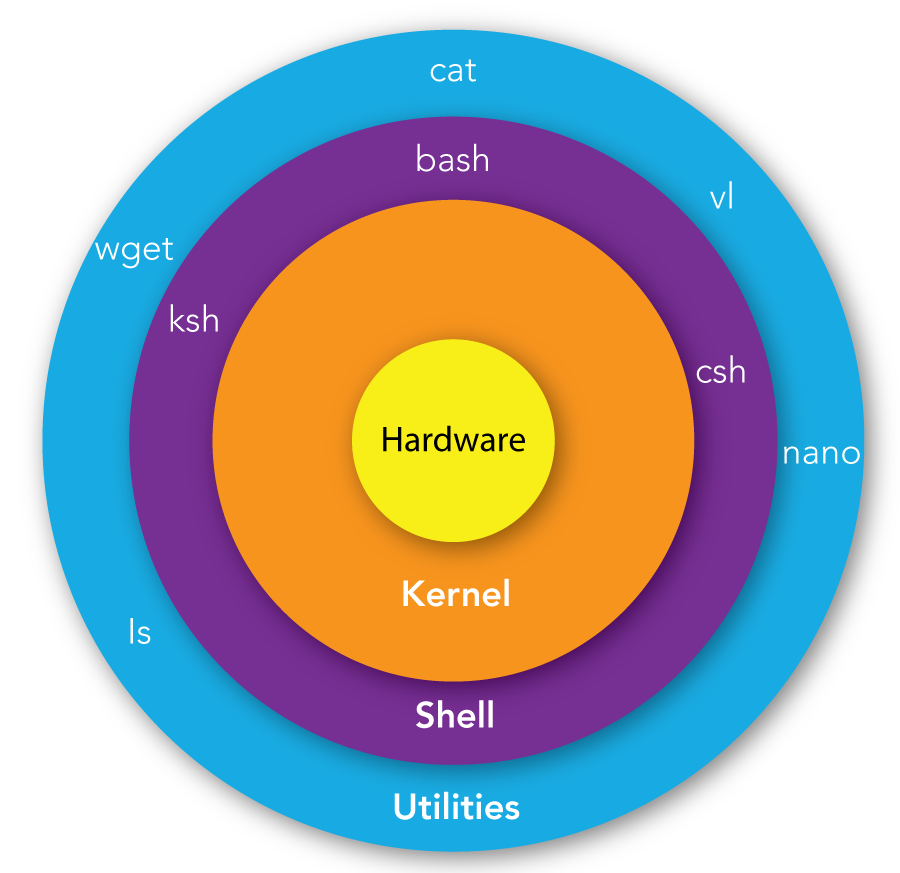
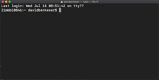

Prior to 1984, your personal computers didn't have a graphical interface we now refer to our Desktop. Even today, graphics requires processing a lot of data through specialized hardware (i.e. Graphics Card).

The majority of applications written for bioinformatics are designed to run on large computer clusters use Linux/Unix. Unix is a terminal based operating system that has been around since 1969, when computers were very limited. The programmers had to develop complex algorithms to run programs and analyze data on such limited systems. This led to a lot of the innovations that are the fundamentals of computers science today. There were a few different versions of Unix. If you have an Apple - it's based on BSD developed at UC Berkeley. In 1983, the GNU Project was started to create a free version of Unix. However, it lacked a functional kernel. In the 1990s, Linus Torvalds created Linux kernel to run the the GNU Unix sytem.

* * *

## 1.1 Why Unix/Linux?

1.  It's very resource efficient - few resources are spent on graphics, rather the focus is on computation
2.  It's very flexible - it provides a simple framework to execute code and link executions together into larger pipelines
3.  It's very stable - Some computers have been running for ~14 years without needing to reboot.
4.  It's very secure
5.  It's very compatible - Strict standards for how files are handled and processed by commands - means that it's many tools or analytical programs can be run on a large range of systems.

## 1.2 But Why Unix/Linux for Cancer Research

1.  While many tools are available for graphical user interfaces, the majority of bioinformatics tools developed for genomics research are still programmed or designed to run in Unix
2.  Resource Efficient - It's not uncommon to have a file that is 20-100GB in size. In order to process such a file, you need to use your limited resources efficiently.
3.  Flexibility - We need flexibility because you may want one type of information and your PI may be interested in another. You can link different commands together to do both.
4.  Stability - We need a systems that we can trust to perform similarly over long periods of time. Some pipelines and analysis may take months to complete - you don't want to have to keep restarting such an analysis.
5.  Security - We often deal with genomic datasets that contain very personal information. We want to be certain that files are stored in a way that is secure.
6.  Compatibility - Our results need to be reproducible - so having tools that work on a wide range of systems is essential.

* * *

## 1.3 Putting the Linux/Unix Into Perspective

To clarify what we're actually interacting with in the Terminal is a **shell** , which is an interactive interpreter between us as users and the **kernel**, which controls how the operating system interacts with the hardware.



From inside to the outside:

1.  Hardware: This is the actual hardware of your computer (CPU, RAM, Storage Devices, Graphics cards, Monitors, Mouses, Keyboard)
2.  Kernel: The drivers and integral operating system components to control how we has users interact with the hardware
3.  Shell: Interactive interface we use to run commands and access files.
4.  Utilities: Our programs that we have either developed or someone else has developed. They are stored as files and then we can call them from the shell.

Just as there are different varieties of **Hardware**, there are different varieties of **Kernel**, **Shell**, and **Utilities**

The most common **Shells** are **Z shell** and **Bash**. On most systems, you can choose which **Shell** you use.

**Bash** or **Bourne Again Shell** is the most common and known for it simplicity and compatibility across systems. It is typically the default for Linux distributions.

**ZSH** or **Z shell** was designed to extend **Bash** functionality and customizations. For the most part, it's compatible with **Bash**. It is typically the default for Mac OS.

We'll be focusing on using **Bash** because it's the most often used **Shell** on Linux research systems. Really, the only difference we'll encounter is in Lesson 10, where we'll see there are a few differences in filenames used when customizing our **shell** environment.

For the purposes of this course, **Z Shell** and **Bash** are going to be nearly identical.

* * *

## 1.4 First Look at Unix/Linux through the Terminal

Terminal is a text-based interface with your computer. It allows you to navigate your filesystem and control your operating system.

It looks something like this:  
  
Your cursor is represented by a square. This is where you can type your commands. It is typically preceded by a `$`, which denotes your are in the system shell and it's ready to accept a command.

Operating systems that were built on top of Unix/Linux systems provide access to the UNIX environment via a default Terminal program. There are many aftermarket Terminal programs that provide users with additional features, such as Tabs.

**Default Unix/Linux Terminal Programs**

| OS  | UNIX/Linux | Terminal Program |
| --- | --- | --- |
| Mac OSX | Darwin BSD | Terminal |
| Linux | Linux | Terminal |
| Windows | None | None |

You'll notice that Windows doesn't have any UNIX/Linux and no default Terminal program. This is because Microsoft was originally based on an operating system called MS-DOS, which looks similar at first glance, but provides a whole different set of commands. The equivalent for Terminal was Command Prompt. In later versions of Windows, Microsoft has implemented PowerShell, which provides additional functionality to interact with the Windows operating system.

* * *

# 1.5 Introduction to UNIX Command Prompt

Open your terminal program, and follow along. In the examples, below you'll see a `$` at the start of the line to denote what should be typed at the command prompt. If the computer replies, with some output - notice that it doesn't have a preceding `$`

## A. **Do Not Type The $ from the examples**

```
$ $ example_command
$: command not found
```

The `$` in the examples is only to delineate between input commands and outputs from the command. If the line doesn't start with a `$` then it represents the output of the previous command.

**Note**: Lines starting with a **#** are meant as comments. The shell will ignore any line starting with a **#** or anything after the **#** mark.

## B. **Unix is Case-sensitive**

Whether referring to commands, files, or arguments, Unix is case-sensitive

```bash
$ pwd
/home/plott

# This is my home directory
```

`pwd` prints out your **p**resent **w**orking **d**irectory this is the folder that you are in.

```bash
$ PWD
PWD: command not found
```

Notice that if we change the capitalization of the command - it's no longer found. Unix is a case-sensitive - meaning that `PWD` is not the same as `pwd`

```bash
$ pWd
Command 'pWd' not found, did you mean:
  command 'pwd' from deb coreutils (8.32-4.1ubuntu1.2)
  command 'pd' from deb puredata-core (0.52.1+ds0-1)
  command 'psd' from deb profile-sync-daemon (6.34-1)
  command 'pdd' from deb pdd (1.5-1)
Try: sudo apt install <deb name>
```

If we make a mistake and capitalize one letter, it's is also incorrect. But sometimes, it'll try to help you out by suggesting some command you possibly meant to type.

## C. Unix uses `spaces` as delimiters between commands, options, and arguments.

```bash
$ ls -alh
total 24K
drwxrwxr-x   2 plott plott 4.0K Mar 10 15:07 .
drwxr-xr-x 190 plott plott  20K Mar 10 15:07 ..
```

The `ls` command list the files and directories of your current `pwd`. The *argument/options* `-alh` tells `ls` that we want to list:

1.  **\-a** : list all files
2.  **\-l** : list files in long listing format
3.  **\-h** : list sizes in human readable formats like `1K` instead of `1024`

Many Unix commands allow you to combine multiple options, so `-a`, `-l`, `-h` becomes `-alh`

However, if we forget a **space** between the command and the options, Unix interprets this as a command:

```
$ ls-alh
ls-alh: command not found
```

Since there is not command called `ls-alh` the it fails.

If we add extra space between the options, we also fail. Unix interprets this as list all files for a file or directory called `l` and same for `h`

```bash
$ ls -a l h
ls: cannot access 'l': No such file or directory
ls: cannot access 'h': No such file or directory
```

The correct way to split

```
$ ls -a -l -h
total 24K
drwxrwxr-x   2 plott plott 4.0K Mar 10 15:07 .
drwxr-xr-x 190 plott plott  20K Mar 10 15:16 ..
```

But what if you need to use a space or special character in a file name or other command. For example a file named `Hello World.txt` is valid in UNIX. Most UNIX users, really hate files with spaces and other characters, so you'll typically seek spaces replaced by `_` underscore.

If you need to include a space in a filename, we *escape* it using the `\` character. So, we have to type the filename as: `Hello\ World.txt` , which uses the `\` to escape the space. Meaning that we use the as a character instead as a delimiter between options or arguments.

## D. Typically, options are prefixed with `-` or `--`. But beware, it's not a rule - just a best practice.

Here is an example of GATK command to validate a SAM file - both ways are valid for the GATK program. Please don't expect this to work on your computer. GATK is a package of tools to process DNA sequencing data.

```bash
# **Don't Execute**
$ gatk ValidateSamFile -i input.bam -MODE SUMMARY

$ gatk ValidateSameFile I=input.bam MODE=SUMMARY
```

* * *

# 1.6 Getting help and documentation for commands

There are often at least a few options for Unix command, some even have hundreds of options. To find out available options for a command there are a few different ways.

## A. Using `man`

The command `man` opens the man-page for a command. It requires an argument, which is the `command` you're interested in.

Let's look at the man-page for `ls`

```bash
$ man ls
LS(1)                                                                User Commands                                                                LS(1)

NAME
       ls - list directory contents

SYNOPSIS
       ls [OPTION]... [FILE]...

DESCRIPTION
       List information about the FILEs (the current directory by default).  Sort entries alphabetically if none of -cftuvSUX nor --sort is specified.

       Mandatory arguments to long options are mandatory for short options too.

       -a, --all
              do not ignore entries starting with .
...
       -R, --recursive
              list subdirectories recursively

Manual page ls(1) line 13 (press h for help or q to quit)
```

The man-page for `ls` goes on for a while, so you can scroll down until you find the *option* you want or press `q` to quit

# Exercise 1: Look at the man-page for `pwd` and `tar`. What are some options for `pwd` ? What does `tar` do?

## B. Using `-h`

Some commands have a quick help or usage statement built in to provide you with a shorter quicker help with the most commonly used options. However, you'll notice that this is the same option that `ls` uses for human-readable file sizes - `ls` is one of many basic unix commands that don't provide help via `-h` option.

```bash
$ curl -h
Usage: curl [options...] <url>
     --abstract-unix-socket <path> Connect via abstract Unix domain socket
     --alt-svc <file name> Enable alt-svc with this cache file
     --anyauth       Pick any authentication method
 -a, --append        Append to target file when uploading
...  #Goes on and on without stopping, you'll have to scroll to the top to see the beginning
```

# Exercise 2: What are some differences between `man tar` and `tar --h`? Which describes the application in more detail?

# Exercise 3: Find the option for `ls` to list one file/directory per line?

# Exercise 4: What does the `touch`, `whoami`, `cd`, `mv`, and `cp` command do? Did you have any issues finding what a command does?

## C. Shell Command Help

Some commands are defined by the SHELL or type of Command Prompt we use. Bash has a `help` command that can provide help on built-in commands.

```bash
$ help
```

```
$ info
```

# Exercise 5: Using `help`, `man`, and `-h` option for `pwd`, which ones are defined and what are the differences between them?

## D. Google `man <command>`

Search Google for the man page for a given command.

# Excercise 6: Find the manpage for `curl`. What does `curl` do? Try it in the command-line and google. Is it installed on your computer?

* * *

# 1.7 Terminal Shortcuts

When working in the terminal, your mouse doesn't really play a role, so it's all about typing out commands. It can be very repetitive typing out very long commands again and again. Luckily there are shortcuts withing the SHELL to help simplify.

| Keys | Description |
| --- | --- |
| up arrow | previous command |
| down arrow | next command |
| CTRL + e | Got to end of line |
| CTRL + a | Got to beginning of line |
| CTRL + c | Interrupt a running program |
| CTRL + z | Suspend a running program, restore with `fg` |
| tab | auto completion |

## A. `Up-Arrow` - Previous Command

We've actually executed a few different commands already. After the first time you've executed a command, it gets stored in your `history`. You can access previous commands by typing the `Up-Arrow`.

# Exercise 7: What was the three previous commands you executed?

## B. `Down-Arrow` - Next Command

Similar to the Up-Arrow, you can navigate the next command in your history by pressing the Down-Arrow. This makes it simple to navigate the list of previous commands.

# Exercise 8: Press the `Up-Arrow` 5 times. Then press the `Down-Arrow` 2 times. What was the command?

## C. `CTRL + a` or `CTRL + e` Moving from beginning to the end of the line and back again.

Often times, we make a mistake on a along command and we need it'd be quicker to go to the beginning of the line to fix the error.

```bash
$ Echo "Hello, This is going to be a very long command because it goes on and on and on and on and on and on"

Command 'Echo' not found, did you mean:
  command 'echo' from deb coreutils (9.4-2ubuntu2)
```

Use Up-Arrow to get to the command and then `CTRL+a` to get to the beginning of the line. Change `Echo` to `echo` , then `CTRL+e` to go to the end of the line. Make any edits at the end of the line and then run the command.

```bash
$ echo "Hello, This is going to be a very long command because it goes on for a while."
Hello, This is going to be a very long command because it goes on for a while.
```

## D. Interrupt or Terminate a Process using `CTRL+c`

When running commands on Unix, it can be easy to execute the wrong command or a command takes a lot longer than we thought it would take. A simple command that can run a long time in Unix is `sleep`. `sleep` pauses a program or terminal session for a given amount of time.

For example `sleep 1` will pause for 1 second before continuing. `sleep 1h` will pause for 1 hour. If we need to terminate the `sleep` command we can press `CTRL+c`

```
$ sleep 1h
# Press CTRL+c
$
```

## E. Pausing a Process using `CTRL+z`

Sometimes, you may want to pause a process before continuing it. To put a process on pause, press `CTRL+z`.

Paused commands can be resumed either by `fg` or `bg` commands.

`fg` stands for **foreground** and resumes the process in the terminal, which causes your terminal to wait until its completed until you can enter another command.

`bg` stand for **background** and resumes the process in the background, which causes all the

```
$ sleep 10;
#Press CTRL+z
[1]+  Stopped                 sleep 10

$ ls
file1    file2

#Resume the sleep 10 command
$ fg
sleep 10

```

It's important to remember that pausing a command, doesn't stop it completely. Unix maintains all the memory and resources that the program was using. If you paused a process that is using 16GB memory, that will still be reserved and you won't have access to that 16GB of memory until either the program is unpaused or killed.

## F. `TAB` - Auto completion

The TAB key in UNIX is a real lifesaver. Instead of having to type out long filenames, directories, executable program names - you can type a few characters and then type the `TAB` key. If UNIX can figure out what you mean explicitly - it'll automatically complete what you're typing. If there are multiple options, typing `TAB` again will list the available options. Tab completion is great if you've forgotten the full program name or need help navigating the directories or files.

# Exercise 9: Use Tab Completion ot find all the commands that start with `ls`

* * *

# Exercise 10: Navigating the Directories.

Start by typing `pwd` to get your present working directory. Next, type `cd /` this will take you to the `root` directory. We want to get back to where we were using tab completion.

# Move on to Unix Lesson 2: Navigating the File System.

* * *

# Troubleshooting:

## I don't have Terminal on my Windows Machine

Labex provides a free virtual machine that will work for this section  
https://labex.io/labs/linux-your-first-linux-lab-270253?course=quick-start-with-linux

### Windows Only Install

[Installing WSL2 on Windows:](https://learn.microsoft.com/en-us/windows/wsl/install) Open PowerShell or Windows Command Prompt in administrator mode by right-clicking and selecting "Run as administrator", enter the wsl --install command, then restart your machine.

```PowerShell
wsl --install
```

https://github.com/microsoft/terminal/releases/download/v1.23.10353.0/Microsoft.WindowsTerminalPreview_1.23.10353.0_x64.zip

### End Windows Only Install