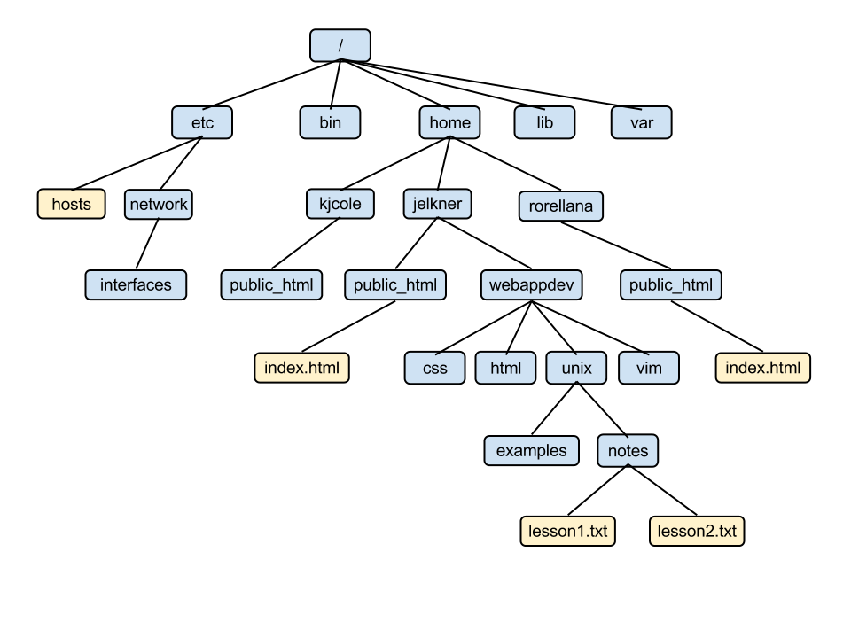

# 2\. Unix Navigating the Filesystem's Tree

**Unix/Linux Commands Cheatsheets:**

- [**English**](https://ucdavis.app.box.com/file/1797035694771)
- [**Spanish**](https://ucdavis.app.box.com/file/1797037122504)

&nbsp;

* * *

In the **Lesson 1**, I introduced you to the Linux/Unix Terminal and showed some of the things you could do. In this lesson, we're going to focus on becoming proficient navigating UNIX File systems in the Terminal. 

- Directories
    - Listing
    - Moving around

## Commands to Navigating Directories

| Command | Description |
| --- | --- |
| ls  | List current files/directories |
| pwd | Show current directory |
| cd  | Change to HOME directory |
| cd &lt;dir&gt; | Change to directory |

Many of these commands will be familiar from Lesson 1. We looked many of these up in *manpages*, *help*, or using the *\-h* option

# 2.1 Directories

Directories are the same a "Folders" in Windows and Mac OS. We use directories to organize files and projects. The operating system uses folders to organize important programs, drivers, and to keep important system files away from users.

You can think of Unix/Linux directory structure like the an inverted tree. We start at the *root* which is `/`

Here is an example image of someone else's directory tree:



Then moving down the tree, we see there are 6 *directories* accessible from the `/` , (etc, usr, bin, home, lib, var).

When you first login to the terminal, you'll most likely be placed in your ***HOME*** directory. This is essentially, where you can store your own files and applications. To confirm you are in your *Home* directory, you can see your **p**resent **w**orking **d**irectory by typing:

```bash
$ pwd
/home/plott
```

Let's start by going to the *root* directory. To **c**hange **d**irectories, we use the **cd** command followed by the directory we want to move to.

```bash
#Move to Root Directory
$ cd / 
$ ls -a
.     bin   dev   lib    mnt   proc  sys  usr
..    boot  home  media  opt   root  tmp  var
```

The root directory is denoted by starting with a `/`.

In the previous `pwd` example, we got back `/home/plott` as our directory. This means that moving from the left to right from **root** `/` we got to `home` and then to your `<user>` directory.

# ~~Exercise 1: Goto the `/` directory and list all the files (-a), in long format (-l), and human readable format (-h). What do you notice about the root directory?~~

# Absolute & Relative Paths

When navigating around Unix File systems, you can easily get lost or not know the shortest path to a specific file or directory. You'll see in the next section how to move from one place directly to another and then also move stepwise.

When we're defining the directory we want to go to, we can define it **relative** to where we currently are or **absolute - ie. relative to root**

The easiest way to remember them is:

### If it starts with `/` then it's a *absolute path*

Absolute Paths means that the full path is defined starting at the **root** directory. There is no ambiguity about where the directory or file is located.

### If it doesn't start with `/`, then it's a *relative path*

Relative Paths means that the path is relative to where you currently are in the directory tree. When supplying programs or the command prompt with relative paths, it's easy to mix up - because you have to be certain about the starting point. The path is relative to your starting point.

```
$ pwd 
/home/plott
$ cd ../../usr/bin
$ pwd
/usr/bin

$ cd /usr/bin
$ pwd
/usr/bin

```

# 2.2 Getting Back Home

There are a few ways to get back to your home directory.

## A. Step-wise (Directory by Directory)

```bash
$ cd /   #starting in the Root directory
$ pwd
/
$ cd home
$ cd user1
$ pwd
/home/user1
```

We can move down the tree a single directory at a time. If we don't start the directory we want to go to with root `/`, then we are saying we want to go to 'home' relative to where we are. Then we got to `user1` relative to `home`, which was our current directory.

# Exercise 2: Navigate to your `root` directory and then get back to you *HOME* directory a step at a time. Use `pwd` and `ls -alh` to list files and directories at each stage.

## B. Go Directly Home

```bash
$ cd /
$ pwd
/
$ cd
$ pwd
/home/user1
```

By typing `cd` and nothing else - automatically send you to your home directory.

## C. Using the Home shorthand `~`

```bash
$ cd /
$ pwd
/
$ cd ~
$ pwd
/home/user1
```

# ~~Exercise 3: Go back to your `root` directory and then try both methods described in (B) and (C).~~

## D. Going there directly using the absolute path

Anytime, we start our directory or file path with root `/` directory, we are specifying the directory relative to the **root** directory. This is called the **absolute path** because no matter where you are on the tree, the file's path is fixed.

```bash
$ cd /
$ pwd
/
$ cd /home/user1
$ pwd
/home/user1
```

You've now successfully, moved down the tree from the **root** directory `/` to your **home** directory and back to root.

### One Step Up The Tree: `..`

Sometimes, you wan to move from one directory up the tree to the previous directory. For example, to move from you're home directory `/home/user1/` to `/home` you can use the `..` to access the parent directory or directory immediately up on the tree.

```bash
$ pwd
/home/user1
$ cd ..
$ pwd 
/home
```

Using `tab-completion` is an easy way to help build the **relative** or **absolute path**

# Exercise 4: Use `tab-completion` to build a relative path from your home directory to the `root` directory and back to your Home. Start in your home directory

## Other examples of Relative and Absolute Path

```
# Using Relative Paths
$ cd ../../home/user1/GATK/sequence/fasta

# Using Absolute Paths
$ cd /home/user1/GATK/sequence/fasta

# Using Relative Paths with '~'
$ cd ~/GATK/sequence/fasta
```

# Move onto Unix Lesson 3: Managing Files and Directories