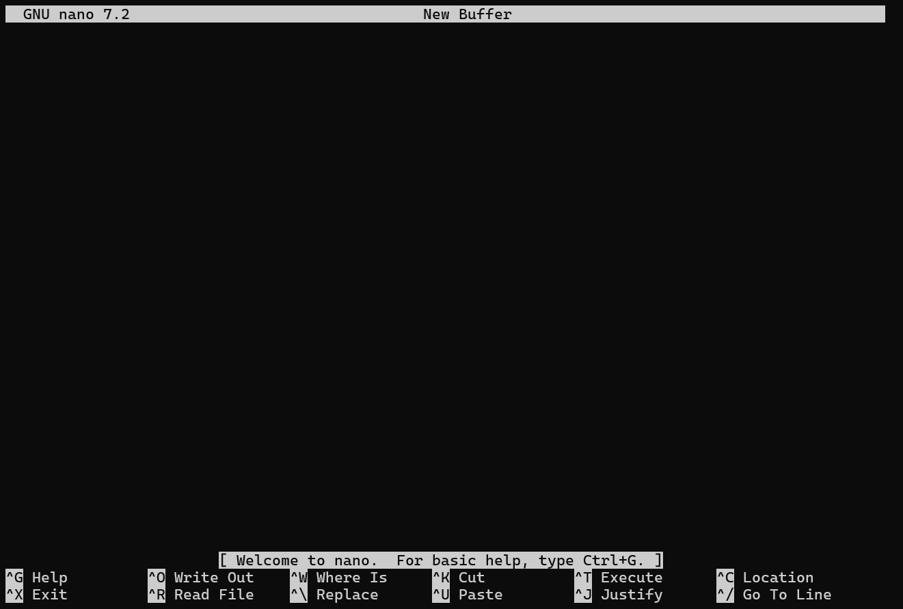

* * *

# Assignment Week 1 Review

Using file/directories commands we learned in Week 1: Create the following directory and file structure.

```
~/.  #Your Home Directory or other starting folder
└── D43_Unix_R_Class
  ├── Books
  │   ├── R
  │   └── Unix
  ├── Cheatsheets
  │   └── My_Notes.md
  ├── Questions
  │   └── CommandPromptIssue.txt
  ├── R
  │   └── Lessons
  │       ├── Lesson_1
  │       ├── Lesson_2
  │       └── Lesson_3
  └── Unix
      └── Lessons
          ├── Lesson_1
          │   └── Exercises_1-10.txt
          ├── Lesson_2
          │   └── Exercises_1-4.txt
          ├── Lesson_3
          │   └── Exercises_1-6.txt
          └── Lesson_4 

```

## Solution:

**A:** Single directory at a time

```bash
$ mkdir D43_Unix_R_Class
$ cd D43_Unix_R_Class
$ mkdir Books
$ mkdir Books/R
$ mkdir Books/Unix
$ mkdir Cheatsheets
$ mkdir Questions 
$ touch Cheatsheets/My_Notes.md
$ touch Questions/CommandPromptIssue.txt
$ mkdir R
$ mkdir R/Lessons
$ mkdir R/Lessons/Lesson_1
$ mkdir R/Lessons/Lesson_2
$ mkdir R/Lessons/Lesson_2
$ mkdir Unix
$ mkdir Unix/Lessons
$ mkdir Unix/Lessons/Lesson_1
$ mkdir Unix/Lessons/Lesson_2
$ mkdir Unix/Lessons/Lesson_3
$ mkdir Unix/Lessons/Lesson_4
$ touch Unix/Lessons/Lesson_1/Exercises_1-10.txt
$ touch Unix/Lessons/Lesson_2/Exercises_1-4.txt
$ touch Unix/Lessons/Lesson_3/Exercises_1-6.txt

$ tree
#or 
$ ls -R
$ history
```

**B.** Multiple Directories using `mkdir -p` option

```bash
$ mkdir -p D43_Unix_R_Class/Books/Unix
$ mkdir D43_Unix_R_Class/Books/R
$ mkdir -p D43_Unix_R_Class/Cheatsheets
$ mkdir -p D43_Unix_R_Class/Questions
$ mkdir -p D43_Unix_R_Class/R/Lessons/Lesson_1
$ mkdir D43_Unix_R_Class/R/Lessons/Lesson_2
$ mkdir D43_Unix_R_Class/R/Lessons/Lesson_3
$ mkdir -p D43_Unix_R_Class/Unix/Lessons/Lesson_1
$ mkdir D43_Unix_R_Class/Unix/Lessons/Lesson_2
$ mkdir D43_Unix_R_Class/Unix/Lessons/Lesson_3
$ mkdir D43_Unix_R_Class/Unix/Lessons/Lesson_4
$ touch D43_Unix_R_Class/Cheatsheets/My_Notes.md
$ touch D43_Unix_R_Class/Questions/CommandPromptIssue.txt
$ touch D43_Unix_R_Class/Unix/Lessons/Lesson_1/Exercises_1-10.txt
$ touch D43_Unix_R_Class/Unix/Lessons/Lesson_2/Exercises_1-4.txt
$ touch D43_Unix_R_Class/Unix/Lessons/Lesson_3/Exercises_1-6.txt

$ tree
#or 
$ ls -R
$ history
```

**C.** Multiple Directories using `mkdir -p` single command and touch single command

```bash
$ mkdir -p D43_Unix_R_Class/Books/Unix D43_Unix_R_Class/Books/R D43_Unix_R_Class/Cheatsheets D43_Unix_R_Class/Questions D43_Unix_R_Class/R/Lessons/Lesson_1 D43_Unix_R_Class/R/Lessons/Lesson_2 D43_Unix_R_Class/R/Lessons/Lesson_3 D43_Unix_R_Class/Unix/Lessons/Lesson_1 D43_Unix_R_Class/Unix/Lessons/Lesson_2 D43_Unix_R_Class/Unix/Lessons/Lesson_3  D43_Unix_R_Class/Unix/Lessons/Lesson_4

$ touch D43_Unix_R_Class/Cheatsheets/My_Notes.md D43_Unix_R_Class/Questions/CommandPromptIssue.txt D43_Unix_R_Class/Unix/Lessons/Lesson_1/Exercises_1-10.txt D43_Unix_R_Class/Unix/Lessons/Lesson_2/Exercises_1-4.txt D43_Unix_R_Class/Unix/Lessons/Lesson_3/Exercises_1-6.txt

$ tree
#or 
$ ls -R 
$ history
```

### Review Question: What command should we use to delete this exercise's directories and files?

* * *

## Lesson 4 Review:

We learned about file permissions and how to set them using `chmod` command

**Week 1 Review Quiz**

### ~~Review Question: The file `secret.txt` is in the folder `.private` on your computer and it contains your bank account information, what permission should you assign the file and the directory?~~

Questions

1.  In the Week 1 Assignment, we created a folder called D43_Unix_R_Class with many subfolders and files. What command should we use to delete the D43_Unix_R_Class folder and all of its files and sub-folders?

```
rm -r D43_Unix_R_Class
rm -rf *
```

2.  A file named secret.txt is in a folder called .private on your computer and it contains your bank account username, password, and account number.  What file permission should you assign the file and the directory (Single choice) \*

```
a. File: rwxr--r--   Directory: rw-rw-rw-

b. File:  600  Directory: 111

c. File: 400  Directory: 500  (File: Only You(read)  Directory: Only you(read + execute) - Best

```

3.  Which statements are true? (Multiple choice) \*

```
Unix is case sensitive;
```

4.  A directory requires which permission in order to be able to change into the directory? (Single choice)

Executable Permissions are required to be able to change into the directory

5.  To see your current working directory, you should use the \___\___ command? (Single choice)

```
pwd
```

6.  The directory /share/course/D43_Unix_R_Class is a \___\___\___\__. (Single choice)  
    Absolute Path - because it starts with `/`
    
7.  The up-arrow key allows you to see the prior command you typed (Single choice)  
    True
    
8.  In order to get to your Unix HOME directory, you can type: (Multiple choice)  
    cd  
    cd ~  
    cd .. # Only if you're in a directory directly below your home directory
    
9.  Windows PowerShell is a Unix terminal (Single choice) \*  
    False - PowerShell is a command-line shell and scripting language developed by Microsoft
    
10. Assignments are due (Single choice)
    

* * *

# Lesson 5 Viewing File Contents

For this lesson, we're going to be using files from the `D43_Unix.tar.gz` file. This is a gzipped (compressed) tarball file, which is a file archive of multiple files. It is a 57.5MB file.

You can download it from: https://ucdavis.box.com/s/bctjh2zmvskf5ycozk75ci3h19vsproq

Once you've downloaded the file, move it to where you want to keep it on your Home directory. Then expand the file with the following command to decompress and unarchive the files into a folder called D43_Unix

```bash
$ tar zxvf D43_Unix.tar.gz
```

You should now have a D43_Unix Folder with lots of files and folders.

* * *

In Lesson 1-4, we were mainly focused learning to navigate and organize the filesystem. We're now going to start to dive into some of the basic programs in Unix that make it such a powerful tool.

In this lesson, we're going to be introduced to Unix Streams, which is a fundamental piece of Unix programs. We'll also start to learn commands to view the contents of files. In the next few lessons, we'll start to practice linking these simple commands together to make some more complex tools.

# Unix Three Streams or Inputs(1)/Outputs(2)

What you see on your terminal screen is made up of three different streams of inputs/outputs.

| UNIX Stream | Description |
| --- | --- |
| STDIN | This is the input we feed to the terminal. |
| STDOUT | The standard output from programs or commands that we issue. |
| STDERR | Error messages from programs or commands |

We'll see more of these in the next few lessons, and we'll see how to capture or redirect them.

A couple **commands**, you'll see used from time to time:

| Command | Description |
| --- | --- |
| file &lt;file&gt; | Provides information about a file |
| echo "&lt;text&gt;" | Print text to terminal |

&nbsp;

# 5.1 Common Commands to View Files

| Command | Description |
| --- | --- |
| cat &lt;file&gt; | Print file contents to stdout |
| less &lt;file&gt; | View file by page |
| head &lt;file&gt; | Output first 10 lines of file |
| tail &lt;file&gt; | Output last 10 lines of file |

* * *

## 5.1.1 `cat`

While the `cat` command may seem simple at first glance, it is a very versatile command that lets you view, concatenate, create, copy, merge, and manipulate file contents.

We're going to just cover the basics of using `cat` to view, contcatenate, create, and copy.

For more indepth examples, please see: https://www.geeksforgeeks.org/cat-command-in-linux-with-examples/

`cat` prints the contents of the terminal screen/STDOUT.

```bash
$ cat D43_Unix/Documents/Page1.md
# First Page

This is my document and I'm going to write some things here

#This is some Code I'd like to run  
ls -alh  
sleep 10

| Column1   |  Column 2 |
| --------- | --------- |
| Row 1     | Row 1     |
| Row 2     | Row 2 Info|

```

Use caution when using `cat` to print long files. It doesn't pause, but rather will print the complete document to the terminal. If it's a long file you may want to use `CTRL+c` to terminate the process.

```bash
$ cat D43_Unix/Books/Elements\ of\ Style.txt
# You'll want to use CTRL+C to exit out of this long book 
```

* * *

## 5.1.2 `less`

`less` lets you efficiently view and search within files interactively. Like `cat` it allows you to view the contents of the file, but it does so in an interactive manner - it only displays a page at a time and let's you scroll forward and backward.

```bash
$ less D43_Unix/Books/Elements\ of\ Style.txt
```

To quit out of `less` you need to type `q`

## Interactive Keys in `less`

| Key | Description |
| --- | --- |
| Space / PgDn | Scroll down one page at a time |
| b / PgUp | Scroll up one page at a time |
| g   | Go to the beginning |
| G   | Go to the end |
| q   | Quit or exit out of less |
| /&lt;pattern&gt; | Search for a pattern |
| n   | Find next pattern match |
| N   | Find previous pattern match |
| &lt;number&gt;g | Goto line &lt;number&gt; |

For more in-depth options and commands in `less`, please see the man pages.

* * *

## 5.1.3 Dealing with Gzipped Files (ending in .gz)

A lot of times you'll come across a gzipped (compressed) file that you want to view. If you use `cat` or `less` on these files, you'll see a lot of garbled output. This is because the compressed file is not a text file but rather a binary compressed text file.

Because it's so common to deal with compressed text files, Unix provides versions of many utilities that handle the conversion seamlessly. Typically, the commands are prefixed with just a `z`.

`zless` displays compressed gzip text files just like `less`

`zcat` prints compressed gzip text files just like `cat`

```bash
$ zless D43_Unix/Reference/Clinvar/Clinvar_20241111.vcf.gz

$ zcat D43_Unix/Reference/Clinvar/Clinvar_20241111.vcf.gz
```

# Exercise 1: View the contents of `D43_Unix/Reference/Gencode/gencode.v47.primary_assembly.basic.annotation.gff3.gz`

**Hint:** Based on the suffix of .gz, this is a gzipped file. Be certain to use a the appropriate command for gzipped files.

* * *

## 5.1.4 `head` or `tail`

`head` and `tail` displays 10 lines at the beginning or end of the file, respectively.

If you want to display more than 10 lines, you use the option `-n <number>` to display a given number of lines.

```bash
$ head D43_Unix/Reference/Homo_sapiens_assembly38.fasta.fai

$ tail D43_Unix/Reference/Homo_sapiens_assembly38.fasta.fai
```

### End Monday April 7, 2025

* * *

# 5.2 Processing Files

There are some very basic commands that can help you process files.

| Command | Description |
| --- | --- |
| wc &lt;file&gt; | Return the number of lines, words, and bytes in a file |
| cut \[options\] &lt;file&gt; | Print specific column(s) from a file |
| sort &lt;file&gt; | Sort a file by values in column(s) |
| uniq &lt;file&gt; | Return only uniq lines from a file |

* * *

## 5.2.1 `wc` Counting lines, words, and bytes for file

```bash
$ wc D43_Unix/Books/Elements\ of\ Style.txt
 2757  16956 108509 D43_Unix/Books/Elements of Style.txt
```

| Options | Description |
| --- | --- |
| \-l | Print out Line counts |
| \-w | Print out word counts |
| \-m | Print out character counts |

# Exercise 2: How many lines does Latin_for_Beginners.txt have?

* * *

## 5.2.2 `cut` - Print out selected fields or section from each line.

`cut` requires you to provide a set of fields to extract. The option for this is `-f<column(s) numbers separated by comma>` . If you need a range of columns, you can specify the range with the starting column number, a dash, and then ending column number.

```bash
$ head D43_Unix/Data/penguins.tsv
rowid   species island  bill_length_mm  bill_depth_mm   flipper_length_mm       body_mass_g     sexyear
1       Adelie  Torgersen       39.1    18.7    181     3750    male    2007
2       Adelie  Torgersen       39.5    17.4    186     3800    female  2007
3       Adelie  Torgersen       40.3    18      195     3250    female  2007
4       Adelie  Torgersen       NA      NA      NA      NA      NA      2007
5       Adelie  Torgersen       36.7    19.3    193     3450    female  2007
6       Adelie  Torgersen       39.3    20.6    190     3650    male    2007
7       Adelie  Torgersen       38.9    17.8    181     3625    female  2007
8       Adelie  Torgersen       39.2    19.6    195     4675    male    2007
9       Adelie  Torgersen       34.1    18.1    193     3475    NA      2007

$ cut -f2-3,8 D43_Unix/Data/penguins.tsv
Chinstrap       Dream   female
Chinstrap       Dream   male
Chinstrap       Dream   male
Chinstrap       Dream   female
```

# Exercise 3: Use `cut` to extract the following columns: rowid, bill_length_mm, body_mass_g, and year from the file `D43_Unix/Data/penguins.tsv`

By default, the delimiter used to determine the columns is a `tab` character. If you need to change the delimiter, you use the `-d <delimiter>` option.

```bash
$ cut -d , -f1,2,3 D43_Unix/Data/Penguins.csv
```

# Exercise 4: Use `cut` to extract the columns: Park Code, Park Name, and State from the file `D43_Unix/Datasets/parks.csv`

* * *

## 5.2.3 `sort` allows you to sort columns either alphabetically or numerically.

By default `sort` will sort any file by line.

```bash
$ sort D43_Unix/Data/Penguins.tsv
1       Adelie  Torgersen       39.1    18.7    181     3750    male    2007
10      Adelie  Torgersen       42      20.2    190     4250    NA      2007
100     Adelie  Dream   43.2    18.5    192     4100    male    2008
```

By default `sort` sorts the columns alphabetically.

To select which columns to sort on and how we want to sort that column, we need to use one or more instances of the `-k` option.

```bash
$ sort -k2,2 -k8,8 D43_Unix/Data/Penguins.tsv
```

To sort numerically, you can put a `n` after the selection. Default is (ascending order)

```bash
$ sort -k4,4n D43_Unix/Data/Penguins.tsv
```

To sort numerically (descending), you can put `r` after the selection

```bash
$ sort -k4,4nr D43_Unix/Data/Penguins.tsv
```

# Exercise 5: Sort `D43_Unix/Data/penguins.tsv` first by sex and then numerically ascending order by body_mass_g

* * *

## 5.2.4 `uniq` outputting unique lines.

We won't cover this to much, in this section but we'll use it a lot more in the next lesson.

`uniq` takes the contents of a file or what is passed to it and returns only the unique items.

If you want to output the duplicate items from the file, use `uniq -d`

* * *

# 5.3 Interactively editing files in Terminal

There are a lot of different editors. If you're a developer, you may use `vi`, `vim`, or `emacs`. But these are way more than we need.

One of the simplest interactive text editors in Unix is called `nano`

| Command | Description |
| --- | --- |
| nano &lt;file&gt; | A simple Terminal editor |

To create a new file, you can just run `nano`  


You'll notice at the bottom of the page, it provides some shortcuts. `^` is the same as `CTRL` key

| Nano Shortcut | Description |
| --- | --- |
| ^G is CTRL+g | Display the Help Screen |
| ^X is CTRL+x | Exit (Prompt to Save) |
| ^O is CTRL+o | Save file |

See `Help` for more shortcuts.

To open a specific file for editing, you can supply the filename you want to read into `nano`

```
$ nano D43_Unix/Private/MyJournal.txt
```

To exit `nano` remember, you'll have to use the `CTRL+x` to get back to the command prompt.

# Exercise 6: Open `D43_Unix/Private/MyJournal.txt` in `nano` and write a joke or sentence. Then save the file, exit `nano` and view the file with `less` to confirm that you've made changes.