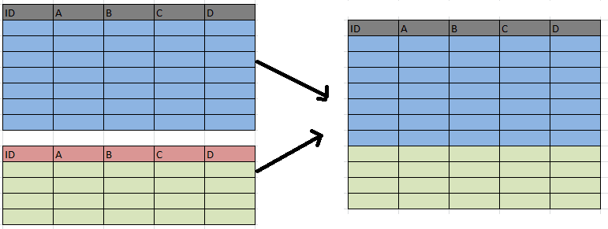
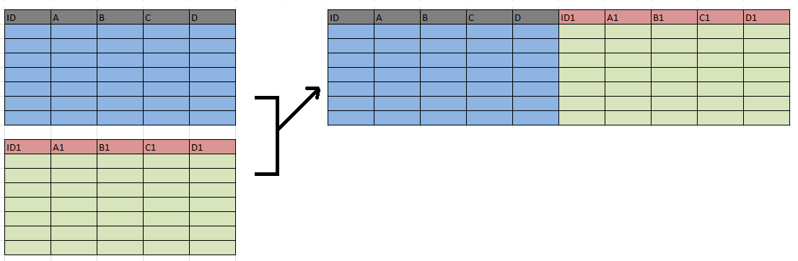

```{r setup, include=FALSE}
knitr::opts_chunk$set(echo = TRUE)
```

# R Matrix

Matrices are the R object where elements are organized in two-dimensional rectangular layouts with ***n*** columns and ***m*** rows.

Matrices are created from vectors, so they have the same limitation that all the datatypes must be the same. So `matrix()` is an atomic data structure.

Like numerical vectors, numerical matrices provide fast computation in mathematical calculations.

## Creating a Matrix

To create a matrix, you'll use the `matrix()` function. The matrix function takes the following parameters:

`matrix(data, mrow, ncol, byrow, dimnames)`

-   data - is the input vector which becomes the elements in the matrix cells
-   mrow - is the number of rows
-   ncol - is the number of columns
-   byrow - (Logical) If TRUE, then vector elements are arranged by row. Default is FALSE, and will assign by column.
-   dimnames - list of (rownames, colnames) to associate with Rows and Columns

```{r}
x = matrix(1:20, 4, 5)
print(x)
```

```{r}
x = matrix(1:20, 4, 5, byrow=TRUE)
print(x)
```

```{r}
x = matrix(1:20, 4, 5, byrow=TRUE, dimnames=list(c("row1", "row2", "row3", "row4"), c("col1", "col2", "col3", "col4", "col5")))
print(x)
```

## Accessing Elements of Matrix

Accessing the elements of the matrix are similar to Python Pandas, where you can access the value by using `[row, column]`.

```{r}
print(paste("Row1/Col1:", x[1,1]))
print(paste("Row2/Col1:", x[2,1]))

```

If you want to access a row, just leave the column value out, like`[row,]`

```{r}
x[2,]
```

If you want to access a column, just leave the row value out, like `[,col]`

```{r}
x[,3]
```

------------------------------------------------------------------------

## Matrix Computation

### Scalar Math

Scalar math works just like with vectors.

```{r}
x*2
```

### Vector Math

Similar to Vector on Vector math - a vector is replicated until it's as long or longer than the length of matrix elements and then applies it. If the vector isn't the same length as the number of elemnts or an exact multiple, then it'll warn you.

```{r}
x * c(1,2,3)
```

Note: It's being applied from top to bottom and then moving to the next column.

```{r}
x = matrix(1:20, 4, 5)
print(x)

x * c(1,2,3)
```

Note: It's being applied from top to bottom and then moving to the next column.

### Element-wise Matrix Math

If we have two matrices of the same size then we can perform computation using the two matrices.

```{r}
x = matrix(1:20, 4, 5)
print(x)

y = matrix(1:20, 4, 5, byrow=TRUE)
print(y)

print(x/y)
```

**Note**: The computation is done element-wise meaning the result for [1,1] is x[1,1] / y[1,1].

Matrices have to be the same dimensions. If they are different dimensions, you'll get an error

```{r eval=FALSE}
x = matrix(1:20, 5, 4)
print(x)

y = matrix(1:20, 4, 5, byrow=TRUE)
print(y)

print(x/y)
```

### Matrix Multiplication (%\*%)

If the number of columns in the first is equal to the number of rows in the second, you can perform perform Matrix Multiplication. The result will be a matrix with the same amount of rows as the first matrix and same number of columns in the second matrix.

```{r}
x = matrix(1:20, 4, 5)
print(x)

y = matrix(1:20, 5, 4, byrow=TRUE)
print(y)

z = x%*%y
print(z)
```

### Cross Product

To perform the cross-product of two matrices you can use the `crossprod()` function.

For further information on Matrix Math and Linear Algebra - please see <https://cran.r-project.org/doc/manuals/R-intro.pdf>

------------------------------------------------------------------------

# Building Matrices using rbind() or cbind()

We can bind columns or rows from multiple matrices to form new matrices. This topic is also applicable to data.frames which we'll discuss next.

## Merging Rows with rbind()

`rbind` or **row bind** is a function used to binde or combined multiple groups of rows together. Number of columns must match between datasets.

**Example**: `rbind(data1, data2)`



```{r}
print(y)

print(z)

rbind(y,z)
```

## Merging Columns with cbind()

`cbind` or **column bind** is a function used to bind or combined multiple groups of columns together. Number of rows must match between datasets.

**Example**: `cbind(data1, data2)`



```{r}
print(x)

print(z)

cbind(x,z)
```
