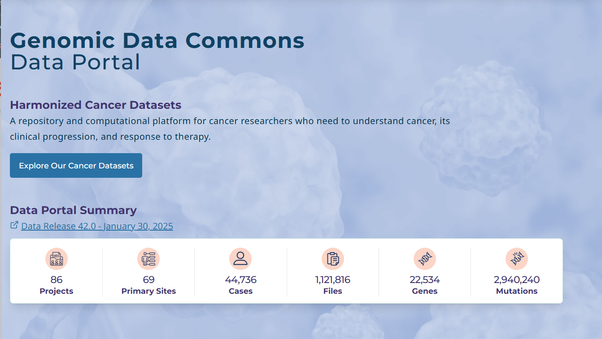
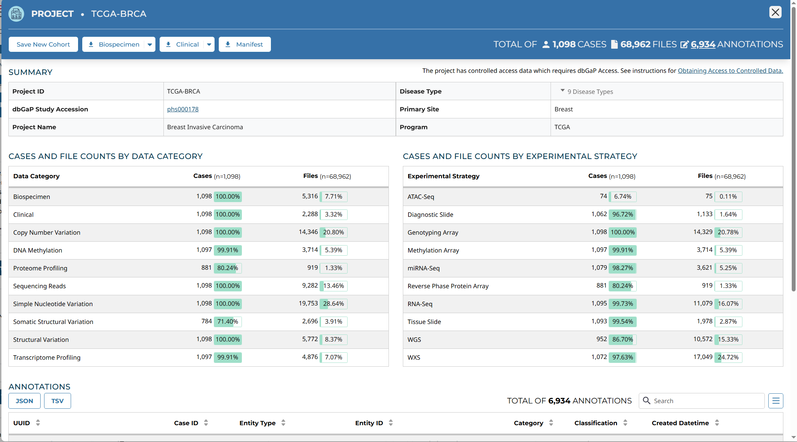

```{r setup, include=FALSE}
knitr::opts_chunk$set(echo = TRUE)
```

## Getting your Dataset for the following sections

We are going to work with some real datasets for the following Lessons. We'll be importing, cleaning, exploring, and plotting variables from the dataset.

Please feel free to use a dataset that you have or download the same one I'll be using for the class.

While we're going to go through the process of finding, downloading, importing a dataset from TCGA. Please note that there are R libraries that are specific for the task and provide ready access to the curated datasets. However, we want to work through the process so we can gain experience and knowledge of what we'll need to do when we are working on our own datasets.

## Getting Clinical Data from GDC Portal

The [Genomic Data Commons](https://portal.gdc.cancer.gov/) is a repository of harmonized cancer datasets that is available for researcher. The Data Commons provides the ability to search for data from different projects and cancer sites.



Select **Projects** from the top left menu bar. To search for the project you're interested in.

I'm going to be using data from the TCGA-BRCA project. There are multiple ways to narrow down your projects you'll be using. 1) If you know the project designation you could use any of the search bars. 2) If you want to narrow the projects by primary site, program, disease type.


Once, you've selected your Project. You should see a Project page



We're goint to select **Clinical** download button and select **TSV**. Which will download a file called **clinical.project-tcga-brca.2025-05-06.tar.gz** to your computer.

Once the file is downloaded to your local computer, we need to expand the gzipped tarball. You can do this either on your own machine, or we'll upload it to the Rstudio Server and do it there.

We're going to use the R function called `untar()` to expand our file and extract a single file called **clinical.tsv**

```{r}
#untar('clinical.project-tcga-brca.2025-05-06.tar.gz') will extract all the files
#pathology_detail.tsv
#follow_up.tsv
#family_history.tsv
#exposure.tsv
#clinical.tsv

untar('clinical.project-tcga-brca.2025-05-06.tar.gz', files='clinical.tsv')
```

Now, let's import the data and see what we have.

```{r}
library(tidyverse)
clinical = read_tsv('clinical.tsv')
head(clinical)
```

Look at all the rows, they're all `<chr>` class.

-   Why do you think they are being imported as `<chr>` ?

-   What can we do to fix that?

```{r error=False}

library(tidyverse)
clinical = read_tsv('clinical.tsv', ....)
head(clinical)
```

Is there anything else you notice about the data table?

We're going to focus on basic demographics information for now.

## Getting Column Names

```{r}
names(clinical)
```

## **Summary**

```{r}

summary(clinical)

```
