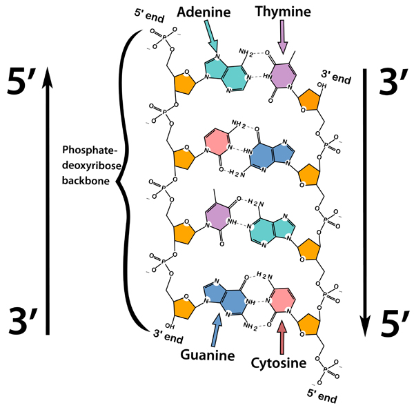

```{r setup, include=FALSE}
knitr::opts_chunk$set(echo = TRUE)
```

# R Week Review

-   **Commenting:** Comments start with `#`, the `#` mark can at any
    position on the line. Everything on the line after the `#` is
    considered a comment

-   **Variables:** Variables can be assigned in three ways. `=`, `<-`,
    or `->` . Variables start with alphabetic characters and can contain
    alphanumeric characters, and/or underscores. Variables names are
    case-sensitive.

    -   variable **=** value :

    -   variable **\<-** value

    -   value **-\>** variable

-   **Functions:** Functions in R are called with the function name
    followed directly by an opening parenthese **(** Then comes the
    arguments, and/or paramenters separated by commas and its completed
    with a closing parenthese **)**

    -   function name(options/parameters separated by commas)

-   **Printing with the `print` function:** If you want to print out a
    variable value or string, the print() function takes the variable or
    string

    -   `print(x) # This will print the value of x`

    -   `print("Hello World")  # Will print Hello World`

### Formatted Print

R provides a formatted print function called `sprintf()` that takes a
format string followed by values to fill in to the format string.
Parameters are separated with commas.

```{r}
apple_cnt = 10
name = "Billy"
sprintf("%s has %s apples.", name, apple_cnt)
```

#### sprintf C-Style Format Characters

`sprintf` is a C-style string formatting function that allows you to
format numbers to display properly- (ie Significant Digits, or
Scientific Notation)

| Notation | Description                                             |
|----------|---------------------------------------------------------|
| %s       | a string                                                |
| %d       | an integer                                              |
| %0xd     | an integer padded with x leading zeros                  |
| %f       | decimal notation with six decimals                      |
| %.xf     | floating point number with x digits after decimal point |
| %e       | compact scientific notation, e in the exponent          |
| %E       | compact scientific notation, E in the exponent          |
| %g       | compact decimal or scientific notation (with e)         |
| %o       | integer in octal form                                   |
| %x       | Integer in hexadecimal form                             |

```{r, collapse=TRUE}

y = sprintf("Mean: %s", 1.223223)  # As an string
print(y)
y = sprintf("Mean: %d", 2)  # As an Integer
print(y)
y = sprintf("Mean: %03d", 2) # As an Integer with 3 Padded Zeros
print(y)
y = sprintf("Mean: %f", 1.223223) # As a floting point number
print(y)
y = sprintf("Mean: %.03f", 1.223223)  # As a floating point number with 3 digits after decimal point
print(y)
y = sprintf("Mean: %e", 0.000123213)  # As a floating point in compact scientific 'e' notation
print(y)
y = sprintf("Mean: %E", 0.000232212) # As a floating point in compact scientific 'E' notation
print(y)
y = sprintf("Mean: %g", 0.0230123) # Compact decimal or scientific notation with 'e'
print(y)
y = sprintf("Mean: %o", 20)
print(y)

```

We'll see alot more on this in the sections about Character/String
Datatypes

------------------------------------------------------------------------

## I. Atomic Datatypes

Datatypes are a fundamental concept in programming. Computer's work on
binary switches, so everything in RAM, CPU, HDD is composed of **0,1**

For example, the binary value **01100001** has different meaning
depending on the type of data. If it represents an integer, then it has
a value of **97**, but if it's a character/string it's an **a.**
Programming languages assign a data type to the data, which determines
how the data is represented.

### Datatypes

R has six basic fundamental datatypes. These are single instances of
fundamental computer datatypes stored in memory.

+-------------------------------+-------------------------------+
| R Datatype                    | Description                   |
+===============================+===============================+
| **Complex**                   | Set of all the complex        |
|                               | numbers (9+2i, where i is the |
|                               | imaginary part)               |
+-------------------------------+-------------------------------+
| **Raw**                       | Byte encoded                  |
+-------------------------------+-------------------------------+
| **Logical (aka Boolean)**     | Logical/Boolean either TRUE   |
|                               | or FALSE                      |
+-------------------------------+-------------------------------+
| **Numeric**                   | Decimal values are called     |
|                               | numeric in R. It is the       |
|                               | default R data type for       |
|                               | numbers in R. Example: 10.4,  |
|                               | 55, 78.121E-2                 |
+-------------------------------+-------------------------------+
| **Integer**                   | Integer data types which are  |
|                               | the set of all integers.      |
|                               | (Must have suffix `L`)        |
|                               | Example: 10L, 1L, 55L         |
+-------------------------------+-------------------------------+
| **Character (aka String)**    | Alphabet and Special          |
|                               | Characters (ASCII) Example:   |
|                               | "Hello", "World"              |
+-------------------------------+-------------------------------+

### Helpful Functions to determine datatypes and classes

R has functions that returns specific attributes about the datatype of
data.

| Function       | Description                                     |
|----------------|-------------------------------------------------|
| class ()       | Returns type of container of an object          |
| mode()         | Returns how the object is stored in memory      |
| typeof()       | Returns type of object that is in the container |
| is.numeric()   | Returns TRUE if type is `numeric`               |
| is.logical()   | Returns TRUE if type is `logical`               |
| is.complex()   | Returns TRUE if type is `complex`               |
| is.integer()   | Returns TRUE if type is `integer`               |
| is.raw()       | Returns TRUE if type is `raw`                   |
| is.character() | Returns TRUE if type is `character`             |

: Let's look at some different Datatypes and use the these functions.

------------------------------------------------------------------------

### A. Complex

```{r, collapse=TRUE}
x <-1i
print(paste("CLASS:", class(x)))
print(paste("MODE:", mode(x)))
print(paste("TYPEOF:", typeof(x)))
print(paste("IS.NUMERIC:", is.numeric(x)))
print(paste("IS.LOGICAL:", is.logical(x)))
print(paste("IS.COMPLEX:", is.complex(x)))
print(paste("IS.INTEGER:", is.integer(x)))
print(paste("IS.RAW:", is.raw(x)))
print(paste("IS.CHARACTER:", is.character(x)))
```

### B. Raw

```{r, collapse=TRUE}
x <-raw(1)
print(paste("CLASS:", class(x)))
print(paste("MODE:", mode(x)))
print(paste("TYPEOF:", typeof(x)))
print(paste("IS.NUMERIC:", is.numeric(x)))
print(paste("IS.LOGICAL:", is.logical(x)))
print(paste("IS.COMPLEX:", is.complex(x)))
print(paste("IS.INTEGER:", is.integer(x)))
print(paste("IS.RAW:", is.raw(x)))
print(paste("IS.CHARACTER:", is.character(x)))
```

------------------------------------------------------------------------

### C. Logical

Boolean/Logical types are binary TRUE or FALSE. Typically, used in
conditionals.

**Note**: Boolean in R are represented as `TRUE` is true and `FALSE` is
false. It must be all caps.

```{r, error=TRUE, collapse=TRUE}
TRUE
FALSE

true
false

True
False
```

**Note:** If you use non-capital `true` or `false` - R interprets these
as variable names and not `TRUE` or `FALSE`

There's one additional **Logical** value. In R, there is a Logical value
that is equivalent to `None` - it is `NA`, which stands for **Not
Available.**

```{r}
x = NA
print(x)
```

```{r, collapse=TRUE}
x <-TRUE
print(paste("CLASS:", class(x)))
print(paste("MODE:", mode(x)))
print(paste("TYPEOF:", typeof(x)))
print(paste("IS.NUMERIC:", is.numeric(x)))
print(paste("IS.LOGICAL:", is.logical(x)))
print(paste("IS.COMPLEX:", is.complex(x)))
print(paste("IS.INTEGER:", is.integer(x)))
print(paste("IS.RAW:", is.raw(x)))
print(paste("IS.CHARACTER:", is.character(x)))
```

Since **NA** is a special case, there are some specific functions for
it.

-   `is.na()` - Returns TRUE or FALSE if the value is NA
-   `anyNA()` - Returns TRUE or FALSE if any value is NA

```{r}
y = NA
print(paste("CLASS:", class(y)))
print(paste("MODE:", mode(y)))
print(paste("TYPEOF:", typeof(y)))
print(paste("IS.NA:", is.na(y)))
print(paste("anyNA:", anyNA(y)))
print(paste("IS.NUMERIC:", is.numeric(y)))
print(paste("IS.LOGICAL:", is.logical(y)))
print(paste("IS.COMPLEX:", is.complex(y)))
print(paste("IS.INTEGER:", is.integer(y)))
print(paste("IS.RAW:", is.raw(y)))
print(paste("IS.CHARACTER:", is.character(y)))
```

#### Comparison Operators

| Operator | Name                     | Example  |
|----------|--------------------------|----------|
| ==       | Equal                    | x == y   |
| !=       | Not Equal                | x != y   |
| \>       | Greater Than             | x \> y   |
| \<       | Less Than                | x \< y   |
| \>=      | Greater Than or Equal To | x \>= y  |
| \<=      | Less Than or Equal To    | x \< = y |

```{r}
x = 10
y = 11

sprintf("Is X Equal to Y: %s", x==y)
sprintf("Is X Not Equal to Y: %s", x!=y)
sprintf("Is X Greater Than Y: %s", x>y)
sprintf("Is X Less Than Y: %s", x<y)
sprintf("Is X Greater Than or Equal to Y: %s", x>=y)
sprintf("Is X Less Than or Equal to Y: %s", x<=y)
```

+------------+------------+------------+------------------------------+
| Operator   | Name       | D          | Example                      |
|            |            | escription |                              |
+============+============+============+==============================+
| &          | E          | Returns    | `c( TR                       |
|            | l          | True if    |  U E,  F AL SE ,  T R  UE)   |
|            | ement-wise | both       |  &  c(FALSE  , T RUE, TRUE)` |
|            | AND        | elements   |                              |
|            | operator   | are TRUE   | Returns:                     |
|            |            |            | `FALSE  , F ALSE, TRUE`      |
+------------+------------+------------+------------------------------+
| &&         | AND        | Returns    | TRUE & TRUE Returns TRUE     |
|            | operator   | TRUE if    |                              |
|            |            | both       | TRUE & FALSE Returns FALSE   |
|            |            | statements |                              |
|            |            | are TRUE   | FALSE & TRUE Returns FALSE   |
+------------+------------+------------+------------------------------+
| \|         | E          | Returns    | `c( TR                       |
|            | l          | TRUE if    |  U E,  F AL SE ,  T R  UE)   |
|            | ement-wise | one or     |  &  c(FALSE  , T RUE, TRUE)` |
|            | OR         | more       |                              |
|            | operator   | element is | Returns:                     |
|            |            | TRUE       | `TR UE , TRUE, TRUE`         |
+------------+------------+------------+------------------------------+
| \|\|       | OR         | Returns    | TRUE & TRUE Returns TRUE     |
|            | operator   | TRUE if at |                              |
|            |            | least one  | TRUE & FALSE Returns TRUE    |
|            |            | statement  |                              |
|            |            | is TRUE    | FALSE & TRUE Returns TRUE    |
+------------+------------+------------+------------------------------+
| !          | Logical    | Negates    | ! FALSE Returns TRUE         |
|            | NOT        | any        |                              |
|            |            | statment:  | ! TRUE Returns FALSE         |
|            |            | Returns    |                              |
|            |            | TRUE if    |                              |
|            |            | statement  |                              |
|            |            | is FALSE   |                              |
|            |            | and vice   |                              |
|            |            | versa      |                              |
+------------+------------+------------+------------------------------+

------------------------------------------------------------------------

### D. Numeric

Decimal values are called numeric in R. It is the default R datatype for
numbers in R.

Real numbers with a decimal point are represented using this data type
in R. It uses a format for double-precision floating-point numbers to
represent numerical values.

Any value 1, 2, 2.544, 1E123 is evaluated as a Numeric datatype

```{r, collapse=TRUE}
1
3
2.53
2.23E-2
```

Remember Numerics are essentially floating point numbers. Meaning, that
there is a limited precision the numbers can store and when comparing
numbers, we need to beware of imprecision.

```{r}
x = 3.223423234E-10 * 10.0
print(x)

# Comparison 
print(x==3.223423234E-9)

```

In R, a Numeric can be also be (*NaN*, *Inf*, *-Inf*).

-   **NaN** - Not a Number
-   **Inf** - Infinite (positive)
-   **-Inf** - Infinite (negative)

```{r, collapse=TRUE}
x <- 1.0
print(paste("CLASS:", class(x)))
print(paste("MODE:", mode(x)))
print(paste("TYPEOF:", typeof(x)))
print(paste("IS.NUMERIC:", is.numeric(x)))
print(paste("IS.LOGICAL:", is.logical(x)))
print(paste("IS.COMPLEX:", is.complex(x)))
print(paste("IS.INTEGER:", is.integer(x)))
print(paste("IS.RAW:", is.raw(x)))
print(paste("IS.CHARACTER:", is.character(x)))
```

Because there are 3 special cases for numeric, there are also functions
to handle these.

-   is.finite() - Return True if value is not NaN, Inf, -Inf, or NA
-   is.infinite() - Returns True if value is Inf or -Inf
-   is.nan() - Returns True if value is NaN

**Finite Numbers**

```{r}
x = 1.0
print(is.infinite(x))
print(is.finite(x))
```

**Infinite Numbers**

```{r}
x = Inf
y = -Inf
print(is.infinite(x))
print(is.infinite(y))
print(is.nan(x))
```

**Not a Number**

```{r}
x = NaN
print(is.nan(x))
```

------------------------------------------------------------------------

### E. Integer

R supports integer data types which are the set of all integers. If you
want an integer, you'll need to need to add the `L` suffix

```{r}
10L
```

```{r, collapse=TRUE}
x <-2L
print(paste("CLASS:", class(x)))
print(paste("MODE:", mode(x)))
print(paste("TYPEOF:", typeof(x)))
print(paste("IS.NUMERIC:", is.numeric(x)))
print(paste("IS.LOGICAL:", is.logical(x)))
print(paste("IS.COMPLEX:", is.complex(x)))
print(paste("IS.INTEGER:", is.integer(x)))
print(paste("IS.RAW:", is.raw(x)))
print(paste("IS.CHARACTER:", is.character(x)))
```

------------------------------------------------------------------------

#### Numerical Datatype Arithmetic

R provides a set of standard arithmetic operators to do basic math.

#### Basic Arithmetic Operators

| R Operator | Name             |
|------------|------------------|
| \+         | Addition         |
| \-         | Subtraction      |
| \*         | Multiplication   |
| /          | Division         |
| \^         | Exponent/Power   |
| %%         | Modulus          |
| %/%        | Integer Division |
| sqrt()     | Square root      |
| abs()      | Absolute Value   |

```{r, collapse=TRUE}
x <- 124
print(paste("Addition:", x+5))
print(paste("Subtraction", x-324))
print(paste("Multiplication:", x*0.2421))
print(paste("Division:", x/21))
print(paste("Exponent/Power:", x^0.5))
print(paste("Modulus:", x%%21))
print(paste("Integer Division:", x%/%21))

print(paste("Grouping:", 2*(x+12)))
print(paste("Different Grouping:", (2*x)+12))
print(paste("Without Grouping:", 2*x+12))
```

#### Grouping for Precedence

If you need to group operations for precedence, you can use parentheses
`(` and `)`.

```{r, collapse=TRUE}
print(paste("Grouping:", 2*(x+12)))
print(paste("Different Grouping:", (2*x)+12))
print(paste("Without Grouping:", 2*x+12))
```

------------------------------------------------------------------------

### F. Character

R supports character data types where you have all the alphabets and
special characters. It stores character values or strings. Strings in R
can contain alphabets, numbers, and symbols.\
The easiest way to denote that a value is of character type in R data
type is to wrap the value inside single or double quotes. 

'string"

"sdd'

```{r, collapse=TRUE}
'string'
"String"

'string"
"sdd'
```

```{r, collapse=TRUE}
x = "A"
print(paste("CLASS:", class(x)))
print(paste("MODE:", mode(x)))
print(paste("TYPEOF:", typeof(x)))
print(paste("IS.NUMERIC:", is.numeric(x)))
print(paste("IS.LOGICAL:", is.logical(x)))
print(paste("IS.COMPLEX:", is.complex(x)))
print(paste("IS.INTEGER:", is.integer(x)))
print(paste("IS.RAW:", is.raw(x)))
print(paste("IS.CHARACTER:", is.character(x)))
```

## II. Casting or Changing Datatypes

Sometimes, you need to convert from one Datatype to another. The process
of converting datatypes is also called **casting**

R has a an `as.<type>` function that will attempt to cast/change a
variable from it's current datatype to the `type` specified.

| Function       | Description                |
|----------------|----------------------------|
| as.numeric()   | Coerce data to `numeric`   |
| as.logical()   | Coerce data to `logical`   |
| as.complex()   | Coerce data to `complex`   |
| as.integer()   | Coerce data to `integer`   |
| as.raw()       | Coerce data to `raw`       |
| as.character() | Coerce data to `character` |

#### Casting Numerical

```{r, collapse=TRUE}
x <- 1.0
y = as.logical(x)
print(paste("AS LOGICAL:", y))

y = as.complex(x)
print(paste("AS COMPLEX:", y))

y = as.integer(x)
print(paste("AS INTEGER:", y))

y = as.raw(x)
print(paste("AS RAW:", y))

y = as.character(x)
print(paste("AS CHARACTER:", y))

```

#### Casting Boolean

```{r, collapse=TRUE}
x <- FALSE
y = as.numeric(x)
print(paste("AS LOGICAL:", y))

y = as.complex(x)
print(paste("AS COMPLEX:", y))

y = as.integer(x)
print(paste("AS INTEGER:", y))

y = as.raw(x)
print(paste("AS RAW:", y))

y = as.character(x)
print(paste("AS CHARACTER:", y))

```

#### Casting Character

```{r, collapse=TRUE}
x <- "Hello"
y = as.logical(x)
print(paste("AS LOGICAL:", y))

y = as.complex(x)
print(paste("AS COMPLEX:", y))

y = as.integer(x)
print(paste("AS INTEGER:", y))

y = as.raw(x)
print(paste("AS RAW:", y))

y = as.numeric(x)
print(paste("AS NUMERIC:", y))

```

#### Casting Numerical

```{r, collapse=TRUE}
x <- "1.25"
y = as.logical(x)
print(paste("AS LOGICAL:", y))

y = as.complex(x)
print(paste("AS COMPLEX:", y))

y = as.integer(x)
print(paste("AS INTEGER:", y))

y = as.raw(x)
print(paste("AS RAW:", y))

y = as.numeric(x)
print(paste("AS NUMERIC:", y))

```

------------------------------------------------------------------------

## III. More Indepth Look at Characters and Strings

### R is 1-based

Well, R is one of the few languages that is **1-based**. So, the first
position in a string is 1 not 0 like in many other programming
languages. This is an important point to remember, because it's a
fundamental difference. When we learn about vectors, lists, and other
datatypes - you'll need to remember that **R is 1-based** not 0-based.

### Character String Functions

Some of the most useful character/string function in R.

+------------------------+--------------------------------------+
| R Function             | Description                          |
+========================+======================================+
| print()                | Print its arguments                  |
+------------------------+--------------------------------------+
| paste()                | Concatenate String                   |
+------------------------+--------------------------------------+
| sprintf()              | C-style format a string              |
+------------------------+--------------------------------------+
| substr(x, start, stop) | Get Substring                        |
+------------------------+--------------------------------------+
| nchar(x)               | Get String Length                    |
+------------------------+--------------------------------------+
| sub(pattern,           | Replace substring with               |
| replacment, x)         |                                      |
+------------------------+--------------------------------------+
| tolower()              | Convert string to lowercase          |
+------------------------+--------------------------------------+
| toupper()              | Convert string to uppercase          |
+------------------------+--------------------------------------+
| trimws()               | Strip whitespace characters          |
+------------------------+--------------------------------------+
| strrep()               | Repeat string n times                |
+------------------------+--------------------------------------+
| strsplit()             | Split up string                      |
+------------------------+--------------------------------------+
| chartr()               | Translate characters in characters   |
|                        | string                               |
+------------------------+--------------------------------------+

Here's some example code to show the basic built-in functions.

```{r, collapse=TRUE}
x = " Hello World! How are you? "
print(x)
```

**Paste**

```{r}
print(paste("Pasting:", 1.45, "and other text"))  # Concatenating a number
```

**Substring**

```{r}
y = substr(x,1,10)
print(paste("Substring:", y))
```

**Number of Characters (nchar)**

```{r}
print(paste("x is", nchar(x), "characters long."))
```

**Uppercase and Lowercase**

```{r}
print(paste("Lowercase:", tolower(x)))
print(paste("Uppercase:", toupper(x)))
```

**Trim Whitespace**

```{r}
print(paste("Trim Whitespace:", trimws(x), sep=""))
```

**Repeat String**

```{r}
print(paste("Repeated String:", strrep('ABC,', 10)))

```

**Split String**

```{r}
print(paste("Split String:", strsplit(x, " ")))  #Notice its outputting a Vector here

y =  strsplit(x, " ")

print(paste("Class:", class(y), ",Mode:", mode(y), ",Typeof:", typeof(y)))

print(y)
```

Notice that we get a *Class:*`list`. We'll discuss what a `list` is
upcoming sections.

### **Translate Characters**

In this example, we'll change all the lower-case vowels to uppercase.

```{r}
print(chartr("aeiou", "AEIOU",x))
```

------------------------------------------------------------------------

------------------------------------------------------------------------

## Getting Reverse Complement of DNA in R

DNA is has two complementary strands: one runs from the 5' -\> 3' and
the other runs 3' -\>5'.



The first completed sequence of the whole Human genome was completed in
2004. It was composed of 25 contigs (continuous stretches of DNA. ie
Chromosomes: Autosomes 1 to 22, the Mitochondria DNA, and Sex
chromosomes (X,Y). To save space, a choice was made to only distribute
the 5' to 3' strand in a computer format called FASTA. The data from the
3' to 5' wasn't lost - because it was just the complement of the 5' to
3' strand in reverse.

If a gene's coding sequence starts on 5' to 3' strand with an **ATG**
then it's easy to find and you can pass it to function that parse the
coding regions. If you didn't take the reverse complement of the
sequence it'd mean you had to have a separate programs and models to
detect genes on the reverse strand. For example you'd to rewrite your
complete programs to look for a CAT and then work in the backward.

It's much easier and quicker to just take the reverse complement of the
DNA/RNA sequence. To reverse complement DNA/RNA, we need to:

1.  **Change the characters (ie Complement the DNA/RNA Sequence)**

    -   DNA: ACGT -\> TGCA

    -   RNA: ACGU -\> UGCA

2.  **Reverse the order of the characters in the string**

#### 1. Complement the Sequence

To complement the sequence, we can do it all at the same time using
`chartr`

```{r}
dna <- 'ACGTTTAC'
complement = chartr("ACGT", "TGCA", dna) 
print(complement)
```

#### 2. Reverse the Sequence

Without `stringi` package, we'd need to split the string into it's
individual characters and then reverse the vector of character and then
combine them together again.

```{r}
dna_split = strsplit(complement, "")[[1]]  # Split up into vector of individual characters
reversed = rev(dna_split) # Reverse the order of the vector
rev_comp = paste(reversed, collapse="")  # Concatenate the characters with no spaces
print(rev_comp)
```

------------------------------------------------------------------------

## Extending Base String Functionality (Package: stringi and/or stringr)

However, using `stringi` library, we can perform the operation in a
single command

```{r}
library(stringi)
rev_comp = stri_reverse(complement)
print(rev_comp)
```

[Stringi
Vignette](https://stringi.gagolewski.com/_static/vignette/stringi.pdf)

------------------------------------------------------------------------

# Importing FASTA File in R using seqinr

[SeqinR](https://cran.r-project.org/web/packages/seqinr/refman/seqinr.html)
is a small library in R that allows you to easily import a FASTA file
sequence file.

```{r}
install.packages("seqinr", repos = "http://cran.us.r-project.org")
```

#### Importing FASTA File

```         
>Example Fasta
NNNNNNNNNNNNNNNNNNNNNNNNNNNNNNNNNNNNNNNNNNNNNNNNNNNNNNNNNNNNNNNNNNNNNNNNNNNNNNNNNNNNNNNNNNNNNNNNNNNNNNNNNNNAAAAAAACCCCCCCCCCCGGGGGGGGGGGGGGGGGTTTTTTTTTTTTTTTTTTTTTTTTTNNNNNNNNNNN
```

To read a Fasta file we can first load seqinr and then use the
`read.fasta()` function. For the file, don't forget to use the correct
path to the sequence.

```{r}
library(seqinr)
my_fasta <- read.fasta(file = "~/D43_Unix/Genomics/chr20.fa", seqtype = "DNA", as.string = TRUE)
```

Let's look at the data - Look at the Environment Window, you'll see that
Data has been loaded `my_fasta` which is a Large list of 63MB.

If you click on 'my_fasta' in the Environment Window, it'll bring up a
viewing window. It looks like it's a named List.

There are many additional function in `seqinr`.

+------------+---------------------------------------------------------+
| Function   | Description                                             |
+============+=========================================================+
| getLength( | Returns the total length of the Fasta sequence          |
| )          |                                                         |
+------------+---------------------------------------------------------+
| getName()  | Return the sequence names                               |
+------------+---------------------------------------------------------+
| s2c()      | Convert the Sequence String to a Vector of single       |
|            | characters                                              |
+------------+---------------------------------------------------------+
| c2s()      | Convert the character Vector to String                  |
+------------+---------------------------------------------------------+

: SeqInR Functions

```{r}

print(getLength(my_fasta))  # Get length of sequence(s)
print(getName(my_fasta))    # Get Name of sequence(s)

fasta_string = getSequence(my_fasta[[1]], as.string=TRUE)  #Get the sequence
fasta_substring = substr(fasta_string, 1000000, 1000100)# Extract substring
print(fasta_substring)
```

```{r}
dna_seq = s2c(fasta_substring)
rev_comp = rev(comp(dna_seq))
c2s(rev_comp)

```

Creating a dotplot comparing the two sequences,

```{r}
dotPlot(dna_seq, rev_comp)
```

------------------------------------------------------------------------

# Stringr

In addition to working with Unicode and International encoded text,
`stringr` also provides equivalent functions to the R-base character
functions and provides many additional functions.

Let's take a look a `stringr` library.


-   [Stringr
    Cheatsheet](https://github.com/rstudio/cheatsheets/blob/main/strings.pdf)

### Detecting Matches

The patterns below can be a simple text match or more complex regular
expressions.

Remember, we briefly discussed Regular Expressions in Unix. They are a
way to search or match different text patterns. (The second page of
Stringr Cheatsheet is dedicated to Regular Expressions) .

+-------------------------------+-------------------------------+
| Functions                     | Description                   |
+===============================+===============================+
| str_detect(x, pattern,        | Detect the presence of a      |
| negate=FALSE)                 | pattern. Returns Boolean      |
+-------------------------------+-------------------------------+
| str_starts(x, pattern,        | Detect the presence of a      |
| negate=FALSE)                 | pattern at the beginning of   |
|                               | string                        |
+-------------------------------+-------------------------------+
| str_ends(x, pattern,          | Detect the presence of a      |
| negate=FALSE)                 | pattern at the ending of      |
|                               | string                        |
+-------------------------------+-------------------------------+
| str_which(x, pattern,         | Find the indexes of strings   |
| negate=FALSE)                 | that contain a pattern match  |
+-------------------------------+-------------------------------+
| str_locate(x, pattern)        | Locate the first position of  |
|                               | pattern matches in a string   |
+-------------------------------+-------------------------------+
| str_locate_all(x, pattern)    | Locate the all positions of   |
|                               | pattern matches in a string   |
+-------------------------------+-------------------------------+
| str_count(x, pattern)         | Count the number of matches   |
|                               | in a string                   |
+-------------------------------+-------------------------------+

```{r, collape=TRUE}
#install.packages("stringr")
library(stringr)
dna = "ttcccagcacagaggaaaaggtagatctgaatgctgaacccctatatggaagaagaaaac
tgaacaaacagaaattgtcatgctctgagagccctgaggatccccaagagatgacttgga
tgacttcgaagagtagcctacagaaagttaatgattggttttctagaagtgatgatgtat
taacttctgatgatttccatgacgaagggtctaattcaaatacaaaagctgaggcggaag
aaatcccaagtgcagcagatggggtttttgtttcttcagagannnnnnnnnnnnnnnnnn
nnnnnnnnnnnnnnnnnnnnnnnnnnnnnnnnnnnnnnnnnnnnnnnnnnnnngtagaga
gtagcattgaagataaaatatttgggaaaacttatcggaggaaagcaagcttcgctaact
tgaactgcacaactgaagatgtaactctagaatcatctctactagaaccgcatatggcac
acaaacaccccttcacaaataaattaaaacgtaaaagaattacatcaagccttggtcctg
aggattttataaagaaagtagatttggcggttgttgttcaaaagtctcctgaaaagaaaa
tcgagaggctcaaccaaatggatcaaaatggtcaggtggtgaatactacta"

print(str_detect(dna, 'ttcc'))
print(str_detect(dna, 'n'))
```

```{r, collape=TRUE}
print(str_starts(dna, 'ttcc'))
print(str_ends(dna, 'acta'))
```

```{r, collape=TRUE}
print(str_which(dna,'ggg'))
```

```{r, collape=TRUE}
print(str_locate(dna,'ggg'))
```

```{r, collape=TRUE}
print(str_locate_all(dna,'ggg'))
```

```{r, collape=TRUE}
print(str_count(dna, 'a'))
print(str_count(dna, 'g'))
```

### Subsetting & Extracting Matching Strings

+-------------------------------+-------------------------------+
| Functions                     | Description                   |
+===============================+===============================+
| str_sub(x, start, end)        | Extract substring             |
+-------------------------------+-------------------------------+
| str_subset(x, pattern,        | Return string that contains a |
| negate=FALSE)                 | match                         |
+-------------------------------+-------------------------------+
| str_extract(x, pattern)       | Return first match found in   |
|                               | each string                   |
+-------------------------------+-------------------------------+
| str_extract_all(x, pattern)   | Return every match found in   |
|                               | each string                   |
+-------------------------------+-------------------------------+
| str_match(x, pattern)         | Locate the first match found  |
|                               | in each string as matrix      |
+-------------------------------+-------------------------------+
| str_match_all(x, pattern)     | Locate the all matches found  |
|                               | in each string as matrix      |
+-------------------------------+-------------------------------+

```{r, collape=TRUE}
print(str_sub(dna, 0,100))
print(str_subset(dna, 'ttc'))
print(str_extract(dna, 'ttcg'))
print(str_extract_all(dna, 'ttcg'))
print(str_match(dna, 'ttcg'))
print(str_match_all(dna, 'ttcg'))
```

### Mutate Strings

+-------------------------------+-------------------------------+
| Functions                     | Description                   |
+===============================+===============================+
| str_sub()\<-value             | Identify with str_sub then    |
|                               | replace                       |
+-------------------------------+-------------------------------+
| str_replace(string, pattern,  | Replace the first match in    |
| replacement)                  | string                        |
+-------------------------------+-------------------------------+
| str_replace_all(string,       | Replace all matches in string |
| pattern, replacement)         |                               |
+-------------------------------+-------------------------------+
| str_remove(string, pattern)   | Remove first match in string  |
+-------------------------------+-------------------------------+
| str_remove_all(string,        | Remove all matches in string  |
| pattern)                      |                               |
+-------------------------------+-------------------------------+
| str_to_lower(string)          | Convert string to uppercase   |
+-------------------------------+-------------------------------+
| str_to_upper(string)          | Convert string to lowercase   |
+-------------------------------+-------------------------------+
| str_to_title(string)          | Convert string to camelcase   |
+-------------------------------+-------------------------------+

```{r}
x = "Hello World"
str_sub(x,1,5)<-'goodbye'
print(paste("str_sub:", x))
print(paste("str_replace:", str_replace(x,'o','e')))
print(paste("str_replace_all", str_replace_all(x,'o','e')))
print(paste("str_remove:", str_remove(x,'o')))
print(paste("str_remove_all:", str_remove_all(x,'o')))
print(paste("str_to_upper:", str_to_upper(x)))
print(paste("str_to_lower:", str_to_lower(x)))
print(paste("str_to_title:", str_to_title(x)))
```

### Join and Split Strings

+-------------------------------+-------------------------------+
| Functions                     | Description                   |
+===============================+===============================+
| str_c(..., sep="",            | Combines multiple strings to  |
| collapse=NULL)                | a single string (like paste0) |
+-------------------------------+-------------------------------+
| str_flatten(string, pattern,  | Combined multiple strings to  |
| replacement)                  | a single string               |
+-------------------------------+-------------------------------+
| str_dup(string,n)             | Repeat string n times         |
+-------------------------------+-------------------------------+
| str_unique(string)            | Remove duplicate strings      |
+-------------------------------+-------------------------------+
| str_split_fixed(string,       | Split vector of strings into  |
| pattern)                      | matrix of strings             |
+-------------------------------+-------------------------------+
| str_split(string)             | Return a list of substrings   |
+-------------------------------+-------------------------------+
| str_glue(string)              | Creates a string from string  |
|                               | and expressions               |
+-------------------------------+-------------------------------+

```{r}
print(str_c("Letter: ", letters))
print(str_flatten(letters, "-"))
print(str_dup("apple", 2))
print(str_unique(c("a", "b", "c", "b", "a")))
print(str_split_fixed("apple", "", 4))
print(str_split("apple", ""))

name = "Paul"
print(str_glue("My name is {name}, not {{name}}."))
```

------------------------------------------------------------------------

The actual percentage of G and C in sequence can greatly influence the
sequence stability, gene expression, and genome function. For this next
assignment, you'll be required to calculate the GC percentage of a DNA
sequence.

# Assignment 1: Calculate the GC Percentage of DNA Sequence

The percentage of Guanine and Cytosine in DNA or RNA significantly
impacts it's molecular stability, shape, and function.

$$
GCpercent=(\sum G +C)/\sum A + C+ G+T
$$

Using the R string functions (I'd encourage you to use the `stringr`
library), calculate the GC percentage for the following DNA sequence. Be
certain to exclude all ambiguous nucleotides.

```{r}
library(stringr)
dna = "ttcccagcacagaggaaaaggtagatctgaatgctgaacccctatatggaagaagaaaac
tgaacaaacagaaattgtcatgctctgagagccctgaggatccccaagagatgacttgga
tgacttcgaagagtagcctacagaaagttaatgattggttttctagaagtgatgatgtat
taacttctgatgatttccatgacgaagggtctaattcaaatacaaaagctgaggcggaag
aaatcccaagtgcagcagatggggtttttgtttcttcagagannnnnnnnnnnnnnnnnn
nnnnnnnnnnnnnnnnnnnnnnnnnnnnnnnnnnnnnnnnnnnnnnnnnnnnngtagaga
gtagcattgaagataaaatatttgggaaaacttatcggaggaaagcaagcttcgctaact
tgaactgcacaactgaagatgtaactctagaatcatctctactagaaccgcatatggcac
acaaacaccccttcacaaataaattaaaacgtaaaagaattacatcaagccttggtcctg
aggattttataaagaaagtagatttggcggttgttgttcaaaagtctcctgaaaagaaaa
tcgagaggctcaaccaaatggatcaaaatggtcaggtggtgaatactacta"

```

------------------------------------------------------------------------
