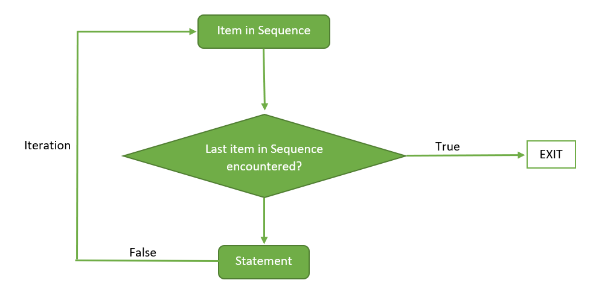
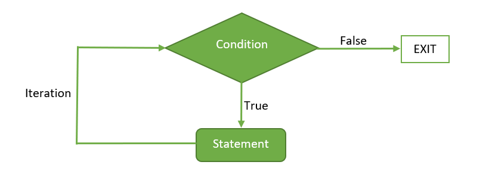
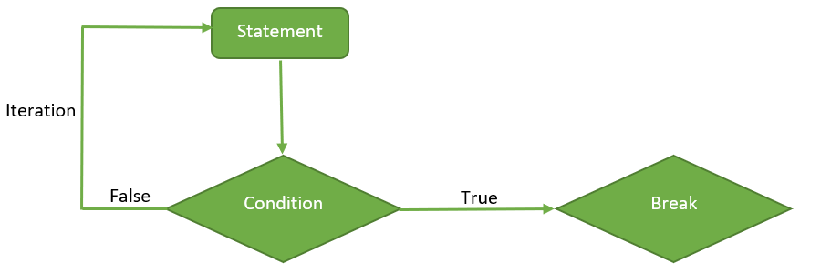

```{r setup, include=FALSE}
knitr::opts_chunk$set(echo = TRUE)
```

## R Loops

R has three different types of loops.

1.  **For** Loop - Iterate over a range of values

2.  **While** Loop - If a conditional evaluates as TRUE, then process a
    code block and repeat

3.  **Repeat** Loop - Repeat over a block of code until a `break` is
    executed.

------------------------------------------------------------------------

## Loop Modifiers:

`break`: Break exits the loop

`next`: Proceeds directly to the next iteration

Loop modifiers allow you to either exit out of the loop or proceed to
the next iteration of the loop.

------------------------------------------------------------------------

## For Loop

The `for` loop syntax starts with `for` , followed by an iteration
statement which consists of `(variable in sequence)` Then followed by a
code block (ie block of code we want to run a set number of times. The
code block is defined between curly brackets `{}` .

#### Syntax:

```         
for (var in sequence){
  <code>
}
```



### Examples:

**Sequence**

```{r}
1:10
```

```{r}
for (i in 1:10){
  print(i)  # Not the value of i gets changed each time through the for loop
}

print("Then End")
```

```{r}
for (i in seq(1,10,2)){
  print(i)
}
```

**Vector**

```{r}
x <- c('A', 'B', 'C')
for (i in x){
  print(i)
}
```

If you want to get the indices instead of the value, you can use
`seq_along(x)` function, which will create a vector of indices for `x`

```{r}
x <- c('A', 'B', 'C')
for (i in seq_along(x)){
  print(i)
  print(x[i])
}
```

**List**

```{r}
x = list(1,"A", c(TRUE, FALSE), 1L)
for (i in x){
  print(i)
}
```

```{r}
for (i in 1:10){
  #print(i)
  if (i>5){
    break
  }
  print(i)
}
print("Next Part")
```

```{r}
for (i in 1:10){
  #print(i)
  if (i>5){
    next
  }
  print(i)
}
print("Next Part")
```

------------------------------------------------------------------------

## While Loop

A `while` loop will run the code, if evaluation of the condition is
`TRUE`. If the condition is evaluated as `FALSE`, it will exit the loop.
Remember, \`while\`
`hecks the condition prior to running the code and as long as the condition is`TRUE\`
it'll keep running it.

#### Syntax:

```         
while(condition){
  <code>
}
```



```{r}
x = 0
while(TRUE){
  x = x + 1
  if (x==3){
    break
  }
  print(x)
}
```

```{r}
x = 0
while(x<10){
  x<-x+1
  
  if (x>5){
    next
  }
  print(x)
}

print(x)
```

```{r}
x = 10
while(x<10){
  x<-x+1
  print(x)
}
```

## Repeat Loop

The repeat loop is a simple loop that repeats the execution of the code
until a `break` statement is encountered. It's important when using a
`repeat` loop to remember to ensure that at some point the `break` will
be encountered. Otherwise, it's equivalent to an endless `while` loop.

#### Syntax:

```         
repeat{
  <code>
  
  if (condition)
  {
    break
  }
}
```



```{r}
x = 0
repeat{
  x<-x+1
  print(x)
  if (x>10){
    break
  }
}
```

It's important to remember that the `repeat` loop runs the code first
and then evaluates the condition. Note, how these result differs from
the `while` loop examples. Even though they have the same conditional -
the results are different.

```{r}
#x = 12
repeat{
  x<-x+1
  print(x)
  if (x>10){
    break
  }
}
```

------------------------------------------------------------------------

### Exercise 1: Write a function to take integer N less than 1000 and return every number within the range 1 to N that is a multiple of 29.

```{r}
1:1000
```

### Optional Exercise: Write a function to translate DNA or RNA into Amino Acid Sequence using the Standard Codon Table.

<https://www.genscript.com/tools/codon-table>

```{r}

rna = "uucccAgcAcAgAggAAAAgguAgAucugAAugcugAAccccuAuAuggAAgAAgAAAAc
ugAAcAAAcAgAAAuugucAugcucugAgAgcccugAggAuccccAAgAgAugAcuuggA
ugAcuucgAAgAguAgccuAcAgAAAguuAAugAuugguuuucuAgAAgugAugAuguAu
uAAcuucugAugAuuuccAugAcgAAgggucuAAuucAAAuAcAAAAgcugAggcggAAg
AAAucccAAgugcAgcAgAugggguuuuuguuucuucAgAgAguAgAgA
guAgcAuugAAgAuAAAAuAuuugggAAAAcuuAucggAggAAAgcAAgcuucgcuAAcu
ugAAcugcAcAAcugAAgAuguAAcucuAgAAucAucucuAcuAgAAccgcAuAuggcAc
AcAAAcAccccuucAcAAAuAAAuuAAAAcguAAAAgAAuuAcAucAAgccuugguccug
AggAuuuuAuAAAgAAAguAgAuuuggcgguuguuguucAAAAgucuccugAAAAgAAAA
ucgAgAggcucAAccAAAuggAucAAAAuggucAgguggugAAuAcuAcuA"
```

```{r}
dna = 'ACGCGTTTAagaaacgttttatACGGGACT'
```

In R, we can use a Named Vector to store the same thing.

How might we create a named vector based off of the NCBI Taxonomy
Standard Codon Table? That we could then use like we did a Python

Translation Tables:
<https://www.ncbi.nlm.nih.gov/Taxonomy/Utils/wprintgc.cgi#SG1>

```{r}
#AAs  = FFLLSSSSYY**CC*WLLLLPPPPHHQQRRRRIIIMTTTTNNKKSSRRVVVVAAAADDEEGGGG

#Starts = ---M------\*\*--\*----M---------------M----------------------------
#Base1 = TTTTTTTTTTTTTTTTCCCCCCCCCCCCCCCCAAAAAAAAAAAAAAAAGGGGGGGGGGGGGGGG
#Base2 = TTTTCCCCAAAAGGGGTTTTCCCCAAAAGGGGTTTTCCCCAAAAGGGGTTTTCCCCAAAAGGGG
#Base3 = TCAGTCAGTCAGTCAGTCAGTCAGTCAGTCAGTCAGTCAGTCAGTCAGTCAGTCAGTCAGTCAG

AAs <- strsplit("FFLLSSSSYY**CC*WLLLLPPPPHHQQRRRRIIIMTTTTNNKKSSRRVVVVAAAADDEEGGGG","") 
Base1 <- strsplit("TTTTTTTTTTTTTTTTCCCCCCCCCCCCCCCCAAAAAAAAAAAAAAAAGGGGGGGGGGGGGGGG","") 
Base2 <- strsplit("TTTTCCCCAAAAGGGGTTTTCCCCAAAAGGGGTTTTCCCCAAAAGGGGTTTTCCCCAAAAGGGG","") 
Base3 <- strsplit("TCAGTCAGTCAGTCAGTCAGTCAGTCAGTCAGTCAGTCAGTCAGTCAGTCAGTCAGTCAGTCAG","")

codon = paste(Base1[[1]], Base2[[1]], Base3[[1]], sep="")
aa = AAs[[1]]
names(aa) = codon

aa[['AuG']]
```

```{r}
aa
```

```{r}
dna ="ATCCTCACTCGGATGGAGGCAAACGCAGAACAATGGTTACTTTTTCGATACGTGAAACATGTCCCACGGTAGCCCAAAGACTTGAGAGTCTATCACCCCTAGGGCCCTTTCCCGGATATAAACGCCAGGTTGAATCCGCATTTGGAGGTACGATGGATCAGTCTGGGTGGGGCGCGCCCCATTTATACCGTGAGTAGGGTCGACCAAGAACCGCAAGATGCGACGGTGTACAAGTAATTGTCAACAGACCATCGTGTTTTCATAATGGTACCAGGATCTTCAAGCCGTGTCAATCAAGC"

for (i in seq(1, to=nchar(dna), by=3)){
  print(substr(dna,i, i+2))
}
```
