```{r setup, include=FALSE}
knitr::opts_chunk$set(echo = TRUE)
```

# Exploring TCGA Breast Cancer Clinical Data with tidyr, dplyr, and ggplot2

Objectives:

-   Find and Download Large Clinical Datasets from Repository

-   Use `dplyr` to filter, select, mutate, summarize, and group data

-   Use `tidyr` to clean and reshape datasets

-   Handle missing values and inconsistent data encodings

-   Create publication style visualizations using `ggplot2`

-   Interpret biological and clinical trends from breast cancer clinical metadata

## Getting your Dataset for the following sections

We are going to work with some real datasets for the following Lessons. We'll be importing, cleaning, exploring, and plotting variables from the dataset.

Please feel free to use a dataset that you have or download the same one I'll be using for the class.

[GDC TCGA-BRCA Breast Cancer Clinical Dataset](https://portal.gdc.cancer.gov/auth/api/v0/clinical_tar)

While we're going to go through the process of finding, downloading, importing a dataset from TCGA. Please note that there are R libraries that are specific for the task and provide ready access to the curated datasets. However, we want to work through the process so we can gain experience and knowledge of what we'll need to do when we are working on our own datasets.

## What is TCGA?

The Cancer Genome Atlas (TCGA) is a landmark cancer genomics project that profiled thousands of tumors across many cancer types.

The TCGA-BRCA project contains:

-   Clinical information

-   Histological subtype information

-   Demographics

-   Treatment records

-   Molecular sequencing data

-   Follow-up information

Clinical datasets are often:

-   Large

-   Messy

-   Inconsistent

-   Missing values

-   Repeated measurements

This makes them ideal for learning data wrangling.

## Getting Clinical Data from GDC Portal

The [Genomic Data Commons](https://portal.gdc.cancer.gov/) is a repository of harmonized cancer datasets that is available for researcher. The Data Commons provides the ability to search for data from different projects and cancer sites.


Select **Projects** from the top left menu bar. To search for the project you're interested in.

I'm going to be using data from the TCGA-BRCA project. There are multiple ways to narrow down your projects you'll be using. 1) If you know the project designation you could use any of the search bars. 2) If you want to narrow the projects by primary site, program, disease type.


Once, you've selected your Project. You should see a Project page


We're goint to select **Clinical** download button and select **TSV**. Which will download a file called **clinical.project-tcga-brca.2026-05-06.tar.gz** to your computer.

```{r}
url = 'https://portal.gdc.cancer.gov/auth/api/v0/clinical_tar'
```

Once the file is downloaded to your local computer, we need to expand the gzipped tarball. You can do this either on your own machine, or we'll upload it to the Rstudio Server and do it there.

We're going to use the R function called `untar()` to expand our file and extract a single file called **clinical.tsv**

```{r}
untar('clinical.project-tcga-brca.2026-05-06.tar.gz')

```

#### **Step1: Importing Tidyverse and Datasets**

The `tidyverse` is a collection of packages designed for data science.

Today we will focus on:

| Package | Purpose                     |
|---------|-----------------------------|
| dplyr   | Data manipulation           |
| tidyr   | Data cleaning and reshaping |
| ggplot2 | Visualization               |
| readr   | Importing files             |

```{r}
library(tidyverse)
clinical <- read_tsv("clinical.tsv")
```

#### Step 2: Inspecting the Dataset

Let's view the dataset

```{r}
clinical
```

If we want to get a by-column view of the table, we can use the `glimpse()` function in `dplyr` . It makes it easy to see each column in the data frame

```{r}
glimpse(clinical)
```

We may also want to see how many rows and columns, specifically there are. You can use `dim(...)` function to get the dimensions of the data frame

```{r}
dim(clinical)
```

If you want to get the column names, you can use the `colnames(...)` function. Recall, this also works to rename columns - if we make an assignment to `colname(...)`

```{r}
colnames(clinical)
```

You can also check for missing values using `summary()` or `colSums()`

```{r}
summary(clinical)
```

```{r}
colSums(is.na(clinical))
```

##### Discussion questions:

-   How many rows are present?

-   How many variables are present?

-   Why are there repeated patient IDs?

-   Why might clinical datasets contain many columns?

-   What values are used for missing values?

    -   How can we change the `read_tsv` function call in order improve the import?

```{r}
clinical = read_tsv('clinical.tsv', na=c("", "NA", "'--"))
glimpse(clinical)
```

## Using Dplyr to Arrange, Manipulate, and Mutate Data Frames

dplyr provides functions to manipulate data. The common syntax of `dplyr` is:

1.  First argument is always the data frame that you want to manipulate

2.  Subsequent arguments describe which columns you want to manipulate and how you want to manipulate them.

3.  The result will always be a new data frame

**dplyr** will never modify an input dataset - but will always return a new tibble data frame.

**dplyr** verbs are organized into 4 group based upon operating on: **rows**, **columns**, **groups**, or **tables**

+------------+----------------+--------------------------------------------------------------------------------------------------------------------------------------------------------------------------------------------------------------+
| Group Type | dplyr Function | Description                                                                                                                                                                                                  |
+============+================+==============================================================================================================================================================================================================+
|            | \|\>, %\>%     | Pipe operator. Inserts the left-hand side as the first argument in the right-hand side call. [Small differences exist between \|\> and %\>%.](https://www.tidyverse.org/blog/2023/04/base-vs-magrittr-pipe/) |
|            |                |                                                                                                                                                                                                              |
|            |                | Note: `|>` was only added in R version 4.10                                                                                                                                                                  |
+------------+----------------+--------------------------------------------------------------------------------------------------------------------------------------------------------------------------------------------------------------+
|            | %in%           | Checks presence of element exists in a vector or list                                                                                                                                                        |
+------------+----------------+--------------------------------------------------------------------------------------------------------------------------------------------------------------------------------------------------------------+
| **ROW**    | filter()       | Allows you to keep rows based on the values of a column                                                                                                                                                      |
+------------+----------------+--------------------------------------------------------------------------------------------------------------------------------------------------------------------------------------------------------------+
|            | arrange()      | Changes the order of the rows based on the values of the columns                                                                                                                                             |
+------------+----------------+--------------------------------------------------------------------------------------------------------------------------------------------------------------------------------------------------------------+
|            | distinct()     | Finds all the unique rows in a dataset                                                                                                                                                                       |
+------------+----------------+--------------------------------------------------------------------------------------------------------------------------------------------------------------------------------------------------------------+
|            | count()        | Returns the count of unique items                                                                                                                                                                            |
+------------+----------------+--------------------------------------------------------------------------------------------------------------------------------------------------------------------------------------------------------------+
| **COLUMN** | mutate()       | Add new columns that are calculated from the existing columns                                                                                                                                                |
+------------+----------------+--------------------------------------------------------------------------------------------------------------------------------------------------------------------------------------------------------------+
|            | select()       | Easily select variables by name in the dataframe                                                                                                                                                             |
+------------+----------------+--------------------------------------------------------------------------------------------------------------------------------------------------------------------------------------------------------------+
|            | rename()       | Allows you to rename a few variables                                                                                                                                                                         |
+------------+----------------+--------------------------------------------------------------------------------------------------------------------------------------------------------------------------------------------------------------+
|            | relocate()     | Move variables around                                                                                                                                                                                        |
+------------+----------------+--------------------------------------------------------------------------------------------------------------------------------------------------------------------------------------------------------------+
| **GROUP**  | group_by()     | Divide your dataset into groups meaningful for your analysis                                                                                                                                                 |
+------------+----------------+--------------------------------------------------------------------------------------------------------------------------------------------------------------------------------------------------------------+
|            | summarize()    | Calculate a single summary statistic, reduces the data frame to have a single row for each group                                                                                                             |
+------------+----------------+--------------------------------------------------------------------------------------------------------------------------------------------------------------------------------------------------------------+
|            | slice\_        | Allows you extract specific rows within each group                                                                                                                                                           |
|            |                |                                                                                                                                                                                                              |
|            |                | -   `slice_head(n=n)` Takes the first n rows from each group                                                                                                                                                 |
|            |                |                                                                                                                                                                                                              |
|            |                | -   `slice_tail(n=n)` Takes the last n rows from each group                                                                                                                                                  |
|            |                |                                                                                                                                                                                                              |
|            |                | -   `slice_min(x, n=n)` Takes n rows with the smallest value of column x                                                                                                                                     |
|            |                |                                                                                                                                                                                                              |
|            |                | -   `slice_max(x, n=n)` Takes n rows with the largest value of columns x                                                                                                                                     |
|            |                |                                                                                                                                                                                                              |
|            |                | -   `slice_sample(n=n)` Gets n random rows                                                                                                                                                                   |
+------------+----------------+--------------------------------------------------------------------------------------------------------------------------------------------------------------------------------------------------------------+
|            | .by            | Group arguments and works with all previous functions()                                                                                                                                                      |
+------------+----------------+--------------------------------------------------------------------------------------------------------------------------------------------------------------------------------------------------------------+
|            | ungroup()      | Remove grouping from data frame                                                                                                                                                                              |
+------------+----------------+--------------------------------------------------------------------------------------------------------------------------------------------------------------------------------------------------------------+
| **TABLE**  | \_join()       | Combine multiple datasets X and Y using \_join functionality. See <https://r4ds.hadley.nz/joins> for examples and information about performing:                                                              |
|            |                |                                                                                                                                                                                                              |
|            |                | -   left_join() - Keeps observations in X - adds columns to current rows                                                                                                                                     |
|            |                |                                                                                                                                                                                                              |
|            |                | -   inner_join() - Only keeps observations from X that have matching key in Y                                                                                                                                |
|            |                |                                                                                                                                                                                                              |
|            |                | -   right_join() - Only keeps observations in Y                                                                                                                                                              |
|            |                |                                                                                                                                                                                                              |
|            |                | -   full_join() - Keeps all observations in X and Y (adds columns and rows)                                                                                                                                  |
|            |                |                                                                                                                                                                                                              |
|            |                | -   semi_join() - Returns rows in X that have a match in Y                                                                                                                                                   |
|            |                |                                                                                                                                                                                                              |
|            |                | -   anti_join() - Returns rows in X that don't have a match in Y                                                                                                                                             |
+------------+----------------+--------------------------------------------------------------------------------------------------------------------------------------------------------------------------------------------------------------+

There are some small differences between `|>` and `%>%`. The `|>` is the simpler of the two, while `%>%` provides additional options. <https://www.tidyverse.org/blog/2023/04/base-vs-magrittr-pipe/>

------------------------------------------------------------------------

If we use the pipe `|>` argument, the first argument (table variable) is filled in automatically.

**Note:** `|>` was introduced in 4.1, and is equivalent to `%>%`. You'll see many older tutorials using the old `%>%` operator instead of the newer `|>` R native pipe operator.

------------------------------------------------------------------------

## Selecting Columns - Creating Subset

Clinical datasets are often too large to analyze easily all at once. There is also a lot of missing variables that have no data.

We'll begin by selecting a subset of useful variables.

```{r}
clinical_small <- clinical |>
  select(
    cases.submitter_id,
    demographic.gender,
    demographic.race,
    demographic.ethnicity,
    demographic.vital_status,
    demographic.days_to_death,
    demographic.age_at_index,
    diagnoses.age_at_diagnosis,
    diagnoses.tumor_grade,
    diagnoses.ajcc_pathologic_stage,
    diagnoses.classification_of_tumor
  )
```

Remember, from Unix that piping takes the **output** from the first argument and passes it to the **input** of the next.

`select(....)` then takes the columns that you want to extract and return the subset, which is assigned to `clinical_small`

------------------------------------------------------------------------

## Filtering Rows

Before filtering rows on a value, it's best to understand what the column contains. Are there are any mis-coded values, such as ("MM", "femAle", 'Mister').

#### distinct()

`distinct()` will return unique rows in the dataset. If you supply a single column it'll return the unique column entries. If you supply multiple columns, it'll find only the unique column pairs. If you want to keep the other columns, you can add the argument `.keep_all=TRUE`

`distinct(...)` takes the column name and then returns the unique values as a `tibble`

```{r}
clinical_small |> distinct(demographic.gender)
```

```{r}
clinical_small |> distinct(demographic.race)
```

```{r}
clinical_small |> distinct(demographic.race, demographic.ethnicity)
```

```{r}
clinical |> distinct(cases.case_id)
```

```{r}
clinical_uniq = clinical |> distinct(cases.case_id, .keep_all=TRUE)
```

------------------------------------------------------------------------

If you need a `vector` of unique items, instead of a `tibble` use the `pull` function, which returns the value as a `vector` . Then we can pass it to `unique()` function which works on a vector and returns a vector of only the unique items.

```{r}
clinical_small |> pull(demographic.gender) |> unique()
```

```{r}
clinical_small |> pull(demographic.vital_status) |> unique()
```

```{r}
clinical_small |> pull(diagnoses.ajcc_pathologic_stage) |> unique()
```

------------------------------------------------------------------------

### Filter()

#### filter(df, conditions ...)

+----------------------+-----------------------------------------------------------+
| Operator             | Description                                               |
+======================+===========================================================+
| \<, \<=, \>, \>=, == | Mathematical comparison operators                         |
+----------------------+-----------------------------------------------------------+
| \|                   | OR                                                        |
+----------------------+-----------------------------------------------------------+
| &                    | AND                                                       |
+----------------------+-----------------------------------------------------------+
| xor()                | Exclusive OR (Excludes things in both)                    |
+----------------------+-----------------------------------------------------------+
| %in%                 | Checks left value/argument is in the right value/argument |
+----------------------+-----------------------------------------------------------+
| is.na(), !is.na()    | Is NA or is not NA()                                      |
+----------------------+-----------------------------------------------------------+
| !                    | Negates expression                                        |
+----------------------+-----------------------------------------------------------+

The `condition...` can be one or more conditional statements that evaluate the values in one or more columns. The output from `filter()` is a new `tibble` data frame.

`filter(...)` allows you to keep rows based using logical comparisons. If the comparison is `TRUE` for the value, then the row will be returned.

### Example: Only Female Patients

```{r}
female_patients <- clinical_small |> filter(demographic.gender == "female")
```

### Example: Only Deceased Patients

```{r}
deceased_patients <- clinical_small |> filter(demographic.vital_status == "Dead")
```

### Example: Stage III Tumors

Above, we see that there are multiple types of Stage III, so rather than having to write a separate comparison for each type, we can use stringr's `str_detect` function

```{r}
stage3 <- clinical_small |>  filter(str_detect(diagnoses.ajcc_pathologic_stage, "Stage III"))
```

The conditionals can be combined using the logical operator `&` (AND) or `|` (OR). If you separate the conditions using commas, `filter()` will interpret them as AND operators.

In addition to the standard comparison operators, **dplyr** accepts the `%in%` operator, which allows you to search from a list or vector of items.

#### count()

`count()` will return the number of unique rows or columns pairs as a new column **n**

```{r}
clinical_small |> count(demographic.gender)
```

```{r}
clinical_small |> count(demographic.race)
```

```{r}
clinical_small |> count(demographic.age_at_index)
```

------------------------------------------------------------------------

### 

------------------------------------------------------------------------

## Arranging and Sorting

We can sort the dataset using `arrange()` function. By default arrange, will sort the values in ascending order.

`arrange()` sorts the rows based on the values in a column(s). By providing multiple columns you can perform more complicated sorting. If you want to sort a column in descending order, you surround the column name with `desc()` function.

```{r}
age_ascending = clinical_small |> arrange(diagnoses.age_at_diagnosis)
```

If you want to change it to descending order, use the `desc()` function

```{r}
age_descending = clinical_small |> arrange(diagnoses.age_at_diagnosis)
```

------------------------------------------------------------------------

## Cleaning The Data with tidyr

Real clinical datasets are often incomplete and messy.

#### mutate() - create a new column or change an existing column

`mutate()` is a core method and adds one or more new columns to the the right-hand side of the dataset. It also allows you to change existing values.

### Replacing Missing Values

When we imported the data, we saw that the NA values in TCGA datasets are represented by `'--` . However, they weren't automatically interpreted as NA. We needed to add an additional parameter to the `read_tsv` function.

`na_if(., "--")` changes all the items in the vector that is passed to it and match the value '--' to NA

```{r eval=FALSE}
clinical |> mutate(cases.days_to_lost_to_followup=na_if(cases.days_to_lost_to_followup,'--'))
```

For the whole table we use `across(everything(),  comparison)`

`across()` applies the function to many columns.

`everything()` selects all the all columns in the dataset

```{r eval=FALSE}
clinical_clean <- clinical |> mutate(across(everything(), ~na_if(., "--")))

```

### Changing Values / Creating New Columns

In this dataset, the age at diagnosis is stored in days. So, if we want to get the age at diagnosis in years

```{r}
clinical_small = clinical_small|> mutate(age_years = diagnoses.age_at_diagnosis / 365)
```

Using mutate(), you can also select a subset of columns to be kept in the output dataset using the `.keep` argument. The `.keep` argument will take the following options

-   `"all"` retains all columns from `.data`. This is the default.

-   `"used"` retains only the columns used in `...` to create new columns. This is useful for checking your work, as it displays inputs and outputs side-by-side.

-   `"unused"` retains only the columns *not* used in `...` to create new columns. This is useful if you generate new columns, but no longer need the columns used to generate them.

-   `"none"` doesn't retain any extra columns from `.data`. Only the grouping variables and columns created by `...` are kept.

### Recoding Values

Dplyr provides a `recode` function that gives you a simple function to select how you want to recode your vector/column.

```{r}
clinical_small$demographic.gender |> recode(female="F", male='M')
```

```{r}
clinical_small$fixed_gender = clinical_small$demographic.gender |> recode(female="F", male='M')
```

`recode()` has been superseded in favor of `recode_values()` or `replace_values()` .

-   **recode_values()** creates a new vector and non-matching values are changed to NA

-   **replace_values()** changes values in the vector. If you're repalcing just a few values in the column - this is the best.

```{r}
clinical_small$demographic.gender |> replace_values("female" ~ 'F')
```

You can also replace multiple items or codings.

```{r}
clinical_small$demographic.gender |> recode_values(c("female", "FEMALE") ~ 'F')
```

```{r}
clinical_small$demographic.gender |> recode_values(c("female", "FEMALE") ~ 'F',
                                                   'male' ~ 'M')
```

Optional method uses `str_replace_all`, which replaces all the matching string in the vector. Issue: male is a substring of female. This means that we need to use the REGEX `^` to denote the start of the word begins with. This prevents female being changed to feM.

```{r}
str_replace_all(clinical_small$demographic.gender, c("^male"='M', "^female"='F'))
```

#### 

### Using mutate() to standardize a Stage Labels)

```{r}
(counts = clinical_small |> count(diagnoses.ajcc_pathologic_stage))
```

We see that there are multiple compound stages. Let's use mutate to create a new column, that has the simplified stages (Stage I, Stage II , Stage III, and Stage IV).

```{r}
clinical_clean <- clinical_small |> mutate(
  simplified_stage = case_when(
    str_detect(diagnoses.ajcc_pathologic_stage, "Stage 0") ~ "Stage 0",
    str_detect(diagnoses.ajcc_pathologic_stage, "Stage I") ~ "Stage I",
    str_detect(diagnoses.ajcc_pathologic_stage, "Stage II") ~ "Stage II",
    str_detect(diagnoses.ajcc_pathologic_stage, "Stage III") ~ "Stage III",
    str_detect(diagnoses.ajcc_pathologic_stage, "Stage IV") ~ "Stage IV",
    TRUE ~ "Unknown"     
    )   
  )
```

```{r}
clinical_clean |> count(simplified_stage)
```

**Evaluation:**

-   Does this work?

-   How can we fix this?

    ```{r}
    clinical_clean <- clinical_small |> mutate(
      simplified_stage = recode_values(diagnoses.ajcc_pathologic_stage,
        c('Stage 0', 'Stage 0is') ~ 'Stage 0',
        c('Stage I', 'Stage IA', 'Stage IB') ~ 'Stage I',
        c('Stage II', 'Stage IIA', 'Stage IIB') ~ 'Stage II',
        c('Stage III', 'Stage IIIA', 'Stage IIIB', 'Stage IIIC') ~ 'Stage III',
        c('Stage IV') ~ 'Stage IV'
        )   
      )
    ```

```{r}
clinical_clean %>% count(simplified_stage)
```

------------------------------------------------------------------------

------------------------------------------------------------------------

### Group Functions

#### group_by() - divide your dataset into meaningful groups

`group_by()` doesn't changed the data, but will add a **Groups** attribute which shows how the data is now grouped. The power of grouping comes in downstream functions - because you can now summarize or analyze them by the grouping.

```{r}
clinical_uniq |> group_by(demographic.gender)
```

#### summarize(...) - Calculates a single summary statistic for each group.

Resulting in a row of summary statistic for every grouping.

```{r}
clinical_uniq |> group_by(demographic.gender) |> summarize(avg_age = mean(demographic.age_at_index))
```

NA's in the data may cause issues when performing analysis. If you need to remove NA values, you can add the options `na.rm=TRUE` in `mean()` and other summary statistic function to remove NA values before calculating.

Finally, `summarize()` can take multiple arguments, so you can have multiple descriptive statistics. Along with the `mean()`, we might want to additional information.

+--------------------------+-------------------------------------------------------------------------------+
| R Function               | Description                                                                   |
+==========================+===============================================================================+
| min()                    | Minimum value                                                                 |
+--------------------------+-------------------------------------------------------------------------------+
| max()                    | Maximum value                                                                 |
+--------------------------+-------------------------------------------------------------------------------+
| mean()                   | Mean value                                                                    |
+--------------------------+-------------------------------------------------------------------------------+
| median()                 | Median value                                                                  |
+--------------------------+-------------------------------------------------------------------------------+
| quartile(data, fraction) | Quartile value for fraction of data: 0.25 = 1st Quartile, 0.75 = 3rd Quartile |
+--------------------------+-------------------------------------------------------------------------------+
| IQR()                    | Interquartile Range                                                           |
+--------------------------+-------------------------------------------------------------------------------+
| sd()                     | Standard Deviation                                                            |
+--------------------------+-------------------------------------------------------------------------------+
| var()                    | Variance                                                                      |
+--------------------------+-------------------------------------------------------------------------------+
| n()                      | Number of entries or rows                                                     |
+--------------------------+-------------------------------------------------------------------------------+

```{r}
clinical_uniq |> group_by(demographic.gender) |> summarize(avg_age = mean(demographic.age_at_index), std_age=sd(demographic.age_at_index))
```

You may get an warning message, when more than one group is being used. This is because function behaviour peels off the last grouping. See <https://r4ds.hadley.nz/data-transform#grouping-by-multiple-variables> for more information.

```{r}
clinical_uniq |> group_by(demographic.gender, demographic.race) |> summarize(avg_age = mean(demographic.age_at_index))
```

------------------------------------------------------------------------

# Exercise: Find the average age by Simplified Tumor Stage

Get the `mean()` and age of index for the clinical data grouping by country of residence and gender.

```{r}
clinical_clean |> group_by(simplified_stage) |> summarize(average_age = mean(demographic.age_at_index, na.rm=TRUE), patient_count=n())
```

# Exercise: Find the Survival Status By Simplified Stage

```{r}
clinical_clean |> group_by(simplified_stage, demographic.vital_status) |> summarize(count =n())
```

------------------------------------------------------------------------

#### ungroup() - removes the grouping from the Tibble data frame

If you need to remove the grouping from a data set, you can pass it to `ungroup()`. The changes will be visible by the **Groups** attribute being removed from the dataset.

Notice that the **Groups** attribute will be removed by `ungroup()`

Now that we've seen some examples of how to modify, and mutate, summarize, and group datasets. Let's move onto plotting the dataset.

------------------------------------------------------------------------

#### Introduction to ggplot2 Visualization

# R Tidyverse - ggplot2

**ggplot2** is based on the concept that a graph can be built using the same components or layers.

We start with data and build your way up to a plot.

{width="699"}

-   [ggplot2 Visualization Cheatsheet](https://rstudio.github.io/cheatsheets/data-visualization.pdf)

-   [ggplot2 Tutorial](https://r4ds.hadley.nz/data-visualize)

-   [Additional ggplot2 Themes (Library: ggthemes)](https://yutannihilation.github.io/allYourFigureAreBelongToUs/ggthemes/)

-   [Book: ggplot2 - Elegant Graphics for Data Analysis 2e](https://ggplot2-book.org/)

-   [Additional Tutorials: Big Book of R: Data Visualization](https://www.bigbookofr.com/data-visualization)

-   [ggplot2 Extensions](https://exts.ggplot2.tidyverse.org/gallery/) - If you want to generate a plot complex plot not handled by the basic ggplot2 library - this is the place to look.

------------------------------------------------------------------------

## Level 1 (Data): Linking our Dataset to the Empty Plot

We first need to pass the dataset to the `ggplot()` function.

By passing our data set to the `ggplot()` function, we generate a plot area that is now ready to start plotting our coordinate system and our data points.

```{r}
gg = ggplot(clinical_clean)
```

## Level 2 (Aesthetics): Mapping Variables to the Axes of the Plot

To map the variables to the different axes of the plot, we need to supply values for the argument `aes()`. We want to pass `aes()` information about which variables we're going to mapping to which axes. This is an aesthetic of the plot and therefore must be passed as a `aes()` object.

If we want *flipper_length_mm* mapped to the X axes and *body_mass_g* mapped to the Y axes - this tells ggplot the way we will be mapping the data to the plot - but it doesn't tell it how you want each point displayed.

**1D Categorical:**

```{r}
ggplot(clinical_clean, aes(x=demographic.race))
```

**1D (Numerical):**

```{r}
ggplot(clinical_clean, aes(x=demographic.age_at_index))
```

**2D (Numerical vs Numerical):**

```{r}
ggplot(clinical_clean, aes(x=demographic.age_at_index, y=diagnoses.age_at_diagnosis))
```

**2D (Categorical vs Numerical):**

```{r}
ggplot(clinical_clean, aes(x=demographic.race, y=demographic.age_at_index))
```

In addition to just defining which variables we want to plot, **aes()** also allows us to define:

+-----------+--------------------------------------------------------------------------------------------------------------+
| Argument  | Description                                                                                                  |
+===========+==============================================================================================================+
| color     | Define the color of the points.                                                                              |
|           |                                                                                                              |
|           | You can define the color either as a string: 'red', or RGB value: #RRGGBB.                                   |
|           |                                                                                                              |
|           | If you supply color with a categorical value column name, then each category will be assigned a unique value |
+-----------+--------------------------------------------------------------------------------------------------------------+
| shape     | Shape of points on the plot.                                                                                 |
+-----------+--------------------------------------------------------------------------------------------------------------+
| size      | Size of point                                                                                                |
+-----------+--------------------------------------------------------------------------------------------------------------+

In this example, we're going to link the following values to the specific aesthetics:

-   **Color:** demographic.gender

-   **Shape:** simplified_stage

-   **Size:** bill_depth_mm

ggplot2 will then automatically group_by the categorical you assign for colors, shape, and size.

```{r}
ggplot(clinical_clean, mapping=aes(x=demographic.age_at_index, y=diagnoses.age_at_diagnosis, color=demographic.gender, shape=simplified_stage, size=demographic.age_at_index)) 
```

But we still have a blank plot, we need to not tell ggplot2 how we want to represent our data is it a scatterplot, or something else.

`geom_point()` - Scatter Plot

```{r}
ggplot(clinical_clean, mapping=aes(x=demographic.age_at_index, y=diagnoses.age_at_diagnosis, color=demographic.gender, shape=simplified_stage, size=demographic.age_at_index)) + geom_point()
```

------------------------------------------------------------------------

## Choosing the Correct Chart Type to Represent Best Present Your Data

There are 6 basic chart types that we'll cover here. While there are many more, I'll leave it to you to explore those.

+------------------+-----------------------------+----------------------------------------------------------------------------------------------------------------------------------------------------------+
| Chart Type       | Data                        | Description                                                                                                                                              |
+==================+=============================+==========================================================================================================================================================+
| **Bar Chart**    | 1 Dim:                      | Length/Height of each bar corresponds to the counts of categorical variable                                                                              |
|                  |                             |                                                                                                                                                          |
|                  | 2xDiscrete/Categorical      |                                                                                                                                                          |
+------------------+-----------------------------+----------------------------------------------------------------------------------------------------------------------------------------------------------+
| **Line Chart**   | 2 Dim:                      | Plots a function, where a value of x corresponds to a single value y or f(x). Shows changes in numerical value over continuous time or ordered sequence. |
|                  |                             |                                                                                                                                                          |
|                  | 2xNumerical/Continuous      |                                                                                                                                                          |
+------------------+-----------------------------+----------------------------------------------------------------------------------------------------------------------------------------------------------+
| **Scatter plot** | 2 Dim:                      | Plots 2 numeric variables as dots on an x-y plot. Used to show relationships between variables.                                                          |
|                  |                             |                                                                                                                                                          |
|                  | 2xNumerical/Continuous      |                                                                                                                                                          |
+------------------+-----------------------------+----------------------------------------------------------------------------------------------------------------------------------------------------------+
| **Histogram**    | 1 Dim:                      | Visually represents the distribution of quantitative data.                                                                                               |
|                  |                             |                                                                                                                                                          |
|                  | 1xNumerical/Continuous      |                                                                                                                                                          |
+------------------+-----------------------------+----------------------------------------------------------------------------------------------------------------------------------------------------------+
| **Box plot**     | 2 Dim:                      | Summarizes the distribution of multiple groups using boxes to show median, lower & upper quartile, min, max, and outliers.                               |
|                  |                             |                                                                                                                                                          |
|                  | 1xDiscrete and 1xContinuous | Median: 50% of data to either side                                                                                                                       |
|                  |                             |                                                                                                                                                          |
|                  |                             | Upper Quartile: 75% data below and 25% above                                                                                                             |
|                  |                             |                                                                                                                                                          |
|                  |                             | Lower Quartile: 25% data below and 75% above                                                                                                             |
|                  |                             |                                                                                                                                                          |
|                  |                             |                                                                                                                      |
+------------------+-----------------------------+----------------------------------------------------------------------------------------------------------------------------------------------------------+
| **Violin**       | 2 Dim:                      | Mix between histogram and box plot. Instead of a rectangle box, the border of the box is the Kernel Density Function of the histogram                    |
|                  |                             |                                                                                                                                                          |
|                  | 1xDiscrete and 1xContinuous |                                                                                                                                                          |
+------------------+-----------------------------+----------------------------------------------------------------------------------------------------------------------------------------------------------+

## ggplot2 Cheatsheets

Spanish: <https://opensource.posit.co/resources/cheatsheets/data-visualization/data-visualization_es.pdf>

English: <https://opensource.posit.co/resources/cheatsheets/data-visualization/data-visualization.pdf>

## Level 3 (Geoms): Geometric Objects- Plotting the data points

We'll need to provide a **geom()** object - which is the graphical representation of the data.

Note: many of the **geoms** can also be passed an **aes()** type, to further customize, shape, linetype, color, fill, weight, size, alpha,...

+---------------------------------------------------------------------------------------+--------------------------------------------------+-------------------------------------------------------------------------------------------+--------------------------------------------------------------------------------------------------------------------+
| Geom Types                                                                            | Plot                                             | Geom Functions                                                                            | Description ***Params()***                                                                                         |
+=======================================================================================+:================================================:+===========================================================================================+====================================================================================================================+
| **Primitives**                                                                        | {width="75"}  | geom_blank() and a + expand_limits()                                                      | Draws nothing - Ensure limits include values across all plots.                                                     |
|                                                                                       |                                                  |                                                                                           |                                                                                                                    |
| a\<-ggplot(df, aes(i,j))                                                              |                                                  |                                                                                           |                                                                                                                    |
|                                                                                       |                                                  |                                                                                           |                                                                                                                    |
| b\<-ggplot(df, aes(x=i, y=j)                                                          |                                                  |                                                                                           |                                                                                                                    |
+---------------------------------------------------------------------------------------+--------------------------------------------------+-------------------------------------------------------------------------------------------+--------------------------------------------------------------------------------------------------------------------+
|                                                                                       | {width="75"} | b + geom_curve(aes(yend = lat + 1, xend = long + 1), curvature = 1)                       | **Draws a curved line**                                                                                            |
|                                                                                       |                                                  |                                                                                           |                                                                                                                    |
|                                                                                       |                                                  |                                                                                           | *x, xend, y, yend, alpha, angle, color, curvature, linetype, size*                                                 |
+---------------------------------------------------------------------------------------+--------------------------------------------------+-------------------------------------------------------------------------------------------+--------------------------------------------------------------------------------------------------------------------+
|                                                                                       | {width="75"} | a + geom_path(lineend = "butt", linejoin = "round", linemitre = 1)                        | **Draws a path connecting observations with a straight line in order which they appear in the data**               |
|                                                                                       |                                                  |                                                                                           |                                                                                                                    |
|                                                                                       |                                                  |                                                                                           | *x, y, alpha, color, group, linetype, size*                                                                        |
+---------------------------------------------------------------------------------------+--------------------------------------------------+-------------------------------------------------------------------------------------------+--------------------------------------------------------------------------------------------------------------------+
|                                                                                       | {width="75"}  | a + geom_polygon(aes(alpha = 50))                                                         | **Draw a polygon. First and last point are connected.**                                                            |
|                                                                                       |                                                  |                                                                                           |                                                                                                                    |
|                                                                                       |                                                  |                                                                                           | *x, y, alpha, color, fill, group, subgroup, linetype, size*                                                        |
+---------------------------------------------------------------------------------------+--------------------------------------------------+-------------------------------------------------------------------------------------------+--------------------------------------------------------------------------------------------------------------------+
|                                                                                       | {width="75"} | b + geom_rect(aes(xmin = long, ymin = lat, xmax = long + 1, ymax = lat + 1))              | **Draws a rectangle using locations of 4 corners (Similar to geom_tile())**                                        |
|                                                                                       |                                                  |                                                                                           |                                                                                                                    |
|                                                                                       |                                                  |                                                                                           | *xmax, xmin, ymax, ymin, alpha, color, fill, linetype, size*                                                       |
+---------------------------------------------------------------------------------------+--------------------------------------------------+-------------------------------------------------------------------------------------------+--------------------------------------------------------------------------------------------------------------------+
|                                                                                       | 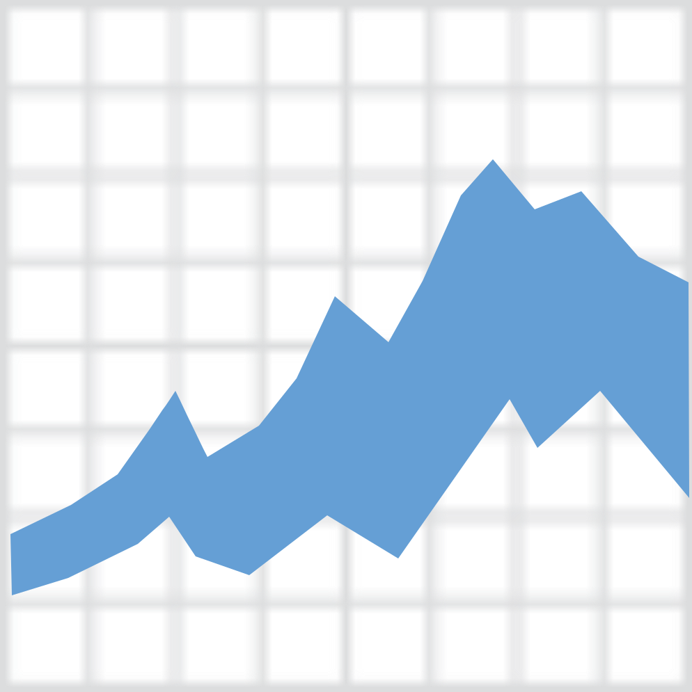{width="75"}  | a + geom_ribbon(aes(ymin = unemploy - 900, ymax = unemploy + 900))                        | **For each value of x, displays a y interval defined by y-min and y-max.**                                         |
|                                                                                       |                                                  |                                                                                           |                                                                                                                    |
|                                                                                       |                                                  |                                                                                           | *x, ymax, ymin, alpha, color, fill, group, linetype, size*                                                         |
+---------------------------------------------------------------------------------------+--------------------------------------------------+-------------------------------------------------------------------------------------------+--------------------------------------------------------------------------------------------------------------------+
| **LIne Segments**                                                                     | 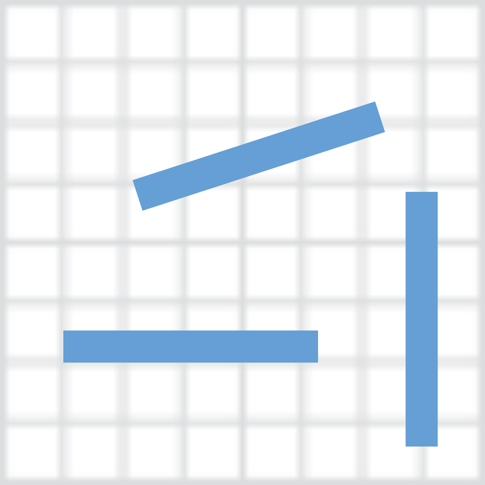{width="75"} | b + geom_abline(aes(intercept = 0, slope = 1))                                            | **Add reference lines to the plot**                                                                                |
|                                                                                       |                                                  |                                                                                           |                                                                                                                    |
| b \<- ggplot(seals, aes(x = long, y = lat))                                           |                                                  | b + geom_hline(aes(yintercept = lat))                                                     | *x, y, alpha, color, linetype, size*                                                                               |
|                                                                                       |                                                  |                                                                                           |                                                                                                                    |
|                                                                                       |                                                  | b + geom_vline(aes(xintercept = long))                                                    |                                                                                                                    |
|                                                                                       |                                                  |                                                                                           |                                                                                                                    |
|                                                                                       |                                                  | b + geom_segment(aes(yend = lat + 1, xend = long + 1))                                    |                                                                                                                    |
+---------------------------------------------------------------------------------------+--------------------------------------------------+-------------------------------------------------------------------------------------------+--------------------------------------------------------------------------------------------------------------------+
|                                                                                       |                                                  | b + geom_spoke(aes(angle = 1:1155, radius = 1))                                           | **Prints line in polar coordinates**                                                                               |
+---------------------------------------------------------------------------------------+--------------------------------------------------+-------------------------------------------------------------------------------------------+--------------------------------------------------------------------------------------------------------------------+
| **One Variable (Continuous)**                                                         | {width="75"}  | c + geom_area(stat = "bin")                                                               | **Plots y-values and shades between y-value and zero**                                                             |
|                                                                                       |                                                  |                                                                                           |                                                                                                                    |
| c \<- ggplot(mpg, aes(hwy))                                                           |                                                  |                                                                                           | *x, y, alpha, color, fill, linetype, size*                                                                         |
|                                                                                       |                                                  |                                                                                           |                                                                                                                    |
| c2 \<- ggplot(mpg)                                                                    |                                                  |                                                                                           |                                                                                                                    |
+---------------------------------------------------------------------------------------+--------------------------------------------------+-------------------------------------------------------------------------------------------+--------------------------------------------------------------------------------------------------------------------+
|                                                                                       | 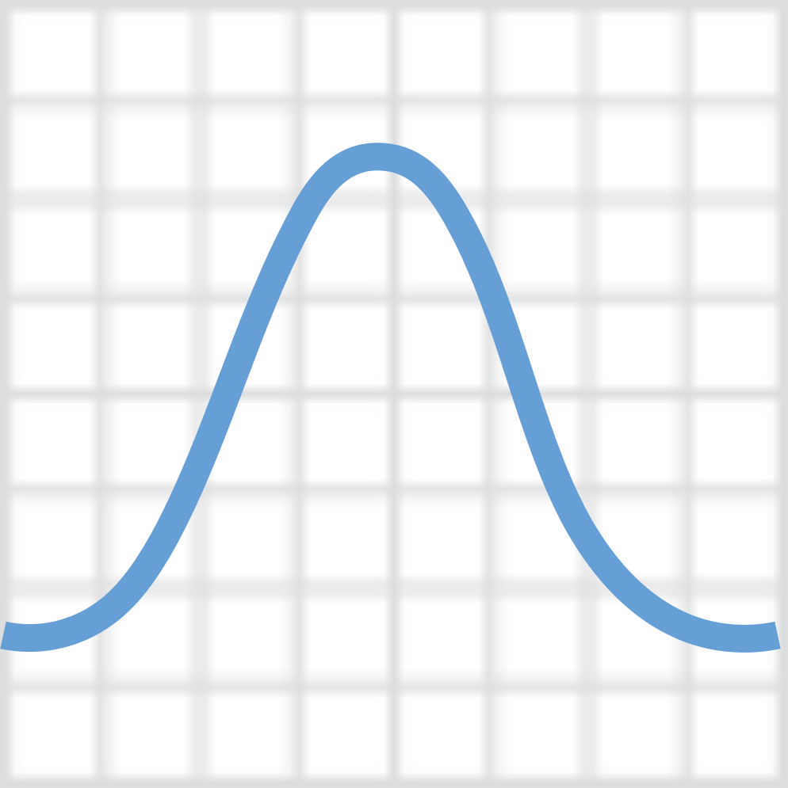{width="75"}  | c + geom_density(kernel = "gaussian")                                                     | **Draws kernel density estimate**                                                                                  |
|                                                                                       |                                                  |                                                                                           |                                                                                                                    |
|                                                                                       |                                                  |                                                                                           | *x, y, alpha, color, fill, group, linetype, size, weight*                                                          |
+---------------------------------------------------------------------------------------+--------------------------------------------------+-------------------------------------------------------------------------------------------+--------------------------------------------------------------------------------------------------------------------+
|                                                                                       | 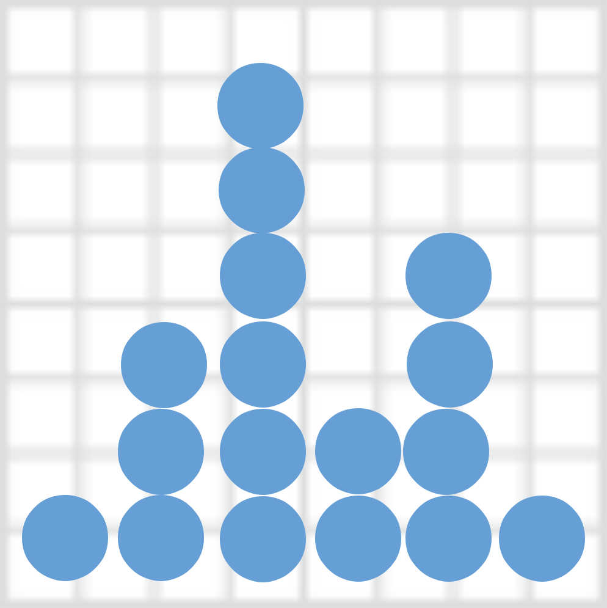{width="75"} | c + geom_dotplot()                                                                        | **Draws dotplot (histogram) where circle width is equal to bin width**                                             |
|                                                                                       |                                                  |                                                                                           |                                                                                                                    |
|                                                                                       |                                                  |                                                                                           | *x, y, alpha, color, fill*                                                                                         |
+---------------------------------------------------------------------------------------+--------------------------------------------------+-------------------------------------------------------------------------------------------+--------------------------------------------------------------------------------------------------------------------+
|                                                                                       | {width="75"} | c + geom_freqpoly()                                                                       | **Draws histogram with lines**                                                                                     |
|                                                                                       |                                                  |                                                                                           |                                                                                                                    |
|                                                                                       |                                                  |                                                                                           | *x, y, alpha, color, group, linetype, size*                                                                        |
+---------------------------------------------------------------------------------------+--------------------------------------------------+-------------------------------------------------------------------------------------------+--------------------------------------------------------------------------------------------------------------------+
|                                                                                       | {width="75"} | c + geom_histogram(binwidth = 5)                                                          | **Draws histogram with bars**                                                                                      |
|                                                                                       |                                                  |                                                                                           |                                                                                                                    |
|                                                                                       |                                                  |                                                                                           | *x, y, alpha, color, fill, linetype, size, weight*                                                                 |
+---------------------------------------------------------------------------------------+--------------------------------------------------+-------------------------------------------------------------------------------------------+--------------------------------------------------------------------------------------------------------------------+
|                                                                                       | {width="75"} | c2 + geom_qq(aes(sample = hwy))                                                           | **Draws Quantile-Quantile plot**                                                                                   |
|                                                                                       |                                                  |                                                                                           |                                                                                                                    |
|                                                                                       |                                                  |                                                                                           | *x, y, alpha, color, fill, linetype, size, weight*                                                                 |
+---------------------------------------------------------------------------------------+--------------------------------------------------+-------------------------------------------------------------------------------------------+--------------------------------------------------------------------------------------------------------------------+
| **One Variable (Discrete)**                                                           | {width="75"} | d + geom_bar()                                                                            | Draws a barplot - where bar height is proportional to the number of cases in each group                            |
|                                                                                       |                                                  |                                                                                           |                                                                                                                    |
| d \<- ggplot(mpg, aes(fl))                                                            |                                                  |                                                                                           |                                                                                                                    |
+---------------------------------------------------------------------------------------+--------------------------------------------------+-------------------------------------------------------------------------------------------+--------------------------------------------------------------------------------------------------------------------+
| **Two Variables (Both Continuous)**                                                   | {width="75"}  | e + geom_label(aes(label = cty), nudge_x = 1, nudge_y = 1)                                | **Plots text labels at (x,y) coordinates**                                                                         |
|                                                                                       |                                                  |                                                                                           |                                                                                                                    |
| e \<- ggplot(mpg, aes(cty, hwy))                                                      |                                                  |                                                                                           | *x, y, label, alpha, angle, color, family, fontface, hjust, lineheight, size, vjust*.                              |
+---------------------------------------------------------------------------------------+--------------------------------------------------+-------------------------------------------------------------------------------------------+--------------------------------------------------------------------------------------------------------------------+
|                                                                                       | 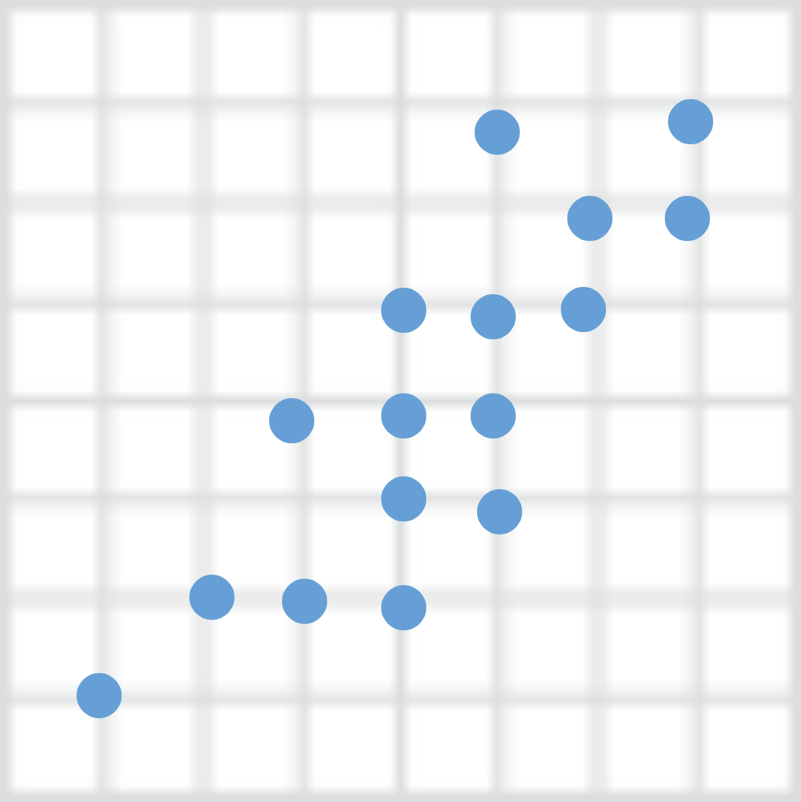{width="75"} | e + geom_point()                                                                          | **Draws a scatterplot.**                                                                                           |
|                                                                                       |                                                  |                                                                                           |                                                                                                                    |
|                                                                                       |                                                  |                                                                                           | *x, y, alpha, color, fill, shape, size, stroke*                                                                    |
+---------------------------------------------------------------------------------------+--------------------------------------------------+-------------------------------------------------------------------------------------------+--------------------------------------------------------------------------------------------------------------------+
|                                                                                       | {width="75"}  | e + geom_quantile()                                                                       | **Draws a quantile regression - fitted quantile lines.**                                                           |
|                                                                                       |                                                  |                                                                                           |                                                                                                                    |
|                                                                                       |                                                  |                                                                                           | *x, y, alpha, color, group, linetype, size, weight*                                                                |
+---------------------------------------------------------------------------------------+--------------------------------------------------+-------------------------------------------------------------------------------------------+--------------------------------------------------------------------------------------------------------------------+
|                                                                                       | {width="75"} | e + geom_rug(sides = “bl")                                                                | **Draws 2x 1d distributions of points on axes**                                                                    |
|                                                                                       |                                                  |                                                                                           |                                                                                                                    |
|                                                                                       |                                                  |                                                                                           | *x, y, alpha, color, linetype, size*                                                                               |
+---------------------------------------------------------------------------------------+--------------------------------------------------+-------------------------------------------------------------------------------------------+--------------------------------------------------------------------------------------------------------------------+
|                                                                                       | 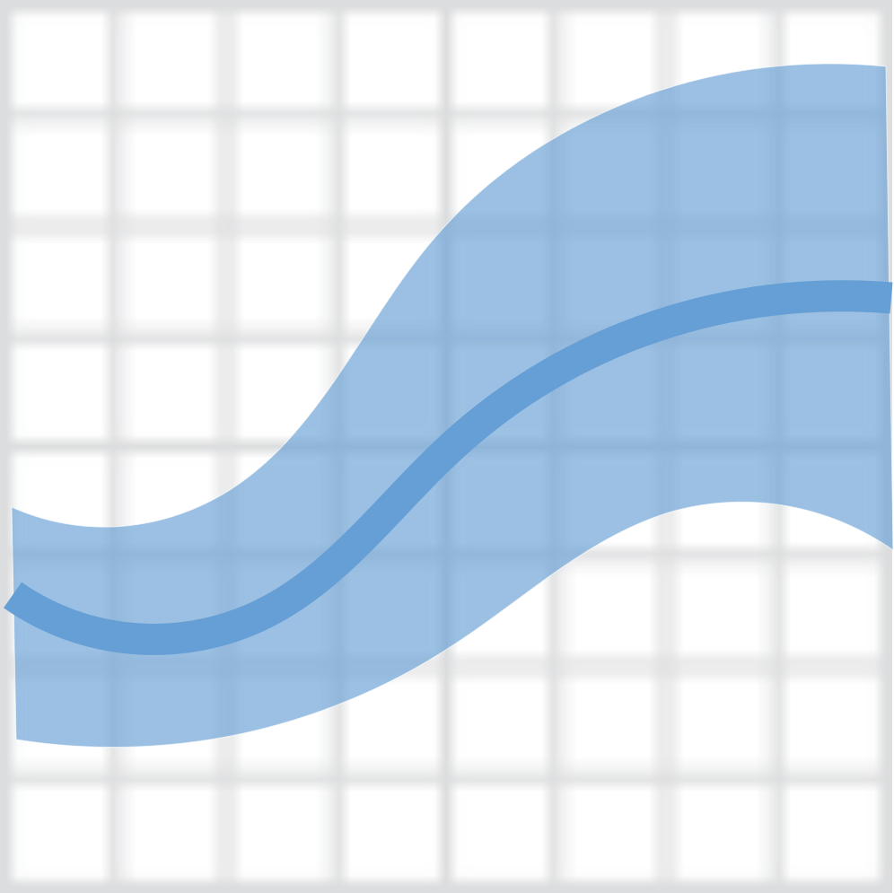{width="75"}  | e + geom_smooth(method = lm)                                                              | **Smooths the datapoints.**                                                                                        |
|                                                                                       |                                                  |                                                                                           |                                                                                                                    |
|                                                                                       |                                                  |                                                                                           | *x, y, alpha, color, fill, group, linetype, size, weight*                                                          |
+---------------------------------------------------------------------------------------+--------------------------------------------------+-------------------------------------------------------------------------------------------+--------------------------------------------------------------------------------------------------------------------+
|                                                                                       | {width="75"} | e + geom_text(aes(label = cty), nudge_x = 1, nudge_y = 1)                                 | **Draw labels on the plot.**                                                                                       |
|                                                                                       |                                                  |                                                                                           |                                                                                                                    |
|                                                                                       |                                                  |                                                                                           | *x, y, label, alpha, angle, color, family, fontface, hjust, lineheight, size, vjust*                               |
+---------------------------------------------------------------------------------------+--------------------------------------------------+-------------------------------------------------------------------------------------------+--------------------------------------------------------------------------------------------------------------------+
| **One Discrete, One Continuous**                                                      | 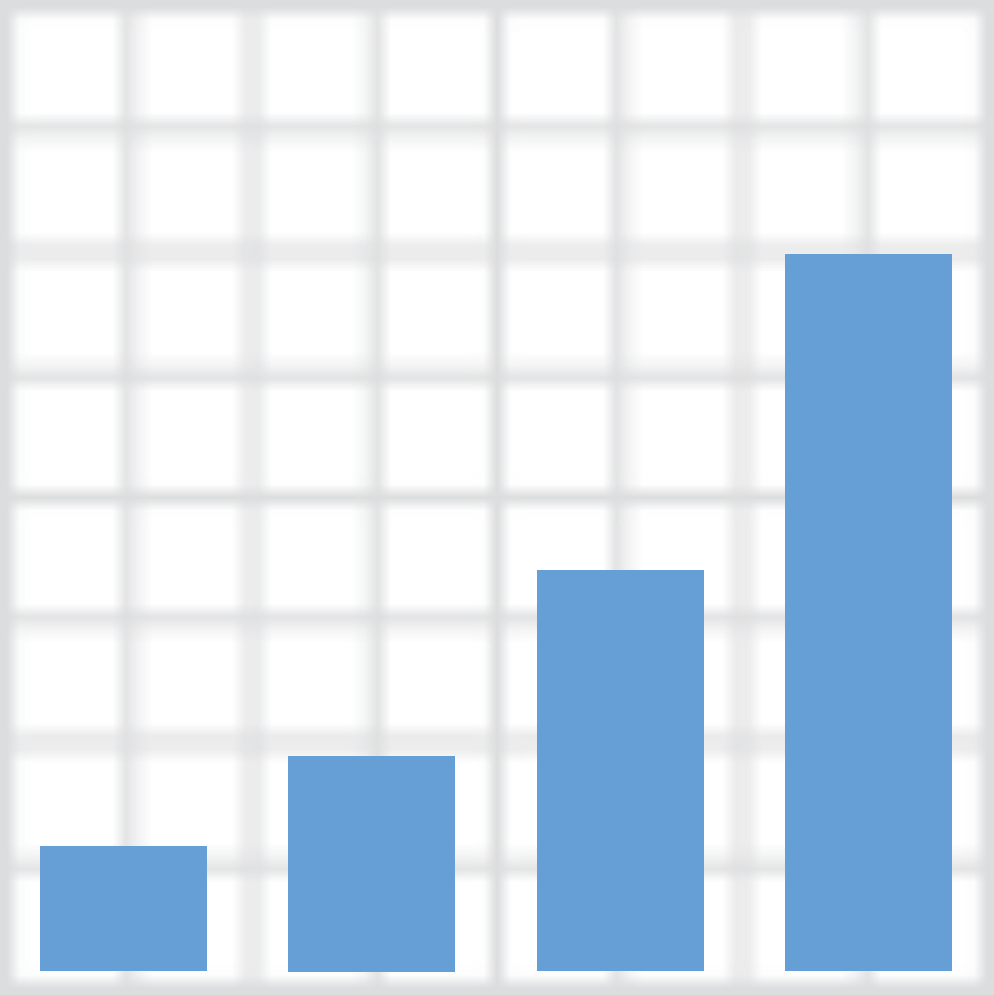{width="75"} | f + geom_col()                                                                            | **Draw barplot where bar height is equal to value in data**                                                        |
|                                                                                       |                                                  |                                                                                           |                                                                                                                    |
| f \<- ggplot(mpg, aes(class, hwy))                                                    |                                                  |                                                                                           | *x, y, alpha, color, fill, group, linetype, size*                                                                  |
+---------------------------------------------------------------------------------------+--------------------------------------------------+-------------------------------------------------------------------------------------------+--------------------------------------------------------------------------------------------------------------------+
|                                                                                       | {width="75"} | f + geom_boxplot()                                                                        | **Draw a boxplot.**                                                                                                |
|                                                                                       |                                                  |                                                                                           |                                                                                                                    |
|                                                                                       |                                                  |                                                                                           | *x, y, lower, middle, upper, ymax, ymin, alpha, color, fill, group, linetype, shape, size, weight*                 |
+---------------------------------------------------------------------------------------+--------------------------------------------------+-------------------------------------------------------------------------------------------+--------------------------------------------------------------------------------------------------------------------+
|                                                                                       | 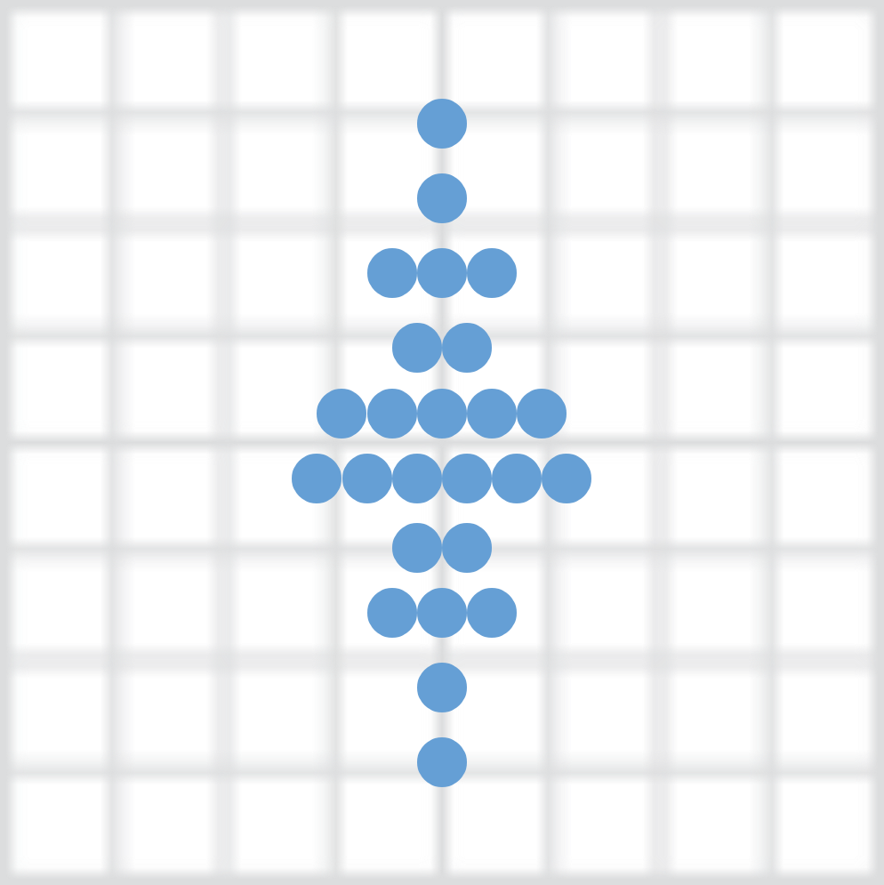{width="75"}   | f + geom_dotplot(binaxis = "y", stackdir = “center")                                      | **Draw a dotplot of distribution, similar to box plot or violin plot but each data points are visualized on plot** |
|                                                                                       |                                                  |                                                                                           |                                                                                                                    |
|                                                                                       |                                                  |                                                                                           | *x, y, alpha, color, fill, group*                                                                                  |
+---------------------------------------------------------------------------------------+--------------------------------------------------+-------------------------------------------------------------------------------------------+--------------------------------------------------------------------------------------------------------------------+
|                                                                                       | 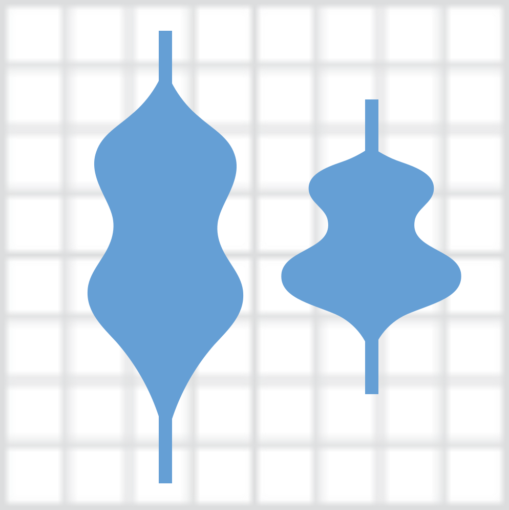{width="75"} | f + geom_violin(scale = “area")                                                           | **Draws a violin plot.**                                                                                           |
|                                                                                       |                                                  |                                                                                           |                                                                                                                    |
|                                                                                       |                                                  |                                                                                           | *x, y, alpha, color, fill, group, linetype, size, weight*                                                          |
+---------------------------------------------------------------------------------------+--------------------------------------------------+-------------------------------------------------------------------------------------------+--------------------------------------------------------------------------------------------------------------------+
| **Both** **Discrete**                                                                 | 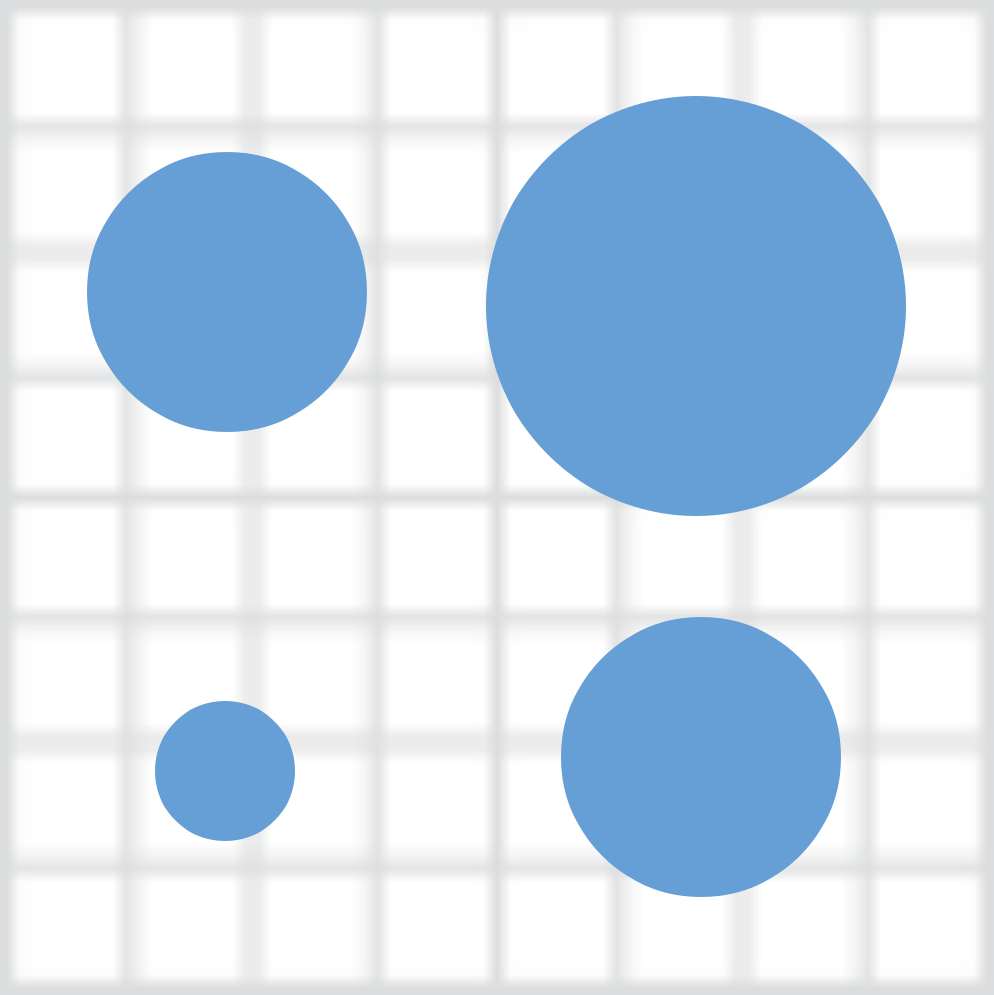{width="75"} | g + geom_count()                                                                          | **Counts Plot**                                                                                                    |
|                                                                                       |                                                  |                                                                                           |                                                                                                                    |
| g \<- ggplot(diamonds, aes(cut, color))                                               |                                                  |                                                                                           | x, y, alpha, color, fill, shape, size, stroke                                                                      |
+---------------------------------------------------------------------------------------+--------------------------------------------------+-------------------------------------------------------------------------------------------+--------------------------------------------------------------------------------------------------------------------+
|                                                                                       | 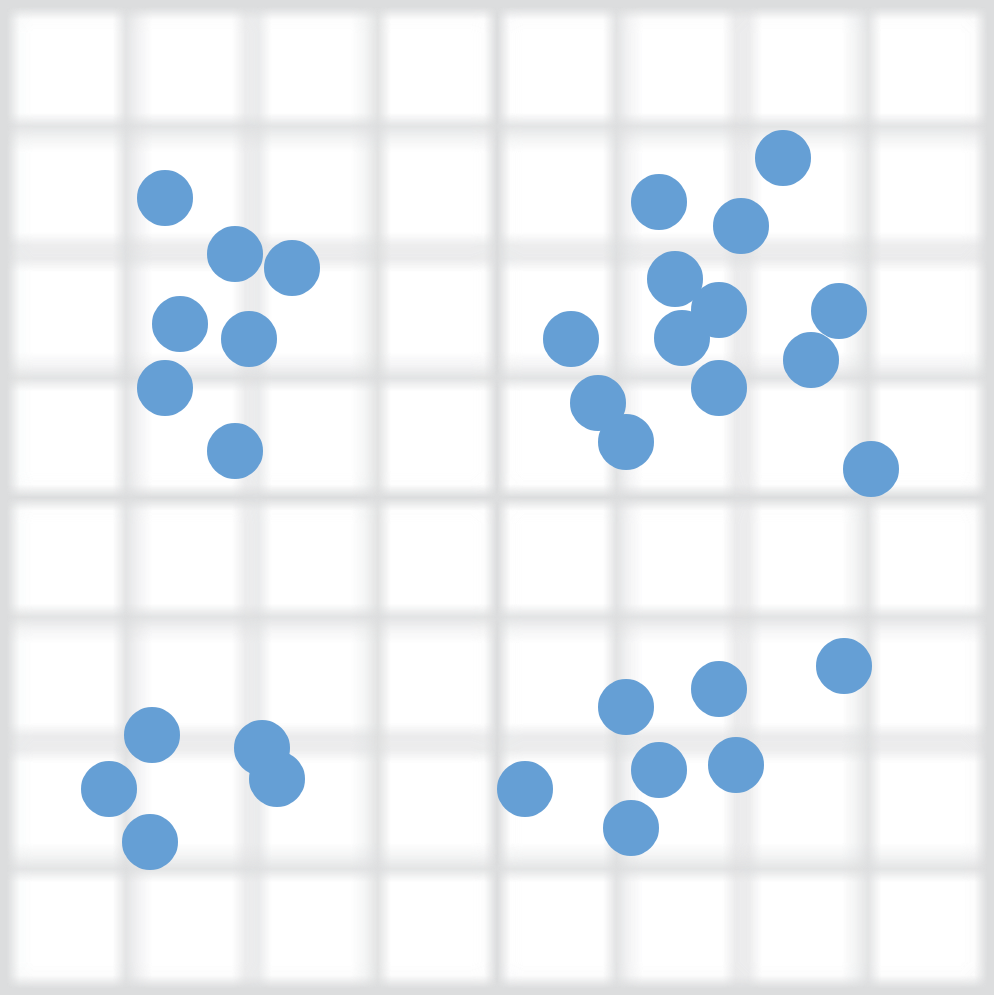{width="75"} | e + geom_jitter(height = 2, width = 2)                                                    | **Adds Jitter to Point Plot**                                                                                      |
|                                                                                       |                                                  |                                                                                           |                                                                                                                    |
|                                                                                       |                                                  |                                                                                           | x, y, alpha, color, fill, shape, size                                                                              |
+---------------------------------------------------------------------------------------+--------------------------------------------------+-------------------------------------------------------------------------------------------+--------------------------------------------------------------------------------------------------------------------+
| **Continuous Bivariate Distribution**                                                 | {width="75"} | h + geom_bin2d(binwidth = c(0.25, 500))                                                   | **Heatmap**                                                                                                        |
|                                                                                       |                                                  |                                                                                           |                                                                                                                    |
| h \<- ggplot(diamonds, aes(carat, price))                                             |                                                  |                                                                                           | x, y, alpha, color, fill, linetype, size, weight                                                                   |
+---------------------------------------------------------------------------------------+--------------------------------------------------+-------------------------------------------------------------------------------------------+--------------------------------------------------------------------------------------------------------------------+
|                                                                                       | {width="75"} | h + geom_density_2d()                                                                     | **2D Density Plot**                                                                                                |
|                                                                                       |                                                  |                                                                                           |                                                                                                                    |
|                                                                                       |                                                  |                                                                                           | x, y, alpha, color, group, linetype, size                                                                          |
+---------------------------------------------------------------------------------------+--------------------------------------------------+-------------------------------------------------------------------------------------------+--------------------------------------------------------------------------------------------------------------------+
|                                                                                       | {width="75"} | h + geom_hex()                                                                            | **Hex Plot**                                                                                                       |
|                                                                                       |                                                  |                                                                                           |                                                                                                                    |
|                                                                                       |                                                  |                                                                                           | x, y, alpha, color, fill, size                                                                                     |
+---------------------------------------------------------------------------------------+--------------------------------------------------+-------------------------------------------------------------------------------------------+--------------------------------------------------------------------------------------------------------------------+
| **Continuous Function**                                                               | 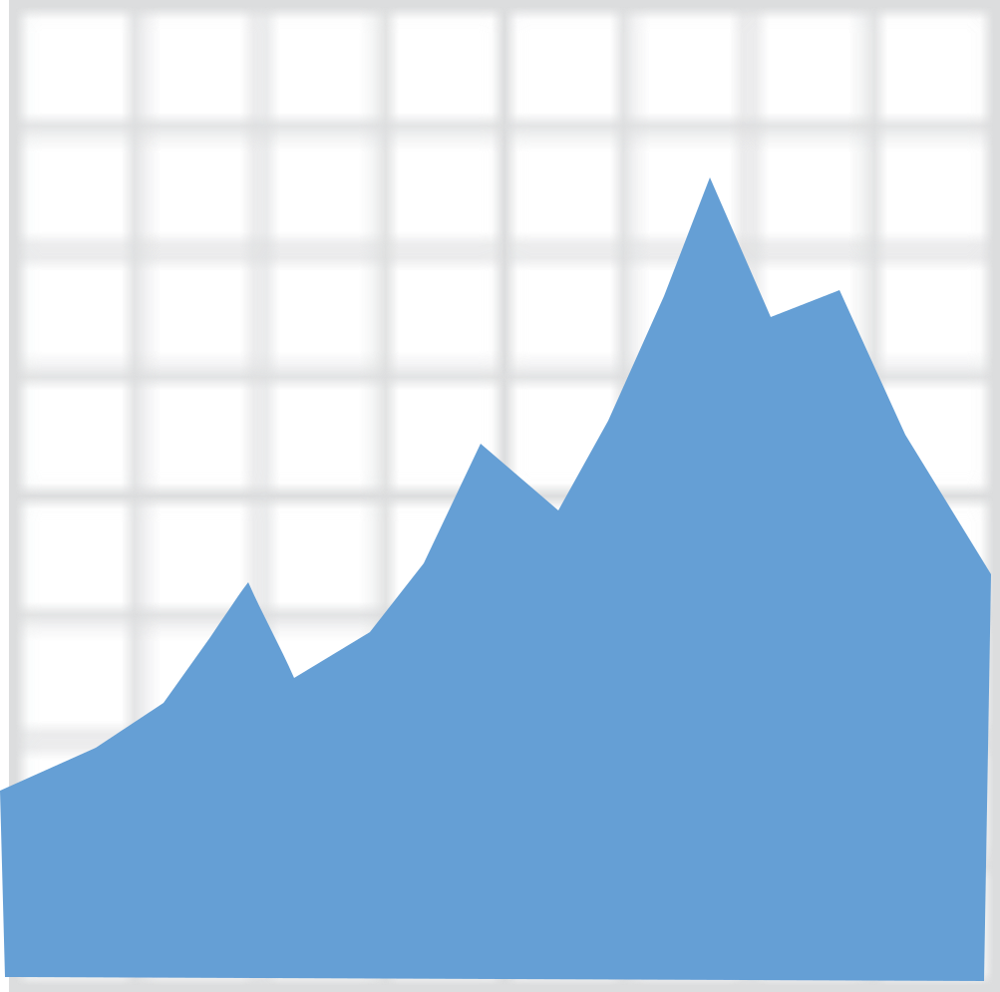{width="75"} | i + geom_area()                                                                           | **Area Plot**                                                                                                      |
|                                                                                       |                                                  |                                                                                           |                                                                                                                    |
| i \<- ggplot(economics, aes(date, unemploy))                                          |                                                  |                                                                                           | x, y, alpha, color, fill, linetype, size                                                                           |
+---------------------------------------------------------------------------------------+--------------------------------------------------+-------------------------------------------------------------------------------------------+--------------------------------------------------------------------------------------------------------------------+
|                                                                                       | 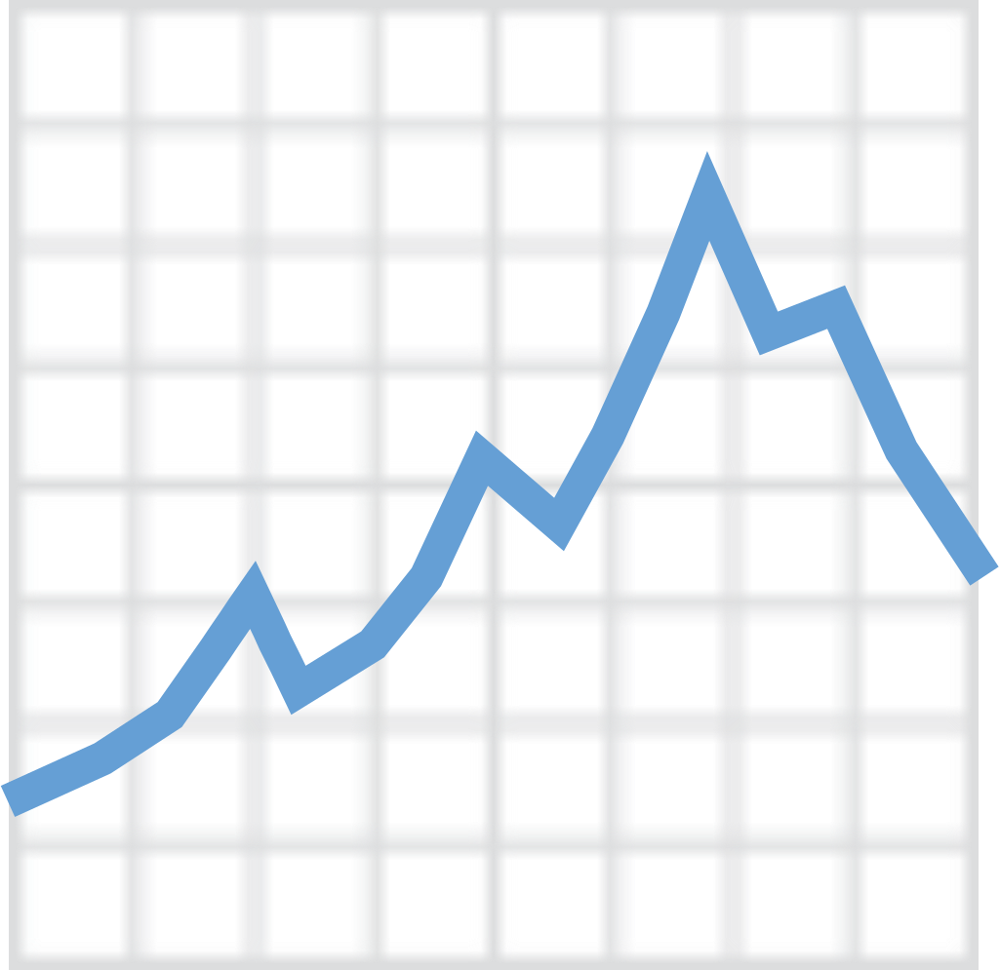{width="75"}  | i + geom_line()                                                                           | **Line Plot**                                                                                                      |
|                                                                                       |                                                  |                                                                                           |                                                                                                                    |
|                                                                                       |                                                  |                                                                                           | x, y, alpha, color, group, linetype, size                                                                          |
+---------------------------------------------------------------------------------------+--------------------------------------------------+-------------------------------------------------------------------------------------------+--------------------------------------------------------------------------------------------------------------------+
|                                                                                       | {width="75"}  | i + geom_step(direction = "hv")                                                           | **Step Plot**                                                                                                      |
|                                                                                       |                                                  |                                                                                           |                                                                                                                    |
|                                                                                       |                                                  |                                                                                           | x, y, alpha, color, group, linetype, size                                                                          |
+---------------------------------------------------------------------------------------+--------------------------------------------------+-------------------------------------------------------------------------------------------+--------------------------------------------------------------------------------------------------------------------+
| **Visualizing Error**                                                                 | 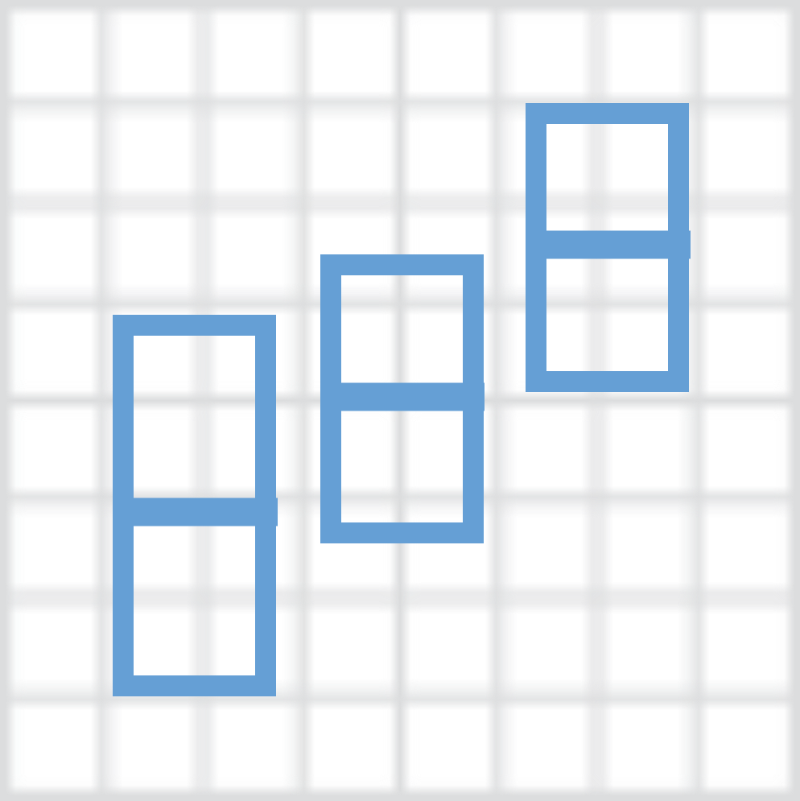{width="75"} | j + geom_crossbar(fatten = 2)                                                             | **Cross Bars**                                                                                                     |
|                                                                                       |                                                  |                                                                                           |                                                                                                                    |
| df \<- data.frame(grp = c("A", "B"), fit = 4:5, se = 1:2)                             |                                                  |                                                                                           | x, y, ymax, ymin, alpha, color, fill, group, linetype, size                                                        |
|                                                                                       |                                                  |                                                                                           |                                                                                                                    |
| j \<- ggplot(df, aes(grp, fit, ymin=fit-se, ymax=fit+se))                             |                                                  |                                                                                           |                                                                                                                    |
+---------------------------------------------------------------------------------------+--------------------------------------------------+-------------------------------------------------------------------------------------------+--------------------------------------------------------------------------------------------------------------------+
|                                                                                       | {width="75"} | j + geom_errorbar()                                                                       | **Error Bars**                                                                                                     |
|                                                                                       |                                                  |                                                                                           |                                                                                                                    |
|                                                                                       |                                                  |                                                                                           | *x, ymax, ymin, alpha, color, group, linetype, size, width* Also **geom_errorbarh().**                             |
+---------------------------------------------------------------------------------------+--------------------------------------------------+-------------------------------------------------------------------------------------------+--------------------------------------------------------------------------------------------------------------------+
|                                                                                       | {width="75"} | j + geom_linerange()                                                                      | **Line Range**                                                                                                     |
|                                                                                       |                                                  |                                                                                           |                                                                                                                    |
|                                                                                       |                                                  |                                                                                           | x, ymin, ymax, alpha, color, group, linetype, size                                                                 |
+---------------------------------------------------------------------------------------+--------------------------------------------------+-------------------------------------------------------------------------------------------+--------------------------------------------------------------------------------------------------------------------+
|                                                                                       | {width="75"} | j + geom_pointrange()                                                                     | **Point Range**                                                                                                    |
|                                                                                       |                                                  |                                                                                           |                                                                                                                    |
|                                                                                       |                                                  |                                                                                           | *x, y, ymin, ymax, alpha, color, fill, group, linetype, shape, size*                                               |
+---------------------------------------------------------------------------------------+--------------------------------------------------+-------------------------------------------------------------------------------------------+--------------------------------------------------------------------------------------------------------------------+
| **Maps**                                                                              | {width="75"} | k + geom_map(aes(map_id = state), map = map) + expand_limits(x = map\$long, y = map\$lat) | **Choropleth Plot**                                                                                                |
|                                                                                       |                                                  |                                                                                           |                                                                                                                    |
| data \<- data.frame(murder = USArrests\$Murder, state = tolower(rownames(USArrests))) |                                                  |                                                                                           | *map_id, alpha, color, fill, linetype, size*                                                                       |
|                                                                                       |                                                  |                                                                                           |                                                                                                                    |
| map \<- map_data("state") k \<- ggplot(data, aes(fill = murder))                      |                                                  |                                                                                           |                                                                                                                    |
+---------------------------------------------------------------------------------------+--------------------------------------------------+-------------------------------------------------------------------------------------------+--------------------------------------------------------------------------------------------------------------------+
| **Three Variables**                                                                   | {width="75"} | l + geom_contour(aes(z = z))                                                              | **Draws 3D in 2D**                                                                                                 |
|                                                                                       |                                                  |                                                                                           |                                                                                                                    |
| seals\$z \<- with(seals, sqrt(delta_long\^2 + delta_lat\^2))                          |                                                  |                                                                                           | *x, y, z, alpha, color, group, linetype, size, weight*                                                             |
|                                                                                       |                                                  |                                                                                           |                                                                                                                    |
| l \<- ggplot(seals, aes(long, lat))                                                   |                                                  |                                                                                           |                                                                                                                    |
+---------------------------------------------------------------------------------------+--------------------------------------------------+-------------------------------------------------------------------------------------------+--------------------------------------------------------------------------------------------------------------------+
|                                                                                       | {width="75"} | l + geom_contour_filled(aes(fill = z))                                                    | **Draws 3D in 2D**                                                                                                 |
|                                                                                       |                                                  |                                                                                           |                                                                                                                    |
|                                                                                       |                                                  |                                                                                           | *x, y, alpha, color, fill, group, linetype, size, subgroup*                                                        |
+---------------------------------------------------------------------------------------+--------------------------------------------------+-------------------------------------------------------------------------------------------+--------------------------------------------------------------------------------------------------------------------+
|                                                                                       | 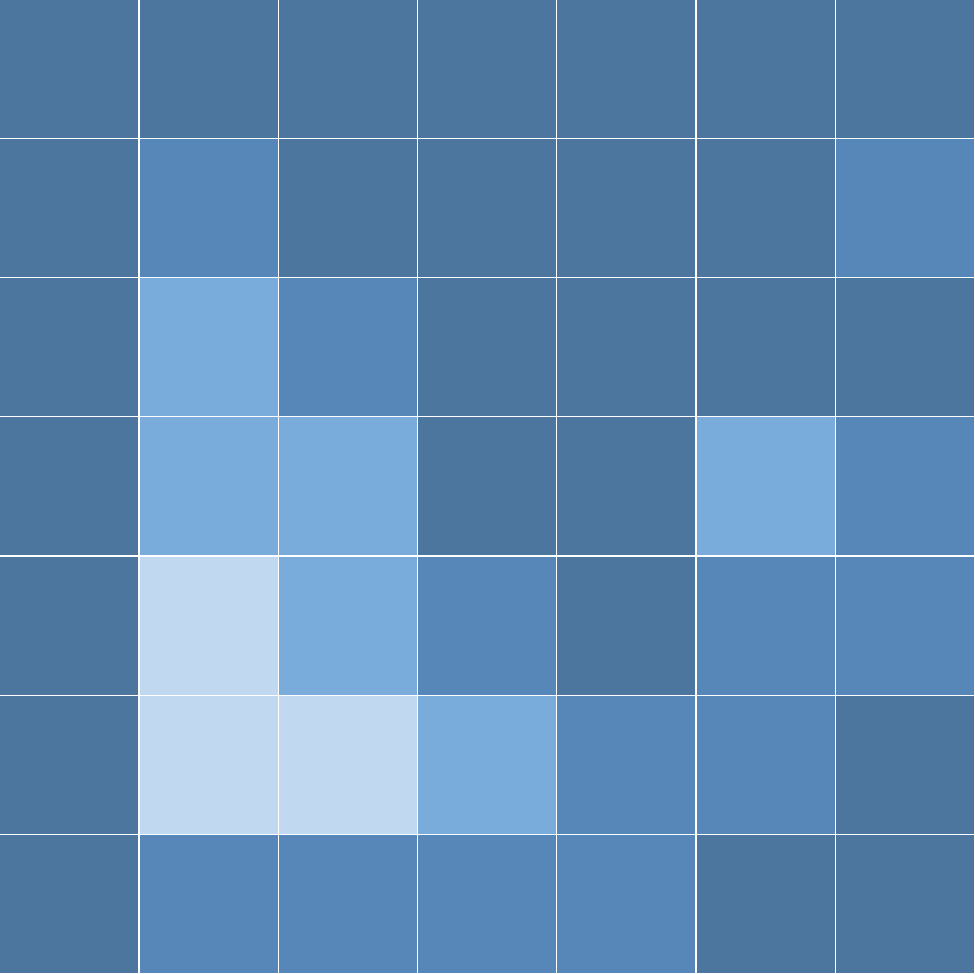{width="75"} | l + geom_raster(aes(fill = z), hjust = 0.5, vjust = 0.5, interpolate = FALSE)             | **Raster plot - high performance**                                                                                 |
|                                                                                       |                                                  |                                                                                           |                                                                                                                    |
|                                                                                       |                                                  |                                                                                           | *x, y, alpha, fill*                                                                                                |
+---------------------------------------------------------------------------------------+--------------------------------------------------+-------------------------------------------------------------------------------------------+--------------------------------------------------------------------------------------------------------------------+
|                                                                                       | 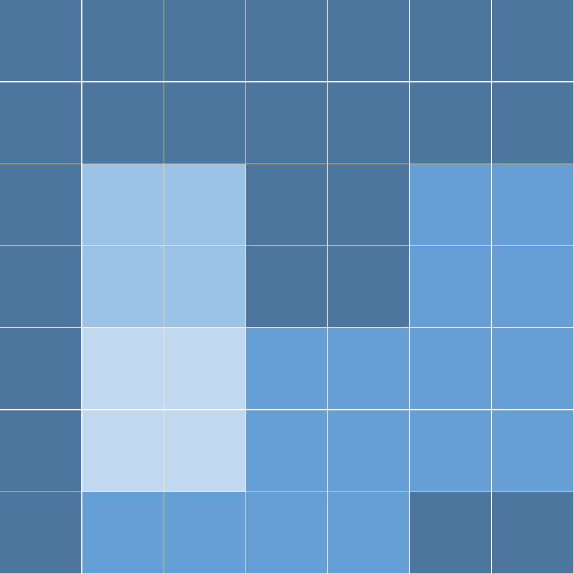{width="75"} | l + geom_tile(aes(fill = z))                                                              | **Same as geom_rect()**                                                                                            |
|                                                                                       |                                                  |                                                                                           |                                                                                                                    |
|                                                                                       |                                                  |                                                                                           | *x, y, alpha, color, fill, linetype, size, width*                                                                  |
+---------------------------------------------------------------------------------------+--------------------------------------------------+-------------------------------------------------------------------------------------------+--------------------------------------------------------------------------------------------------------------------+

------------------------------------------------------------------------

## Basic Chart Types

### Bar Chart: geom_bar()

If we wanted a bar plot of the numbers of individuals and stages in the dataset by gender.

```{r}
ggplot(clinical_clean, aes(demographic.gender, fill=simplified_stage))+geom_bar()
```

We can plot the number of individuals for each stage

```{r}
ggplot(clinical_clean, aes(x=simplified_stage))+geom_bar()
```

If you want them separated out by gender, we need to pass an argument to the `geom_bar(position='dodge')` or `geom_bar(position='dodge2')`

```{r}
ggplot(clinical_clean, aes(x=simplified_stage, fill=demographic.gender))+geom_bar(position='dodge')
```

Because the Clinical dataset isn't the greatest for many different plot types, we'll use a few different datasets to demonstrate some of the other plot types.

------------------------------------------------------------------------

### Line Plot: geom_line()

```{r}
economics
```

```{r}
ggplot(economics, aes(date, unemploy))+geom_line()
```

```{r}
penguins = read_csv("https://raw.githubusercontent.com/mwaskom/seaborn-data/master/penguins.csv")
head(penguins)
```

```{r}
ggplot(penguins, mapping=aes(x=flipper_length_mm, y=body_mass_g, color=species)) + geom_point(shape=0)
```

```{r}
ggplot(penguins, aes(x=species, y=body_mass_g, color=species)) + 
  geom_violin() + geom_boxplot(width=0.1)
```

------------------------------------------------------------------------

### Scatter Plot: geom_point()

```{r}
ggplot(penguins, aes(flipper_length_mm, body_mass_g)) + geom_point()
```

```{r}
ggplot(penguins, aes(flipper_length_mm, body_mass_g, color=species)) + geom_point()
```

```{r}
ggplot(penguins, aes(flipper_length_mm, body_mass_g, group=species)) + geom_point(aes(color = species)) + geom_smooth(method = "lm", se = FALSE, aes(color = species))
```

```{r}
ggplot(penguins, aes(flipper_length_mm, body_mass_g, group=species, color=species)) + geom_point() + geom_smooth(method = "lm", se = FALSE)
```

------------------------------------------------------------------------

### Histogram

```{r}
ggplot(penguins, aes(body_mass_g)) + geom_histogram()
```

```{r}
ggplot(penguins, aes(body_mass_g)) + geom_histogram(aes(fill=species), alpha=0.5 , position = "identity")
```

```{r}
ggplot(penguins, aes(body_mass_g)) + geom_density(aes(fill=species), alpha=0.5 , position = "identity")
```

------------------------------------------------------------------------

### Box Plot

```{r}
ggplot(penguins,aes(species,body_mass_g)) + geom_boxplot()
```

```{r}
ggplot(penguins,aes(species,body_mass_g, color=species)) + geom_boxplot()
```

------------------------------------------------------------------------

### Violin Plot

```{r}
ggplot(penguins, aes(species, body_mass_g)) + geom_violin()
```

```{r}
ggplot(penguins, aes(species, body_mass_g)) + geom_violin() + geom_boxplot(width=0.2)
```

```{r}
ggplot(penguins, aes(species, body_mass_g, color=island)) + geom_violin()+ geom_boxplot(width=0.2)
```

------------------------------------------------------------------------

## Level 4 (Facets): Add Subplots based on values (Optional)

If you have categorical variables, it's easy to define multiple subplots that based on the number of categories. Facets will create a subplot for each category.

There are two different types of **facets**

1.  facet_grid()
2.  facet_wrap()

### facet_grid(rows\~columns)

**facet_grid()** allows you to define a grid of subplots (rows and columns) you want to by categories of the defined rows. For the penguins dataset we can plot rows for each *species* and columns for each *island*

```{r}
ggplot(penguins, aes(x=flipper_length_mm, y=body_mass_g)) + geom_point() + facet_grid(species~island)
```

If you only want to plot a single category as a row by species, then you can just define the **column** value as a period (.)

```{r}
ggplot(penguins, mapping=aes(x=flipper_length_mm, y=body_mass_g)) + geom_point() + facet_grid(species~.)
```

Alternatively, if you just want as a single column, define the **rows** as a period (.)

```{r}
ggplot(penguins, mapping=aes(x=flipper_length_mm, y=body_mass_g)) + geom_point() + facet_grid(.~species)
```

### facet_wrap(\~columns)

**facet_wrap()** will wrap the subplots into a rectangular layout.

#### Syntax:

```         
facet_wrap(
  facets,
  nrow = NULL,
  ncol = NULL,
  scales = "fixed",
  shrink = TRUE,
  labeller = "label_value",
  as.table = TRUE,
  switch = deprecated(),
  drop = TRUE,
  dir = "h",
  strip.position = "top",
  axes = "margins",
  axis.labels = "all"
)
```

We can leave the number of rows and columns up to the defaults in **facet_wrap()**

```{r}
ggplot(penguins, aes(x=flipper_length_mm, y=body_mass_g)) + geom_point() + facet_wrap(~species)
```

If we want the plot have a specific number of rows and colums, we can define the `nrow`, and/or `ncol` arguments.

```{r}
ggplot(penguins, mapping=aes(x=flipper_length_mm, y=body_mass_g)) + geom_point() + facet_wrap(~species, nrow=2)
```

# Labels & Legends

You can adjust the labels of your plot using `labs()`

+-----------------+-------------------------------+----------------------------------------------+
| Label Arguments | Description                   | Example                                      |
+=================+===============================+==============================================+
| x               | x-axis label                  | labs(x="Flipper Length (mm)")                |
+-----------------+-------------------------------+----------------------------------------------+
| y               | y-axis label                  | labs(y="Body Mass (g)")                      |
+-----------------+-------------------------------+----------------------------------------------+
| title           | Plot Title above the plot     | labs(title="Palmer Penguins")                |
+-----------------+-------------------------------+----------------------------------------------+
| subtitle        | Plot subtitle below the title | labs(subtitle="Flipper Length vs Body Mass") |
+-----------------+-------------------------------+----------------------------------------------+
| caption         | Caption below the plot        | labs(caption="Figure 1")                     |
+-----------------+-------------------------------+----------------------------------------------+
| alt             | Alternative text              | labs(alt="Alternative Text")                 |
+-----------------+-------------------------------+----------------------------------------------+

```{r}
(gg = ggplot(penguins,aes(species,body_mass_g, color=species)) + geom_boxplot())
```

```{r}
gg + labs(x="Species", y="Body Mass (g)", title="Palmer's Penguins", subtitle="Distribution by Species", 
     caption="Figure 1", alt="Alternative Text")
```

------------------------------------------------------------------------

# Themes

Themes provide the ability to change characteristics of the plot theme (ie background colors, tick marks, fonts, font size). ggplot2 has a few 8 built-in themes. <https://ggplot2.tidyverse.org/reference/ggtheme.html>

To explore many more predefined themes, check out: <https://exts.ggplot2.tidyverse.org/ggthemes.html> or <https://github.com/hrbrmstr/hrbrthemes>

```{r}
ggplot(penguins,aes(species,body_mass_g, color=species)) + geom_boxplot() + 
  labs(x="Species", y="Body Mass (g)", title="Palmer's Penguins", subtitle="Distribution by Species", caption="Figure 1", alt="Alternative Text") + theme_light()
```

# Additional ggplot2 Extensions

<https://exts.ggplot2.tidyverse.org/gallery/>

```{r}
library(ggstatsplot)
ggscatterstats(
  data = penguins, ## data frame from which variables are taken
  x = flipper_length_mm, ## predictor/independent variable
  y = body_mass_g, ## dependent variable
  xlab = "Flipper Length (mm)", ## label for the x-axis
  ylab = "Body Mass (g)", ## label for the y-axis
  xfill = "#CC79A7", ## fill for marginals on the x-axis
  yfill = "#009E73", ## fill for marginals on the y-axis
  title = "Relationship between Flipper Length and Body Mass"
)
```
