```{r setup, include=FALSE}
knitr::opts_chunk$set(echo = TRUE)
```

# R Tidyverse - ggplot2

**ggplot2** is based on the concept that a graph can be built using the same components or layers.

We start with data and build your way up to a plot.

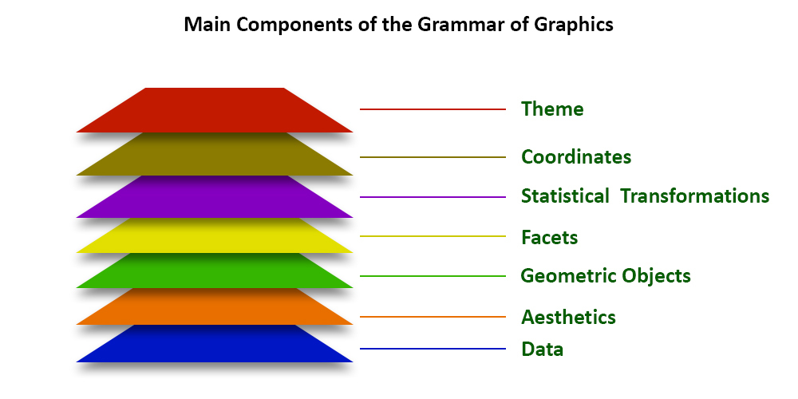{width="699"}

-   [ggplot2 Visualization Cheatsheet](https://rstudio.github.io/cheatsheets/data-visualization.pdf)

-   [ggplot2 Tutorial](https://r4ds.hadley.nz/data-visualize)

-   [Additional ggplot2 Themes (Library: ggthemes)](https://yutannihilation.github.io/allYourFigureAreBelongToUs/ggthemes/)

-   [Book: ggplot2 - Elegant Graphics for Data Analysis 2e](https://ggplot2-book.org/)

-   [Additional Tutorials: Big Book of R: Data Visualization](https://www.bigbookofr.com/data-visualization)

-   [ggplot2 Extensions](https://exts.ggplot2.tidyverse.org/gallery/) - If you want to generate a plot complex plot not handled by the basic ggplot2 library - this is the place to look.

------------------------------------------------------------------------

## Level 1 (Data): Linking our Dataset to the Empty Plot

We first need to do is import our dataset and pass it to the `ggplot()` function.

```{r}
library(tidyverse)
penguins = read_csv("https://raw.githubusercontent.com/mwaskom/seaborn-data/master/penguins.csv")
head(penguins)
```

By passing our data set to the `ggplot()` function, we generate a plot area that is now ready to start plotting our coordinate system and our data points.

```{r}
gg = ggplot(penguins)
```

## Level 2 (Aesthetics): Mapping Variables to the Axes of the Plot

To map the variables to the different axes of the plot, we need to supply values for the argument `aes()`. We want to pass `aes()` information about which variables we're going to mapping to which axes. This is an aesthetic of the plot and therefore must be passed as a `aes()` object.

If we want *flipper_length_mm* mapped to the X axes and *body_mass_g* mapped to the Y axes - this tells ggplot the way we will be mapping the data to the plot - but it doesn't tell it how you want each point displayed.

**1D Categorical:**

```{r}
ggplot(penguins, aes(x=sex))
```

**1D (Numerical):**

```{r}
ggplot(penguins, aes(x=flipper_length_mm))
```

**2D (Numerical vs Numerical):**

```{r}
ggplot(penguins, aes(x=flipper_length_mm, y=body_mass_g))
```

**2D (Categorical vs Numerical):**

```{r}
ggplot(penguins, aes(x=sex, y=body_mass_g))
```

In addition to just defining which variables we want to plot, **aes()** also allows us to define:

+----------+--------------------------------------------------------------------------------------------------------------+
| Argument | Description                                                                                                  |
+==========+==============================================================================================================+
| color    | Define the color of the points.                                                                              |
|          |                                                                                                              |
|          | You can define the color either as a string: 'red', or RGB value: #RRGGBB.                                   |
|          |                                                                                                              |
|          | If you supply color with a categorical value column name, then each category will be assigned a unique value |
+----------+--------------------------------------------------------------------------------------------------------------+
| shape    | Shape of points on the plot.                                                                                 |
+----------+--------------------------------------------------------------------------------------------------------------+
| size     | Size of point                                                                                                |
+----------+--------------------------------------------------------------------------------------------------------------+

In this example, we're going to link the following values to the specific aesthetics:

-   Color: species

-   Shape: island

-   Size: bill_depth_mm

ggplot2 will then automatically group_by the categorical you assign for colors, shape, and size.

```{r}
ggplot(penguins, mapping=aes(x=flipper_length_mm, y=body_mass_g, color=species, shape=island, size=bill_depth_mm)) + geom_point()
```

But we still have a blank plot, we need to not tell ggplot2 how we want to represent our data is it a scatterplot, or something else.

------------------------------------------------------------------------

## Choosing the Correct Chart Type to Represent Best Present Your Data

There are 6 basic chart types that we'll cover here. While there are many more, I'll leave it to you to explore those.

+------------------+-----------------------------+----------------------------------------------------------------------------------------------------------------------------------------------------------+
| Chart Type       | Data                        | Description                                                                                                                                              |
+==================+=============================+==========================================================================================================================================================+
| **Bar Chart**    | 1 Dim:                      | Length/Height of each bar corresponds to the counts of categorical variable                                                                              |
|                  |                             |                                                                                                                                                          |
|                  | 2xDiscrete/Categorical      |                                                                                                                                                          |
+------------------+-----------------------------+----------------------------------------------------------------------------------------------------------------------------------------------------------+
| **Line Chart**   | 2 Dim:                      | Plots a function, where a value of x corresponds to a single value y or f(x). Shows changes in numerical value over continuous time or ordered sequence. |
|                  |                             |                                                                                                                                                          |
|                  | 2xNumerical/Continuous      |                                                                                                                                                          |
+------------------+-----------------------------+----------------------------------------------------------------------------------------------------------------------------------------------------------+
| **Scatter plot** | 2 Dim:                      | Plots 2 numeric variables as dots on an x-y plot. Used to show relationships between variables.                                                          |
|                  |                             |                                                                                                                                                          |
|                  | 2xNumerical/Continuous      |                                                                                                                                                          |
+------------------+-----------------------------+----------------------------------------------------------------------------------------------------------------------------------------------------------+
| **Histogram**    | 1 Dim:                      | Visually represents the distribution of quantitative data.                                                                                               |
|                  |                             |                                                                                                                                                          |
|                  | 1xNumerical/Continuous      |                                                                                                                                                          |
+------------------+-----------------------------+----------------------------------------------------------------------------------------------------------------------------------------------------------+
| **Box plot**     | 2 Dim:                      | Summarizes the distribution of multiple groups using boxes to show median, lower & upper quartile, min, max, and outliers.                               |
|                  |                             |                                                                                                                                                          |
|                  | 1xDiscrete and 1xContinuous | Median: 50% of data to either side                                                                                                                       |
|                  |                             |                                                                                                                                                          |
|                  |                             | Upper Quartile: 75% data below and 25% above                                                                                                             |
|                  |                             |                                                                                                                                                          |
|                  |                             | Lower Quartile: 25% data below and 75% above                                                                                                             |
|                  |                             |                                                                                                                                                          |
|                  |                             |                                                                                                                      |
+------------------+-----------------------------+----------------------------------------------------------------------------------------------------------------------------------------------------------+
| **Violin**       | 2 Dim:                      | Mix between histogram and box plot. Instead of a rectangle box, the border of the box is the Kernel Density Function of the histogram                    |
|                  |                             |                                                                                                                                                          |
|                  | 1xDiscrete and 1xContinuous |                                                                                                                                                          |
+------------------+-----------------------------+----------------------------------------------------------------------------------------------------------------------------------------------------------+

## 

## Level 3 (Geoms): Geometric Objects- Plotting the data points

We'll need to provide a **geom()** object - which is the graphical representation of the data.

Note: many of the **geoms** can also be passed an **aes()** type, to further customize, shape, linetype, color, fill, weight, size, alpha,...

+---------------------------------------------------------------------------------------+--------------------------------------------------+-------------------------------------------------------------------------------------------+--------------------------------------------------------------------------------------------------------------------+
| Geom Types                                                                            | Plot                                             | Geom Functions                                                                            | Description ***Params()***                                                                                         |
+=======================================================================================+:================================================:+===========================================================================================+====================================================================================================================+
| **Primitives**                                                                        | 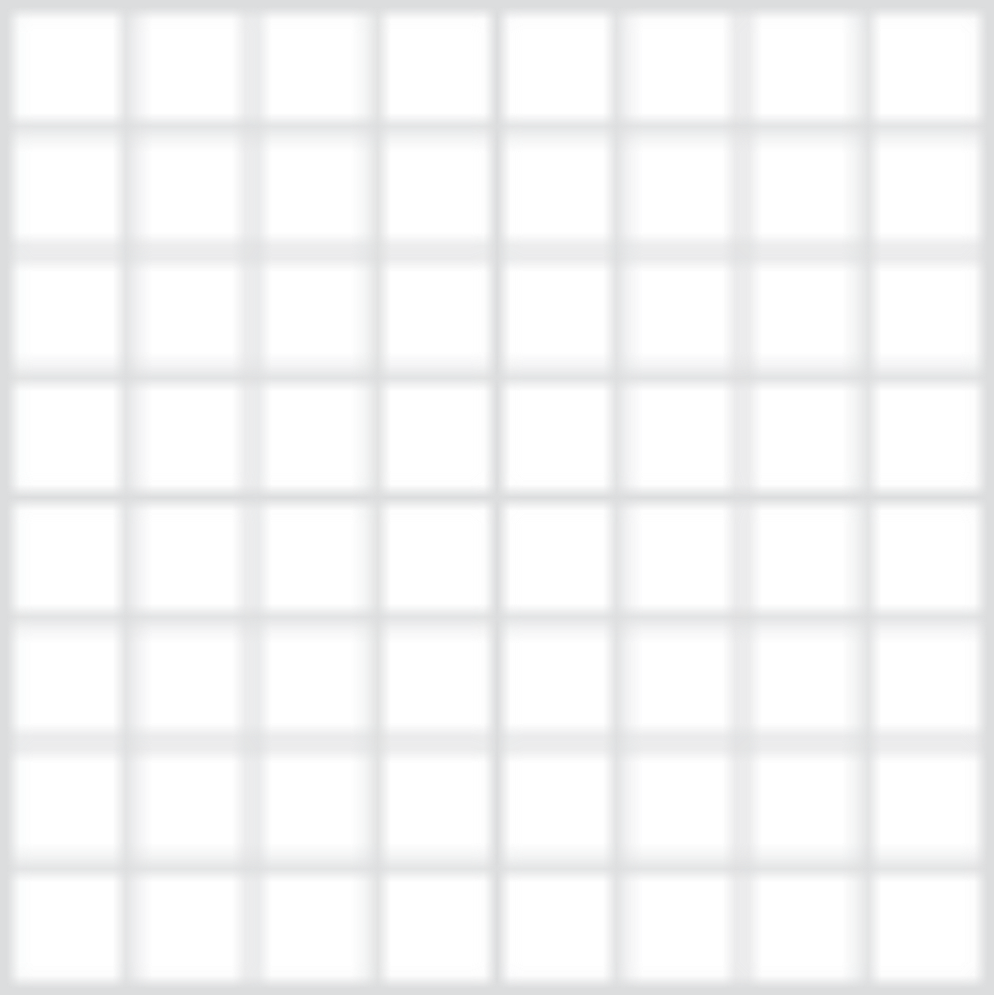{width="75"}  | geom_blank() and a + expand_limits()                                                      | Draws nothing - Ensure limits include values across all plots.                                                     |
|                                                                                       |                                                  |                                                                                           |                                                                                                                    |
| a\<-ggplot(df, aes(i,j))                                                              |                                                  |                                                                                           |                                                                                                                    |
|                                                                                       |                                                  |                                                                                           |                                                                                                                    |
| b\<-ggplot(df, aes(x=i, y=j)                                                          |                                                  |                                                                                           |                                                                                                                    |
+---------------------------------------------------------------------------------------+--------------------------------------------------+-------------------------------------------------------------------------------------------+--------------------------------------------------------------------------------------------------------------------+
|                                                                                       | 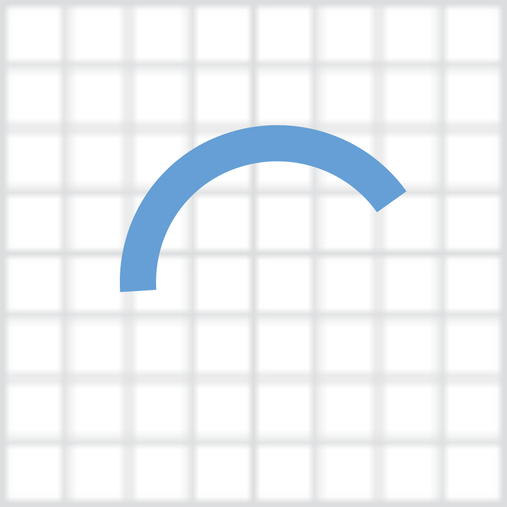{width="75"} | b + geom_curve(aes(yend = lat + 1, xend = long + 1), curvature = 1)                       | **Draws a curved line**                                                                                            |
|                                                                                       |                                                  |                                                                                           |                                                                                                                    |
|                                                                                       |                                                  |                                                                                           | *x, xend, y, yend, alpha, angle, color, curvature, linetype, size*                                                 |
+---------------------------------------------------------------------------------------+--------------------------------------------------+-------------------------------------------------------------------------------------------+--------------------------------------------------------------------------------------------------------------------+
|                                                                                       | 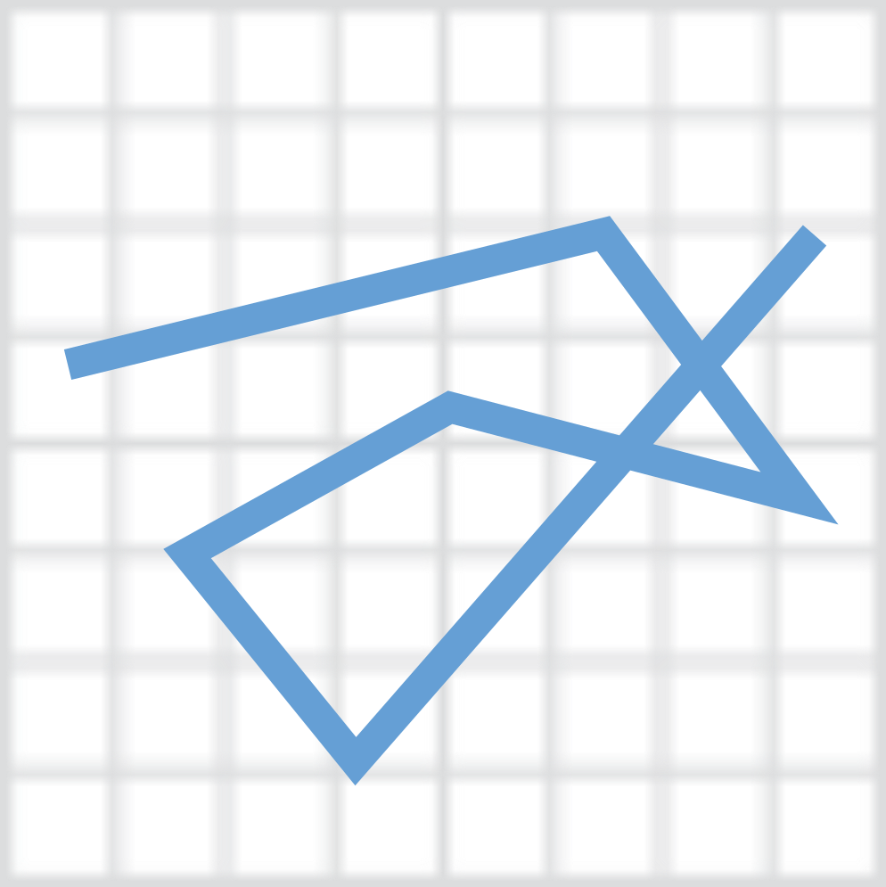{width="75"} | a + geom_path(lineend = "butt", linejoin = "round", linemitre = 1)                        | **Draws a path connecting observations with a straight line in order which they appear in the data**               |
|                                                                                       |                                                  |                                                                                           |                                                                                                                    |
|                                                                                       |                                                  |                                                                                           | *x, y, alpha, color, group, linetype, size*                                                                        |
+---------------------------------------------------------------------------------------+--------------------------------------------------+-------------------------------------------------------------------------------------------+--------------------------------------------------------------------------------------------------------------------+
|                                                                                       | 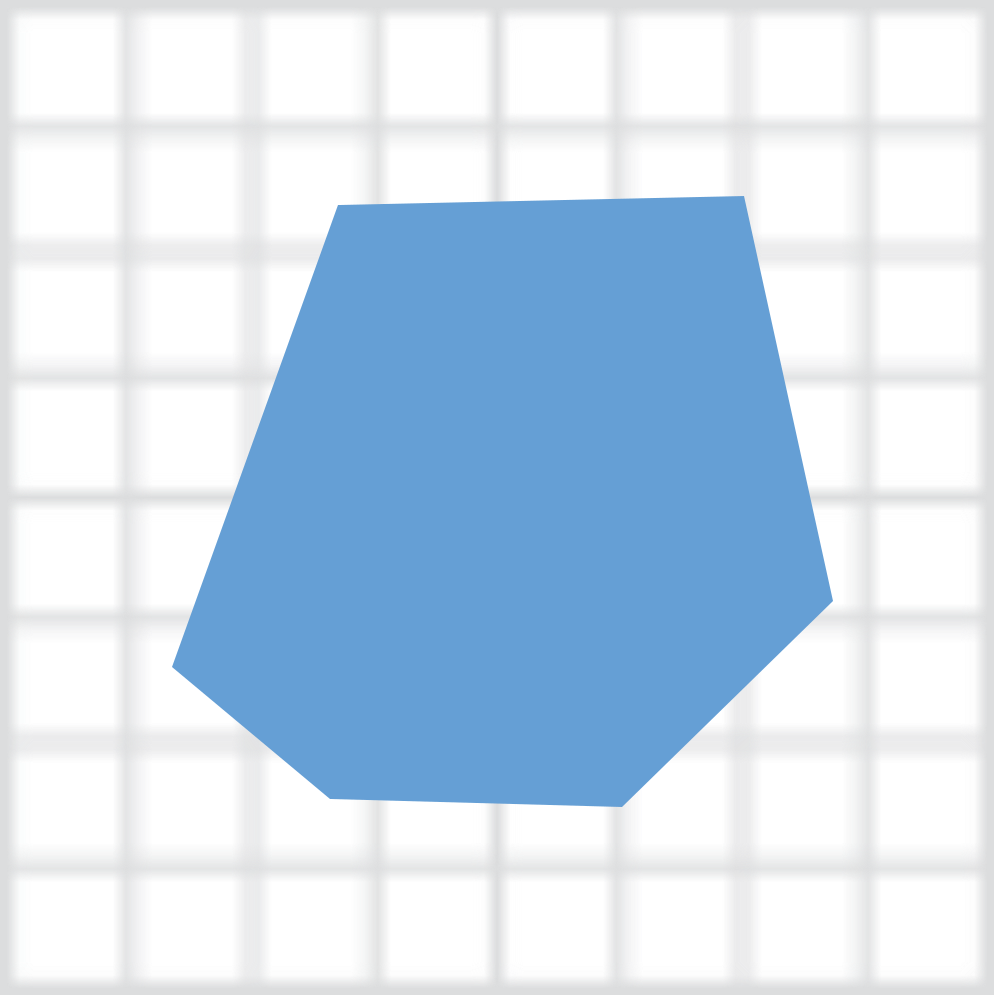{width="75"}  | a + geom_polygon(aes(alpha = 50))                                                         | **Draw a polygon. First and last point are connected.**                                                            |
|                                                                                       |                                                  |                                                                                           |                                                                                                                    |
|                                                                                       |                                                  |                                                                                           | *x, y, alpha, color, fill, group, subgroup, linetype, size*                                                        |
+---------------------------------------------------------------------------------------+--------------------------------------------------+-------------------------------------------------------------------------------------------+--------------------------------------------------------------------------------------------------------------------+
|                                                                                       | 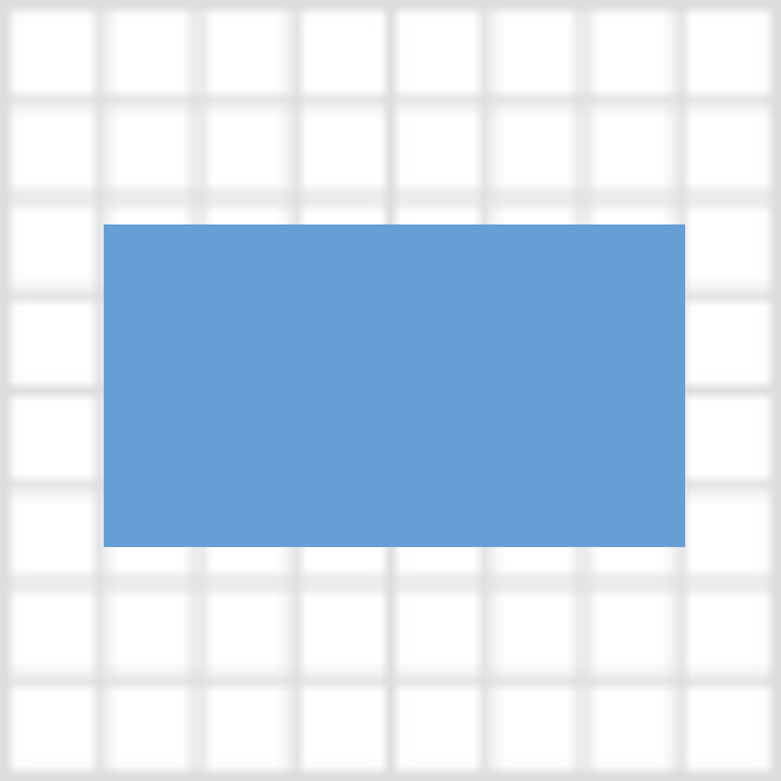{width="75"} | b + geom_rect(aes(xmin = long, ymin = lat, xmax = long + 1, ymax = lat + 1))              | **Draws a rectangle using locations of 4 corners (Similar to geom_tile())**                                        |
|                                                                                       |                                                  |                                                                                           |                                                                                                                    |
|                                                                                       |                                                  |                                                                                           | *xmax, xmin, ymax, ymin, alpha, color, fill, linetype, size*                                                       |
+---------------------------------------------------------------------------------------+--------------------------------------------------+-------------------------------------------------------------------------------------------+--------------------------------------------------------------------------------------------------------------------+
|                                                                                       | {width="75"}  | a + geom_ribbon(aes(ymin = unemploy - 900, ymax = unemploy + 900))                        | **For each value of x, displays a y interval defined by y-min and y-max.**                                         |
|                                                                                       |                                                  |                                                                                           |                                                                                                                    |
|                                                                                       |                                                  |                                                                                           | *x, ymax, ymin, alpha, color, fill, group, linetype, size*                                                         |
+---------------------------------------------------------------------------------------+--------------------------------------------------+-------------------------------------------------------------------------------------------+--------------------------------------------------------------------------------------------------------------------+
| **LIne Segments**                                                                     | {width="75"} | b + geom_abline(aes(intercept = 0, slope = 1))                                            | **Add reference lines to the plot**                                                                                |
|                                                                                       |                                                  |                                                                                           |                                                                                                                    |
| b \<- ggplot(seals, aes(x = long, y = lat))                                           |                                                  | b + geom_hline(aes(yintercept = lat))                                                     | *x, y, alpha, color, linetype, size*                                                                               |
|                                                                                       |                                                  |                                                                                           |                                                                                                                    |
|                                                                                       |                                                  | b + geom_vline(aes(xintercept = long))                                                    |                                                                                                                    |
|                                                                                       |                                                  |                                                                                           |                                                                                                                    |
|                                                                                       |                                                  | b + geom_segment(aes(yend = lat + 1, xend = long + 1))                                    |                                                                                                                    |
+---------------------------------------------------------------------------------------+--------------------------------------------------+-------------------------------------------------------------------------------------------+--------------------------------------------------------------------------------------------------------------------+
|                                                                                       |                                                  | b + geom_spoke(aes(angle = 1:1155, radius = 1))                                           | **Prints line in polar coordinates**                                                                               |
+---------------------------------------------------------------------------------------+--------------------------------------------------+-------------------------------------------------------------------------------------------+--------------------------------------------------------------------------------------------------------------------+
| **One Variable (Continuous)**                                                         | 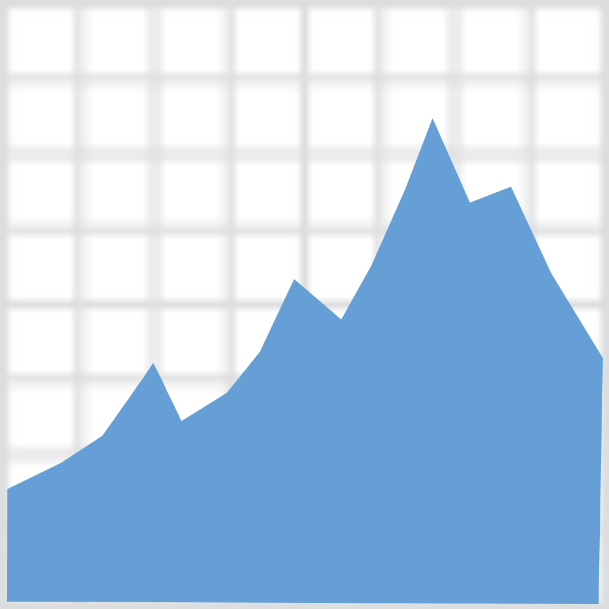{width="75"}  | c + geom_area(stat = "bin")                                                               | **Plots y-values and shades between y-value and zero**                                                             |
|                                                                                       |                                                  |                                                                                           |                                                                                                                    |
| c \<- ggplot(mpg, aes(hwy))                                                           |                                                  |                                                                                           | *x, y, alpha, color, fill, linetype, size*                                                                         |
|                                                                                       |                                                  |                                                                                           |                                                                                                                    |
| c2 \<- ggplot(mpg)                                                                    |                                                  |                                                                                           |                                                                                                                    |
+---------------------------------------------------------------------------------------+--------------------------------------------------+-------------------------------------------------------------------------------------------+--------------------------------------------------------------------------------------------------------------------+
|                                                                                       | {width="75"}  | c + geom_density(kernel = "gaussian")                                                     | **Draws kernel density estimate**                                                                                  |
|                                                                                       |                                                  |                                                                                           |                                                                                                                    |
|                                                                                       |                                                  |                                                                                           | *x, y, alpha, color, fill, group, linetype, size, weight*                                                          |
+---------------------------------------------------------------------------------------+--------------------------------------------------+-------------------------------------------------------------------------------------------+--------------------------------------------------------------------------------------------------------------------+
|                                                                                       | {width="75"} | c + geom_dotplot()                                                                        | **Draws dotplot (histogram) where circle width is equal to bin width**                                             |
|                                                                                       |                                                  |                                                                                           |                                                                                                                    |
|                                                                                       |                                                  |                                                                                           | *x, y, alpha, color, fill*                                                                                         |
+---------------------------------------------------------------------------------------+--------------------------------------------------+-------------------------------------------------------------------------------------------+--------------------------------------------------------------------------------------------------------------------+
|                                                                                       | 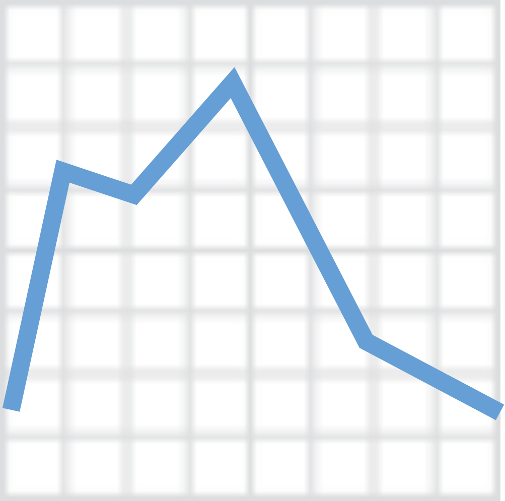{width="75"} | c + geom_freqpoly()                                                                       | **Draws histogram with lines**                                                                                     |
|                                                                                       |                                                  |                                                                                           |                                                                                                                    |
|                                                                                       |                                                  |                                                                                           | *x, y, alpha, color, group, linetype, size*                                                                        |
+---------------------------------------------------------------------------------------+--------------------------------------------------+-------------------------------------------------------------------------------------------+--------------------------------------------------------------------------------------------------------------------+
|                                                                                       | 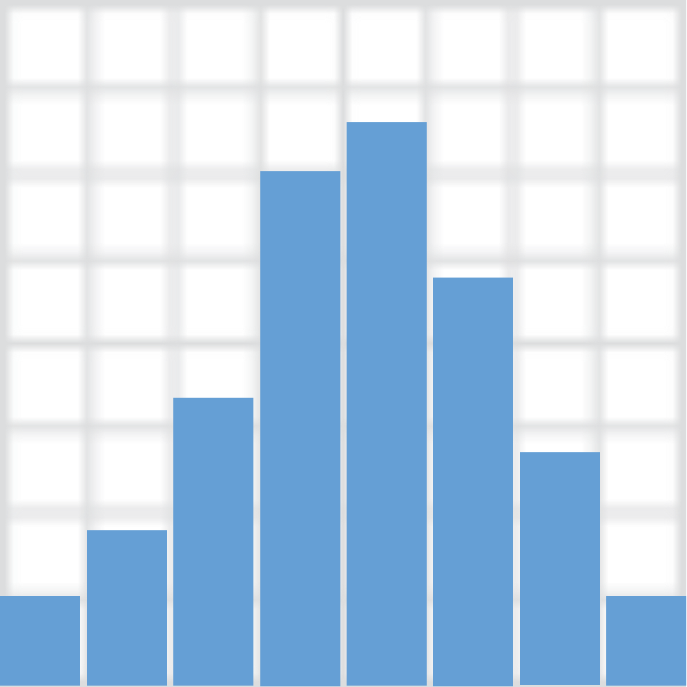{width="75"} | c + geom_histogram(binwidth = 5)                                                          | **Draws histogram with bars**                                                                                      |
|                                                                                       |                                                  |                                                                                           |                                                                                                                    |
|                                                                                       |                                                  |                                                                                           | *x, y, alpha, color, fill, linetype, size, weight*                                                                 |
+---------------------------------------------------------------------------------------+--------------------------------------------------+-------------------------------------------------------------------------------------------+--------------------------------------------------------------------------------------------------------------------+
|                                                                                       | 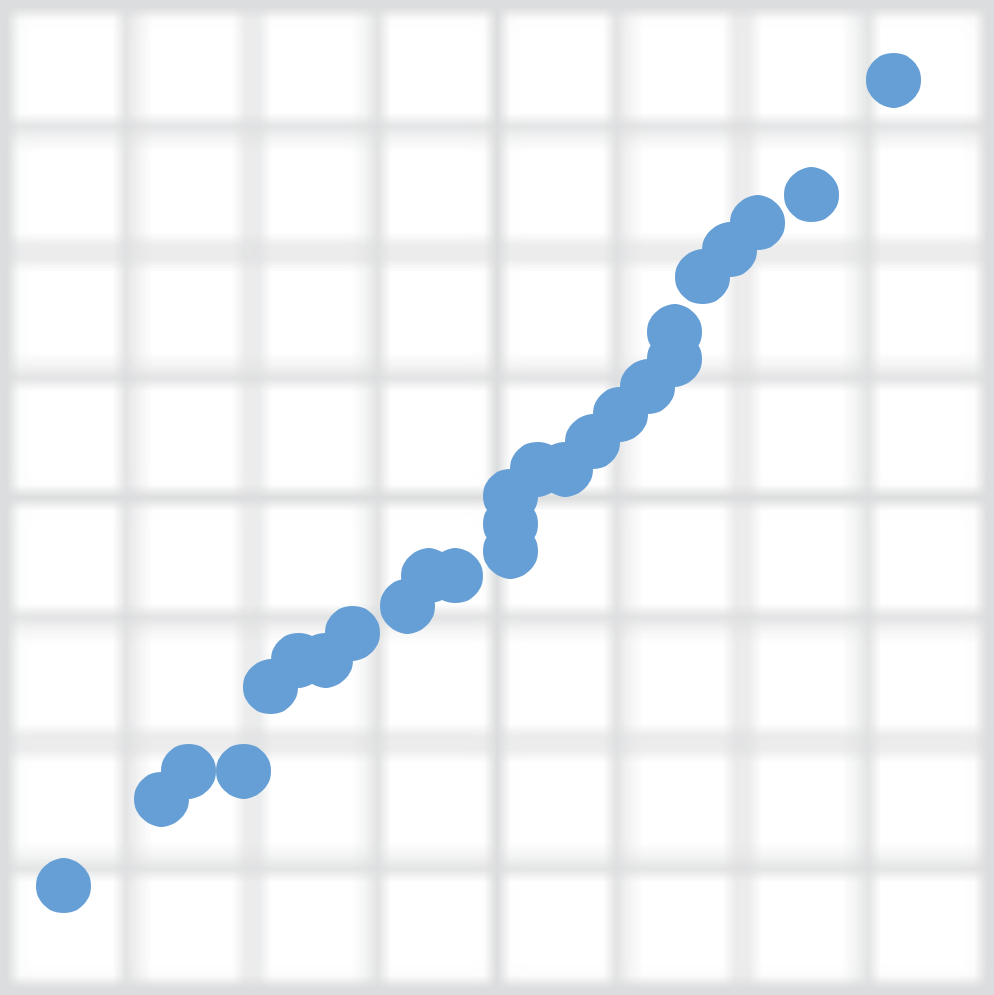{width="75"} | c2 + geom_qq(aes(sample = hwy))                                                           | **Draws Quantile-Quantile plot**                                                                                   |
|                                                                                       |                                                  |                                                                                           |                                                                                                                    |
|                                                                                       |                                                  |                                                                                           | *x, y, alpha, color, fill, linetype, size, weight*                                                                 |
+---------------------------------------------------------------------------------------+--------------------------------------------------+-------------------------------------------------------------------------------------------+--------------------------------------------------------------------------------------------------------------------+
| **One Variable (Discrete)**                                                           | 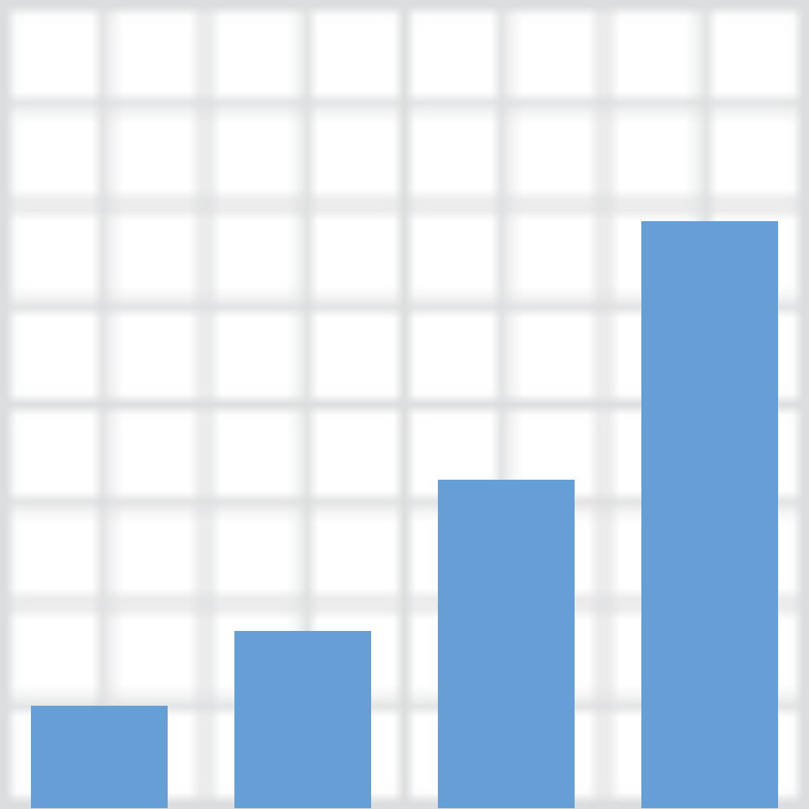{width="75"} | d + geom_bar()                                                                            | Draws a barplot - where bar height is proportional to the number of cases in each group                            |
|                                                                                       |                                                  |                                                                                           |                                                                                                                    |
| d \<- ggplot(mpg, aes(fl))                                                            |                                                  |                                                                                           |                                                                                                                    |
+---------------------------------------------------------------------------------------+--------------------------------------------------+-------------------------------------------------------------------------------------------+--------------------------------------------------------------------------------------------------------------------+
| **Two Variables (Both Continuous)**                                                   | {width="75"}  | e + geom_label(aes(label = cty), nudge_x = 1, nudge_y = 1)                                | **Plots text labels at (x,y) coordinates**                                                                         |
|                                                                                       |                                                  |                                                                                           |                                                                                                                    |
| e \<- ggplot(mpg, aes(cty, hwy))                                                      |                                                  |                                                                                           | *x, y, label, alpha, angle, color, family, fontface, hjust, lineheight, size, vjust*.                              |
+---------------------------------------------------------------------------------------+--------------------------------------------------+-------------------------------------------------------------------------------------------+--------------------------------------------------------------------------------------------------------------------+
|                                                                                       | {width="75"} | e + geom_point()                                                                          | **Draws a scatterplot.**                                                                                           |
|                                                                                       |                                                  |                                                                                           |                                                                                                                    |
|                                                                                       |                                                  |                                                                                           | *x, y, alpha, color, fill, shape, size, stroke*                                                                    |
+---------------------------------------------------------------------------------------+--------------------------------------------------+-------------------------------------------------------------------------------------------+--------------------------------------------------------------------------------------------------------------------+
|                                                                                       | 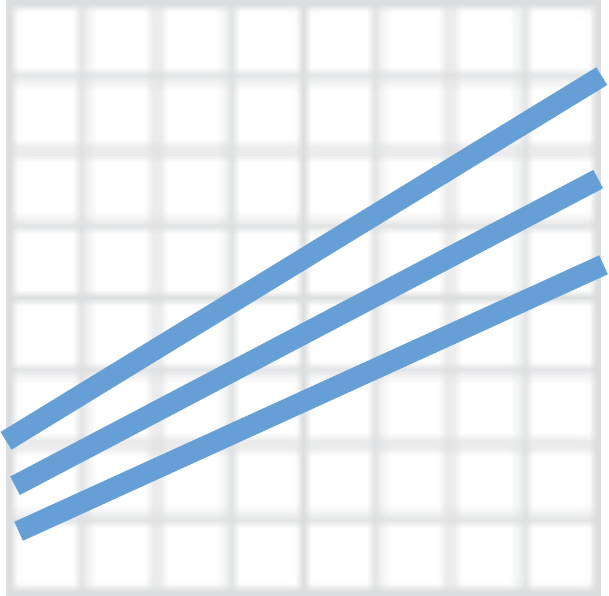{width="75"}  | e + geom_quantile()                                                                       | **Draws a quantile regression - fitted quantile lines.**                                                           |
|                                                                                       |                                                  |                                                                                           |                                                                                                                    |
|                                                                                       |                                                  |                                                                                           | *x, y, alpha, color, group, linetype, size, weight*                                                                |
+---------------------------------------------------------------------------------------+--------------------------------------------------+-------------------------------------------------------------------------------------------+--------------------------------------------------------------------------------------------------------------------+
|                                                                                       | 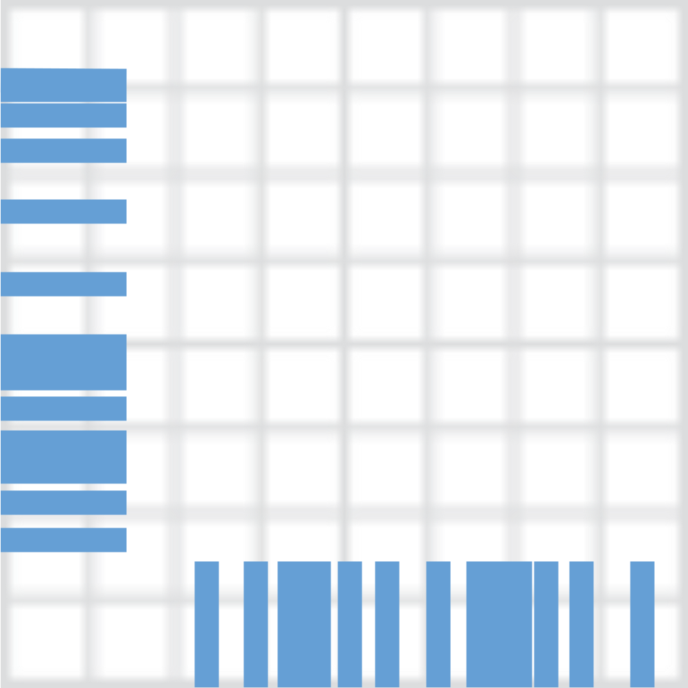{width="75"} | e + geom_rug(sides = “bl")                                                                | **Draws 2x 1d distributions of points on axes**                                                                    |
|                                                                                       |                                                  |                                                                                           |                                                                                                                    |
|                                                                                       |                                                  |                                                                                           | *x, y, alpha, color, linetype, size*                                                                               |
+---------------------------------------------------------------------------------------+--------------------------------------------------+-------------------------------------------------------------------------------------------+--------------------------------------------------------------------------------------------------------------------+
|                                                                                       | {width="75"}  | e + geom_smooth(method = lm)                                                              | **Smooths the datapoints.**                                                                                        |
|                                                                                       |                                                  |                                                                                           |                                                                                                                    |
|                                                                                       |                                                  |                                                                                           | *x, y, alpha, color, fill, group, linetype, size, weight*                                                          |
+---------------------------------------------------------------------------------------+--------------------------------------------------+-------------------------------------------------------------------------------------------+--------------------------------------------------------------------------------------------------------------------+
|                                                                                       | 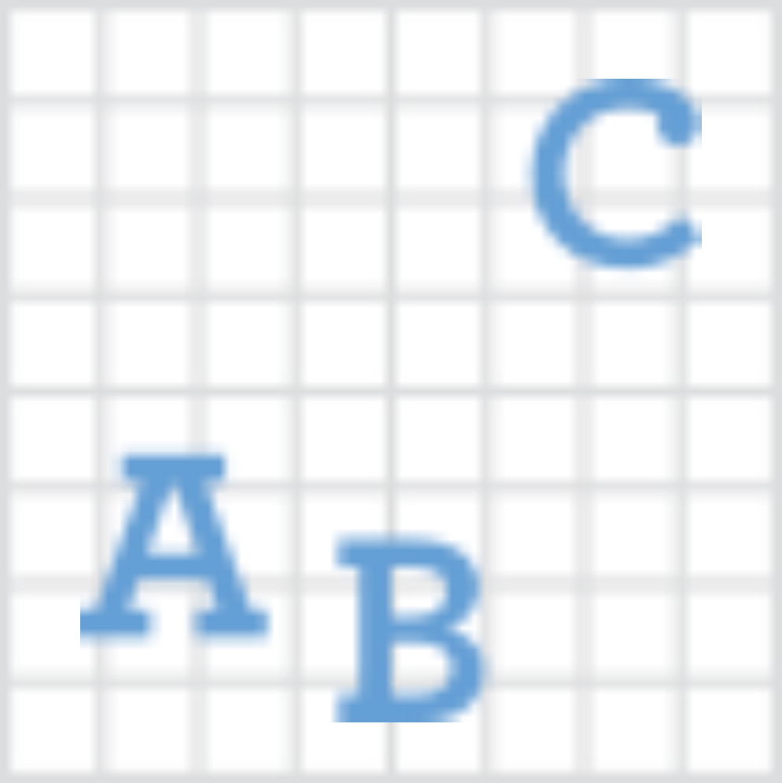{width="75"} | e + geom_text(aes(label = cty), nudge_x = 1, nudge_y = 1)                                 | **Draw labels on the plot.**                                                                                       |
|                                                                                       |                                                  |                                                                                           |                                                                                                                    |
|                                                                                       |                                                  |                                                                                           | *x, y, label, alpha, angle, color, family, fontface, hjust, lineheight, size, vjust*                               |
+---------------------------------------------------------------------------------------+--------------------------------------------------+-------------------------------------------------------------------------------------------+--------------------------------------------------------------------------------------------------------------------+
| **One Discrete, One Continuous**                                                      | {width="75"} | f + geom_col()                                                                            | **Draw barplot where bar height is equal to value in data**                                                        |
|                                                                                       |                                                  |                                                                                           |                                                                                                                    |
| f \<- ggplot(mpg, aes(class, hwy))                                                    |                                                  |                                                                                           | *x, y, alpha, color, fill, group, linetype, size*                                                                  |
+---------------------------------------------------------------------------------------+--------------------------------------------------+-------------------------------------------------------------------------------------------+--------------------------------------------------------------------------------------------------------------------+
|                                                                                       | {width="75"} | f + geom_boxplot()                                                                        | **Draw a boxplot.**                                                                                                |
|                                                                                       |                                                  |                                                                                           |                                                                                                                    |
|                                                                                       |                                                  |                                                                                           | *x, y, lower, middle, upper, ymax, ymin, alpha, color, fill, group, linetype, shape, size, weight*                 |
+---------------------------------------------------------------------------------------+--------------------------------------------------+-------------------------------------------------------------------------------------------+--------------------------------------------------------------------------------------------------------------------+
|                                                                                       | {width="75"}   | f + geom_dotplot(binaxis = "y", stackdir = “center")                                      | **Draw a dotplot of distribution, similar to box plot or violin plot but each data points are visualized on plot** |
|                                                                                       |                                                  |                                                                                           |                                                                                                                    |
|                                                                                       |                                                  |                                                                                           | *x, y, alpha, color, fill, group*                                                                                  |
+---------------------------------------------------------------------------------------+--------------------------------------------------+-------------------------------------------------------------------------------------------+--------------------------------------------------------------------------------------------------------------------+
|                                                                                       | {width="75"} | f + geom_violin(scale = “area")                                                           | **Draws a violin plot.**                                                                                           |
|                                                                                       |                                                  |                                                                                           |                                                                                                                    |
|                                                                                       |                                                  |                                                                                           | *x, y, alpha, color, fill, group, linetype, size, weight*                                                          |
+---------------------------------------------------------------------------------------+--------------------------------------------------+-------------------------------------------------------------------------------------------+--------------------------------------------------------------------------------------------------------------------+
| **Both** **Discrete**                                                                 | {width="75"} | g + geom_count()                                                                          | **Counts Plot**                                                                                                    |
|                                                                                       |                                                  |                                                                                           |                                                                                                                    |
| g \<- ggplot(diamonds, aes(cut, color))                                               |                                                  |                                                                                           | x, y, alpha, color, fill, shape, size, stroke                                                                      |
+---------------------------------------------------------------------------------------+--------------------------------------------------+-------------------------------------------------------------------------------------------+--------------------------------------------------------------------------------------------------------------------+
|                                                                                       | {width="75"} | e + geom_jitter(height = 2, width = 2)                                                    | **Adds Jitter to Point Plot**                                                                                      |
|                                                                                       |                                                  |                                                                                           |                                                                                                                    |
|                                                                                       |                                                  |                                                                                           | x, y, alpha, color, fill, shape, size                                                                              |
+---------------------------------------------------------------------------------------+--------------------------------------------------+-------------------------------------------------------------------------------------------+--------------------------------------------------------------------------------------------------------------------+
| **Continuous Bivariate Distribution**                                                 | {width="75"} | h + geom_bin2d(binwidth = c(0.25, 500))                                                   | **Heatmap**                                                                                                        |
|                                                                                       |                                                  |                                                                                           |                                                                                                                    |
| h \<- ggplot(diamonds, aes(carat, price))                                             |                                                  |                                                                                           | x, y, alpha, color, fill, linetype, size, weight                                                                   |
+---------------------------------------------------------------------------------------+--------------------------------------------------+-------------------------------------------------------------------------------------------+--------------------------------------------------------------------------------------------------------------------+
|                                                                                       | {width="75"} | h + geom_density_2d()                                                                     | **2D Density Plot**                                                                                                |
|                                                                                       |                                                  |                                                                                           |                                                                                                                    |
|                                                                                       |                                                  |                                                                                           | x, y, alpha, color, group, linetype, size                                                                          |
+---------------------------------------------------------------------------------------+--------------------------------------------------+-------------------------------------------------------------------------------------------+--------------------------------------------------------------------------------------------------------------------+
|                                                                                       | {width="75"} | h + geom_hex()                                                                            | **Hex Plot**                                                                                                       |
|                                                                                       |                                                  |                                                                                           |                                                                                                                    |
|                                                                                       |                                                  |                                                                                           | x, y, alpha, color, fill, size                                                                                     |
+---------------------------------------------------------------------------------------+--------------------------------------------------+-------------------------------------------------------------------------------------------+--------------------------------------------------------------------------------------------------------------------+
| **Continuous Function**                                                               | {width="75"} | i + geom_area()                                                                           | **Area Plot**                                                                                                      |
|                                                                                       |                                                  |                                                                                           |                                                                                                                    |
| i \<- ggplot(economics, aes(date, unemploy))                                          |                                                  |                                                                                           | x, y, alpha, color, fill, linetype, size                                                                           |
+---------------------------------------------------------------------------------------+--------------------------------------------------+-------------------------------------------------------------------------------------------+--------------------------------------------------------------------------------------------------------------------+
|                                                                                       | {width="75"}  | i + geom_line()                                                                           | **Line Plot**                                                                                                      |
|                                                                                       |                                                  |                                                                                           |                                                                                                                    |
|                                                                                       |                                                  |                                                                                           | x, y, alpha, color, group, linetype, size                                                                          |
+---------------------------------------------------------------------------------------+--------------------------------------------------+-------------------------------------------------------------------------------------------+--------------------------------------------------------------------------------------------------------------------+
|                                                                                       | 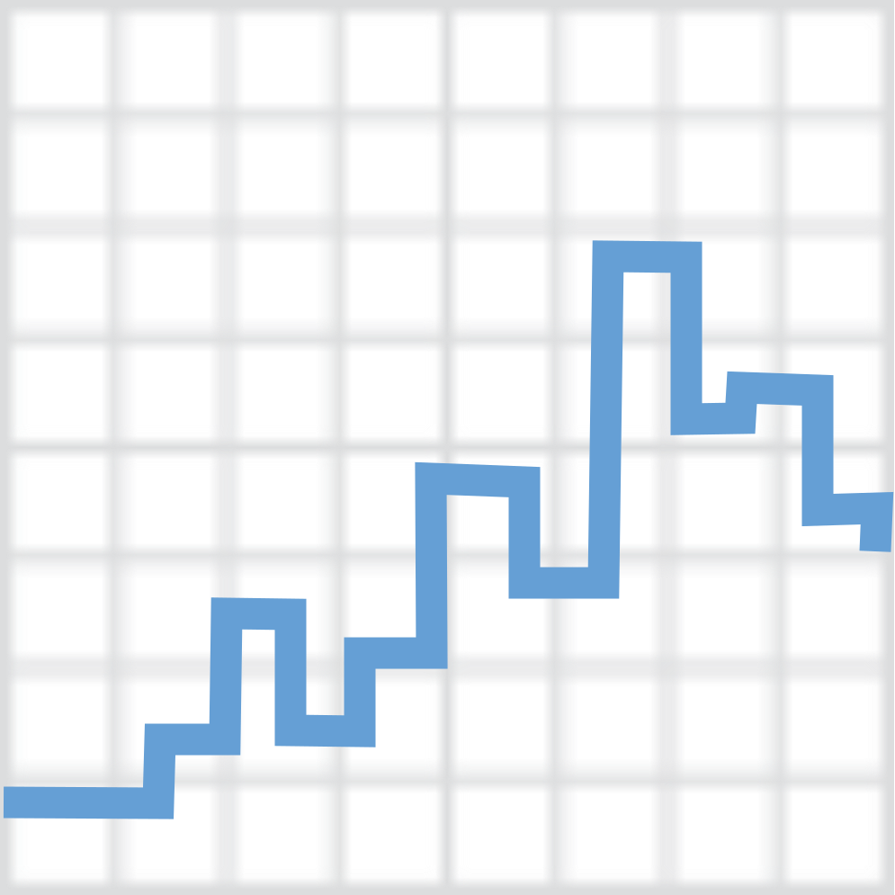{width="75"}  | i + geom_step(direction = "hv")                                                           | **Step Plot**                                                                                                      |
|                                                                                       |                                                  |                                                                                           |                                                                                                                    |
|                                                                                       |                                                  |                                                                                           | x, y, alpha, color, group, linetype, size                                                                          |
+---------------------------------------------------------------------------------------+--------------------------------------------------+-------------------------------------------------------------------------------------------+--------------------------------------------------------------------------------------------------------------------+
| **Visualizing Error**                                                                 | {width="75"} | j + geom_crossbar(fatten = 2)                                                             | **Cross Bars**                                                                                                     |
|                                                                                       |                                                  |                                                                                           |                                                                                                                    |
| df \<- data.frame(grp = c("A", "B"), fit = 4:5, se = 1:2)                             |                                                  |                                                                                           | x, y, ymax, ymin, alpha, color, fill, group, linetype, size                                                        |
|                                                                                       |                                                  |                                                                                           |                                                                                                                    |
| j \<- ggplot(df, aes(grp, fit, ymin=fit-se, ymax=fit+se))                             |                                                  |                                                                                           |                                                                                                                    |
+---------------------------------------------------------------------------------------+--------------------------------------------------+-------------------------------------------------------------------------------------------+--------------------------------------------------------------------------------------------------------------------+
|                                                                                       | 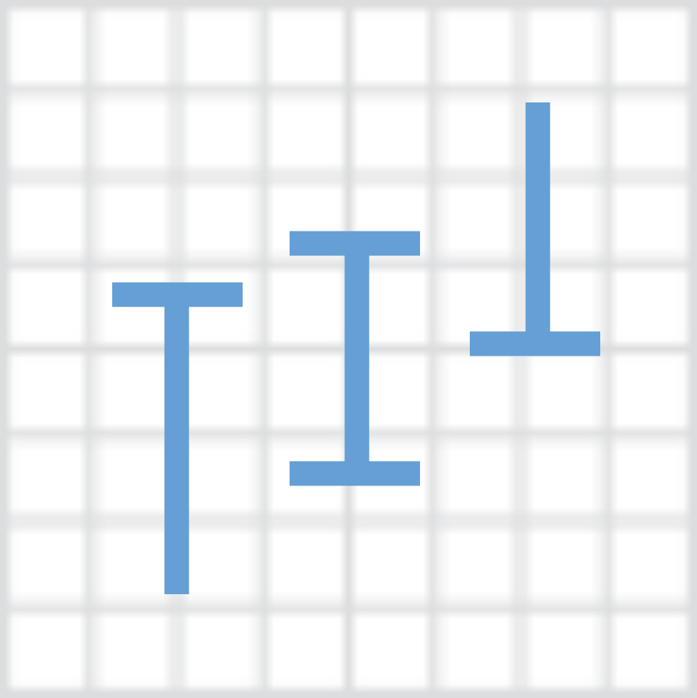{width="75"} | j + geom_errorbar()                                                                       | **Error Bars**                                                                                                     |
|                                                                                       |                                                  |                                                                                           |                                                                                                                    |
|                                                                                       |                                                  |                                                                                           | *x, ymax, ymin, alpha, color, group, linetype, size, width* Also **geom_errorbarh().**                             |
+---------------------------------------------------------------------------------------+--------------------------------------------------+-------------------------------------------------------------------------------------------+--------------------------------------------------------------------------------------------------------------------+
|                                                                                       | 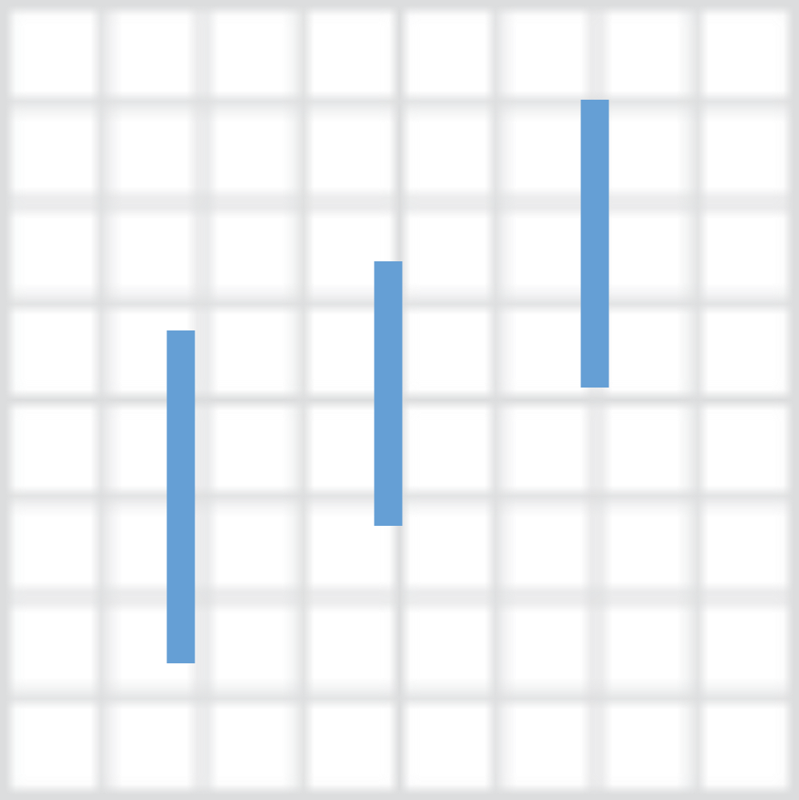{width="75"} | j + geom_linerange()                                                                      | **Line Range**                                                                                                     |
|                                                                                       |                                                  |                                                                                           |                                                                                                                    |
|                                                                                       |                                                  |                                                                                           | x, ymin, ymax, alpha, color, group, linetype, size                                                                 |
+---------------------------------------------------------------------------------------+--------------------------------------------------+-------------------------------------------------------------------------------------------+--------------------------------------------------------------------------------------------------------------------+
|                                                                                       | 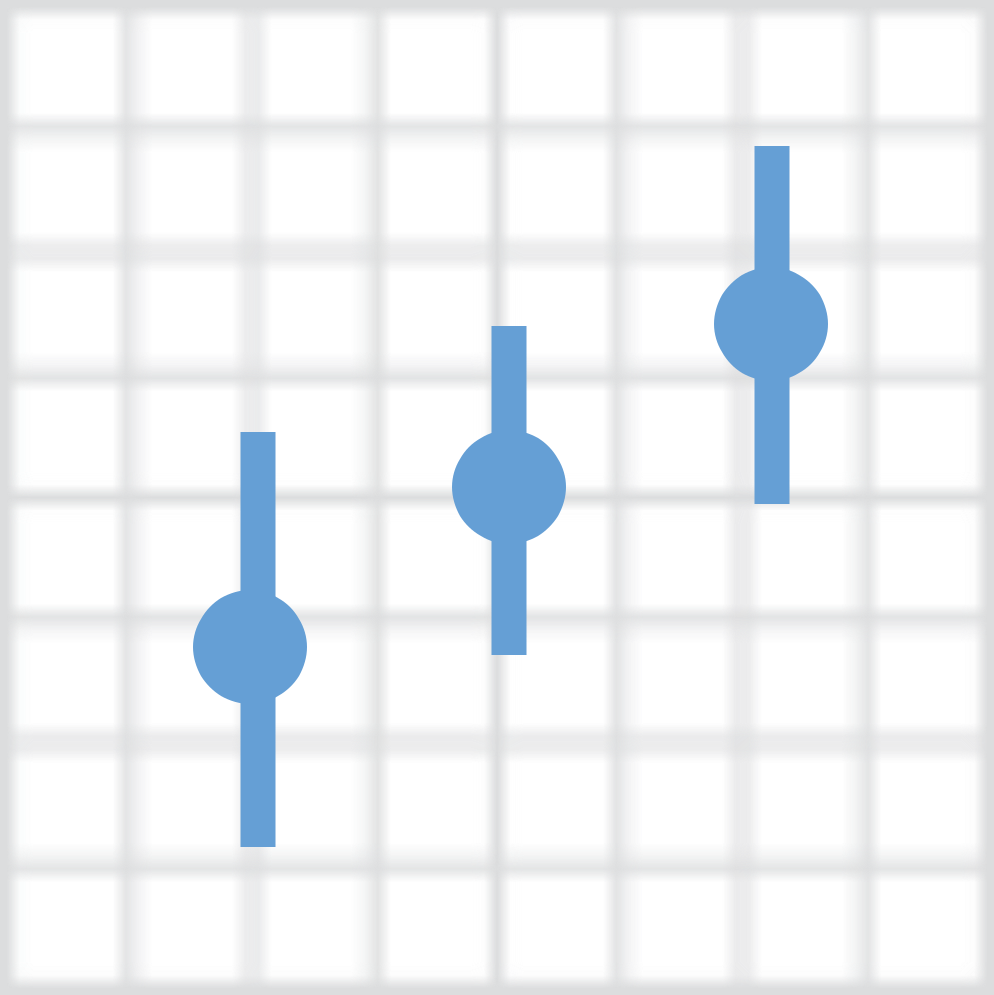{width="75"} | j + geom_pointrange()                                                                     | **Point Range**                                                                                                    |
|                                                                                       |                                                  |                                                                                           |                                                                                                                    |
|                                                                                       |                                                  |                                                                                           | *x, y, ymin, ymax, alpha, color, fill, group, linetype, shape, size*                                               |
+---------------------------------------------------------------------------------------+--------------------------------------------------+-------------------------------------------------------------------------------------------+--------------------------------------------------------------------------------------------------------------------+
| **Maps**                                                                              | {width="75"} | k + geom_map(aes(map_id = state), map = map) + expand_limits(x = map\$long, y = map\$lat) | **Choropleth Plot**                                                                                                |
|                                                                                       |                                                  |                                                                                           |                                                                                                                    |
| data \<- data.frame(murder = USArrests\$Murder, state = tolower(rownames(USArrests))) |                                                  |                                                                                           | *map_id, alpha, color, fill, linetype, size*                                                                       |
|                                                                                       |                                                  |                                                                                           |                                                                                                                    |
| map \<- map_data("state") k \<- ggplot(data, aes(fill = murder))                      |                                                  |                                                                                           |                                                                                                                    |
+---------------------------------------------------------------------------------------+--------------------------------------------------+-------------------------------------------------------------------------------------------+--------------------------------------------------------------------------------------------------------------------+
| **Three Variables**                                                                   | 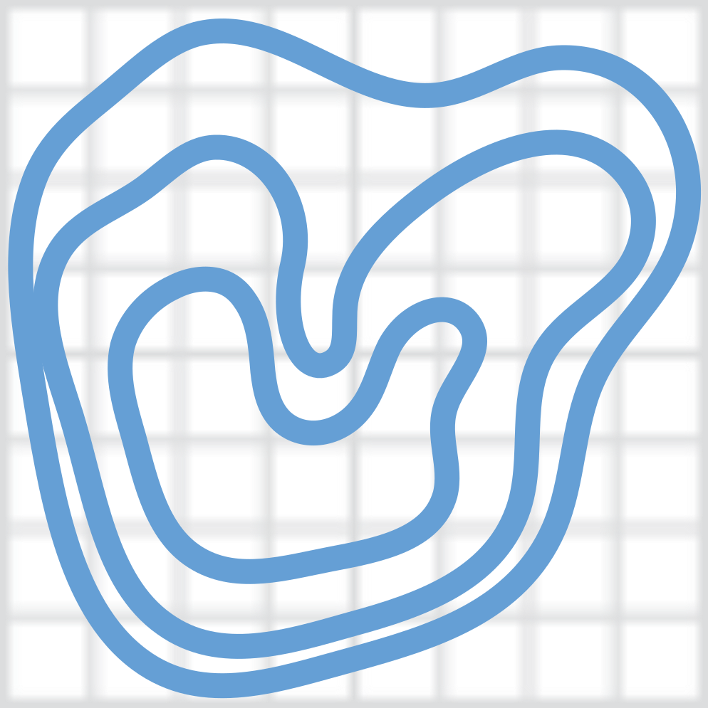{width="75"} | l + geom_contour(aes(z = z))                                                              | **Draws 3D in 2D**                                                                                                 |
|                                                                                       |                                                  |                                                                                           |                                                                                                                    |
| seals\$z \<- with(seals, sqrt(delta_long\^2 + delta_lat\^2))                          |                                                  |                                                                                           | *x, y, z, alpha, color, group, linetype, size, weight*                                                             |
|                                                                                       |                                                  |                                                                                           |                                                                                                                    |
| l \<- ggplot(seals, aes(long, lat))                                                   |                                                  |                                                                                           |                                                                                                                    |
+---------------------------------------------------------------------------------------+--------------------------------------------------+-------------------------------------------------------------------------------------------+--------------------------------------------------------------------------------------------------------------------+
|                                                                                       | {width="75"} | l + geom_contour_filled(aes(fill = z))                                                    | **Draws 3D in 2D**                                                                                                 |
|                                                                                       |                                                  |                                                                                           |                                                                                                                    |
|                                                                                       |                                                  |                                                                                           | *x, y, alpha, color, fill, group, linetype, size, subgroup*                                                        |
+---------------------------------------------------------------------------------------+--------------------------------------------------+-------------------------------------------------------------------------------------------+--------------------------------------------------------------------------------------------------------------------+
|                                                                                       | {width="75"} | l + geom_raster(aes(fill = z), hjust = 0.5, vjust = 0.5, interpolate = FALSE)             | **Raster plot - high performance**                                                                                 |
|                                                                                       |                                                  |                                                                                           |                                                                                                                    |
|                                                                                       |                                                  |                                                                                           | *x, y, alpha, fill*                                                                                                |
+---------------------------------------------------------------------------------------+--------------------------------------------------+-------------------------------------------------------------------------------------------+--------------------------------------------------------------------------------------------------------------------+
|                                                                                       | {width="75"} | l + geom_tile(aes(fill = z))                                                              | **Same as geom_rect()**                                                                                            |
|                                                                                       |                                                  |                                                                                           |                                                                                                                    |
|                                                                                       |                                                  |                                                                                           | *x, y, alpha, color, fill, linetype, size, width*                                                                  |
+---------------------------------------------------------------------------------------+--------------------------------------------------+-------------------------------------------------------------------------------------------+--------------------------------------------------------------------------------------------------------------------+

------------------------------------------------------------------------

## Basic Chart Types

### Bar Chart: geom_bar()

If we wanted a bar plot of the numbers of individuals in the penguins dataset by sex.

```{r}
ggplot(penguins, aes(sex, fill=island))+geom_bar()
```

However, we want them grouped by species and then plot the sex. We need to adjust what we're plotting on the x axis. We actually want to plot the species and then fill the bars proportionally by the sex. This give a stacked bar plot of sex by species.

```{r}
ggplot(penguins, aes(x=island, fill=sex))+geom_bar()
```

If you want them separated out by sex, we need to pass an argument to the `geom_bar(position='dodge')` or `geom_bar(position='dodge2')`

```{r}
ggplot(penguins, aes(x=species, fill=sex))+geom_bar(position='dodge')
```

------------------------------------------------------------------------

### Line Plot: geom_line()

```{r}
economics
```

```{r}
ggplot(economics, aes(date, unemploy))+geom_line()
```

```{r}
ggplot(penguins, mapping=aes(x=flipper_length_mm, y=body_mass_g, color=species)) + geom_point(shape=0)
```

```{r}
ggplot(penguins, aes(x=species, y=body_mass_g, color=species)) + 
  geom_violin() + geom_boxplot(width=0.1)
```

------------------------------------------------------------------------

### Scatter Plot: geom_point()

```{r}
ggplot(penguins, aes(flipper_length_mm, body_mass_g)) + geom_point()
```

```{r}
ggplot(penguins, aes(flipper_length_mm, body_mass_g, color=species)) + geom_point()
```

```{r}
ggplot(penguins, aes(flipper_length_mm, body_mass_g, group=species)) + geom_point(aes(color = species)) + geom_smooth(method = "lm", se = FALSE, aes(color = species))
```

```{r}
ggplot(penguins, aes(flipper_length_mm, body_mass_g, group=species, color=species)) + geom_point() + geom_smooth(method = "lm", se = FALSE)
```

------------------------------------------------------------------------

### Histogram

```{r}
ggplot(penguins, aes(body_mass_g)) + geom_histogram()
```

```{r}
ggplot(penguins, aes(body_mass_g)) + geom_histogram(aes(fill=species), alpha=0.5 , position = "identity")
```

```{r}
ggplot(penguins, aes(body_mass_g)) + geom_density(aes(fill=species), alpha=0.5 , position = "identity")
```

------------------------------------------------------------------------

### Box Plot

```{r}
ggplot(penguins,aes(species,body_mass_g)) + geom_boxplot()
```

```{r}
ggplot(penguins,aes(species,body_mass_g, color=species)) + geom_boxplot()
```

------------------------------------------------------------------------

### Violin Plot

```{r}
ggplot(penguins, aes(species, body_mass_g)) + geom_violin()
```

```{r}
ggplot(penguins, aes(species, body_mass_g)) + geom_violin() + geom_boxplot(width=0.2)
```

```{r}
ggplot(penguins, aes(species, body_mass_g, color=island)) + geom_violin()+ geom_boxplot(width=0.2)
```

------------------------------------------------------------------------

## Level 4 (Facets): Add Subplots based on values (Optional)

If you have categorical variables, it's easy to define multiple subplots that based on the number of categories. Facets will create a subplot for each category.

There are two different types of **facets**

1.  facet_grid()
2.  facet_wrap()

### facet_grid(rows\~columns)

**facet_grid()** allows you to define a grid of subplots (rows and columns) you want to by categories of the defined rows. For the penguins dataset we can plot rows for each *species* and columns for each *island*

```{r}
ggplot(penguins, aes(x=flipper_length_mm, y=body_mass_g)) + geom_point() + facet_grid(species~island)
```

If you only want to plot a single category as a row by species, then you can just define the **column** value as a period (.)

```{r}
ggplot(penguins, mapping=aes(x=flipper_length_mm, y=body_mass_g)) + geom_point() + facet_grid(species~.)
```

Alternatively, if you just want as a single column, define the **rows** as a period (.)

```{r}
ggplot(penguins, mapping=aes(x=flipper_length_mm, y=body_mass_g)) + geom_point() + facet_grid(.~species)
```

### facet_wrap(\~columns)

**facet_wrap()** will wrap the subplots into a rectangular layout.

#### Syntax:

```         
facet_wrap(
  facets,
  nrow = NULL,
  ncol = NULL,
  scales = "fixed",
  shrink = TRUE,
  labeller = "label_value",
  as.table = TRUE,
  switch = deprecated(),
  drop = TRUE,
  dir = "h",
  strip.position = "top",
  axes = "margins",
  axis.labels = "all"
)
```

We can leave the number of rows and columns up to the defaults in **facet_wrap()**

```{r}
ggplot(penguins, aes(x=flipper_length_mm, y=body_mass_g)) + geom_point() + facet_wrap(~species)
```

If we want the plot have a specific number of rows and colums, we can define the `nrow`, and/or `ncol` arguments.

```{r}
ggplot(penguins, mapping=aes(x=flipper_length_mm, y=body_mass_g)) + geom_point() + facet_wrap(~species, nrow=2)
```

# Labels & Legends

You can adjust the labels of your plot using `labs()`

| Label Arguments | Description                   | Example                                      |
|-----------------|-------------------------------|----------------------------------------------|
| x               | x-axis label                  | labs(x="Flipper Length (mm)")                |
| y               | y-axis label                  | labs(y="Body Mass (g)")                      |
| title           | Plot Title above the plot     | labs(title="Palmer Penguins")                |
| subtitle        | Plot subtitle below the title | labs(subtitle="Flipper Length vs Body Mass") |
| caption         | Caption below the plot        | labs(caption="Figure 1")                     |
| alt             | Alternative text              | labs(alt="Alternative Text")                 |

```{r}
(gg = ggplot(penguins,aes(species,body_mass_g, color=species)) + geom_boxplot())
```

```{r}
gg + labs(x="Species", y="Body Mass (g)", title="Palmer's Penguins", subtitle="Distribution by Species", 
     caption="Figure 1", alt="Alternative Text")
```

------------------------------------------------------------------------

# Themes

Themes provide the ability to change characteristics of the plot theme (ie background colors, tick marks, fonts, font size). ggplot2 has a few 8 built-in themes. <https://ggplot2.tidyverse.org/reference/ggtheme.html>

To explore many more predefined themes, check out: <https://exts.ggplot2.tidyverse.org/ggthemes.html> or <https://github.com/hrbrmstr/hrbrthemes>

```{r}
ggplot(penguins,aes(species,body_mass_g, color=species)) + geom_boxplot() + 
  labs(x="Species", y="Body Mass (g)", title="Palmer's Penguins", subtitle="Distribution by Species", caption="Figure 1", alt="Alternative Text") + theme_light()
```

# Additional ggplot2 Extensions

<https://exts.ggplot2.tidyverse.org/gallery/>

```{r}
library(ggstatsplot)
ggscatterstats(
  data = penguins, ## data frame from which variables are taken
  x = flipper_length_mm, ## predictor/independent variable
  y = body_mass_g, ## dependent variable
  xlab = "Flipper Length (mm)", ## label for the x-axis
  ylab = "Body Mass (g)", ## label for the y-axis
  xfill = "#CC79A7", ## fill for marginals on the x-axis
  yfill = "#009E73", ## fill for marginals on the y-axis
  title = "Relationship between Flipper Length and Body Mass"
)
```
